```mermaid
graph LR
    Delegator_API["Delegator API"]
    Command_Execution_Core["Command Execution Core"]
    Process_Control_Interaction["Process Control & Interaction"]
    Output_Status_Management["Output & Status Management"]
    Subprocess_Abstraction_Layer["Subprocess Abstraction Layer"]
    User_Client["User/Client"]
    Operating_System["Operating System"]
    User_Client -- "Initiates Commands" --> Delegator_API
    User_Client -- "Receives Results" --> Delegator_API
    Delegator_API -- "Delegates Command Execution" --> Command_Execution_Core
    Delegator_API -- "Directs Process Interaction" --> Process_Control_Interaction
    Delegator_API -- "Requests Output/Status" --> Output_Status_Management
    Command_Execution_Core -- "Spawns Processes" --> Subprocess_Abstraction_Layer
    Process_Control_Interaction -- "Controls Process State" --> Subprocess_Abstraction_Layer
    Subprocess_Abstraction_Layer -- "Orchestrates Process Execution" --> Operating_System
    Operating_System -- "Provides Process Data" --> Subprocess_Abstraction_Layer
    Subprocess_Abstraction_Layer -- "Forwards Raw Data" --> Output_Status_Management
    Output_Status_Management -- "Provides Processed Data" --> Delegator_API
    Command_Execution_Core -- "Retrieves Piped Output" --> Output_Status_Management
    click Delegator_API href "https://github.com/CodeBoarding/GeneratedOnBoardings/blob/main/delegator.py/Delegator_API.md" "Details"
    click Command_Execution_Core href "https://github.com/CodeBoarding/GeneratedOnBoardings/blob/main/delegator.py/Command_Execution_Core.md" "Details"
    click Process_Control_Interaction href "https://github.com/CodeBoarding/GeneratedOnBoardings/blob/main/delegator.py/Process_Control_Interaction.md" "Details"
    click Subprocess_Abstraction_Layer href "https://github.com/CodeBoarding/GeneratedOnBoardings/blob/main/delegator.py/Subprocess_Abstraction_Layer.md" "Details"
    click Operating_System href "https://github.com/CodeBoarding/GeneratedOnBoardings/blob/main/delegator.py/Operating_System.md" "Details"
```

## Details

The `delegator` library provides a high-level, simplified API for interacting with external processes, abstracting the complexities of subprocess management. Its architecture is designed around a central `Delegator API` that serves as the primary interface for users. This API orchestrates interactions with core internal components: the `Command Execution Core` for initiating commands, `Process Control & Interaction` for real-time communication, and `Output & Status Management` for retrieving command results. At its foundation, the `Subprocess Abstraction Layer` directly interfaces with the `Operating System` to handle low-level process operations. This modular design ensures clear separation of concerns, facilitating robust command execution, interactive process control, and streamlined output handling, all optimized for both programmatic use and visual representation in diagrams.

### Delegator API [[Expand]](./Delegator_API.md)
The central, user-facing facade that provides a simplified API for running, interacting with, and managing external commands. It orchestrates all subprocess management logic.

**Related Classes/Methods**:

- <a href="https://github.com/amitt001/delegator.py/blob/master/delegator.py" target="_blank" rel="noopener noreferrer">`delegator.Command`</a>

### Command Execution Core [[Expand]](./Command_Execution_Core.md)
Responsible for initiating the execution of external commands, abstracting the choice between blocking and non-blocking modes, and orchestrating command chaining/pipelining.

**Related Classes/Methods**:

- <a href="https://github.com/amitt001/delegator.py/blob/master/delegator.py#L177-L204" target="_blank" rel="noopener noreferrer">`delegator.Command.run`:177-204</a>
- <a href="https://github.com/amitt001/delegator.py/blob/master/delegator.py#L264-L285" target="_blank" rel="noopener noreferrer">`delegator.Command.pipe`:264-285</a>

### Process Control & Interaction [[Expand]](./Process_Control_Interaction.md)
Manages real-time, interactive communication with a running subprocess (e.g., sending input, expecting patterns) and controls its lifecycle (e.g., termination, killing, blocking).

**Related Classes/Methods**:

- <a href="https://github.com/amitt001/delegator.py/blob/master/delegator.py#L206-L263" target="_blank" rel="noopener noreferrer">`delegator.Command.send`:206-263</a>
- <a href="https://github.com/amitt001/delegator.py/blob/master/delegator.py#L206-L263" target="_blank" rel="noopener noreferrer">`delegator.Command.expect`:206-263</a>
- <a href="https://github.com/amitt001/delegator.py/blob/master/delegator.py#L206-L263" target="_blank" rel="noopener noreferrer">`delegator.Command.terminate`:206-263</a>
- <a href="https://github.com/amitt001/delegator.py/blob/master/delegator.py#L206-L263" target="_blank" rel="noopener noreferrer">`delegator.Command.kill`:206-263</a>
- <a href="https://github.com/amitt001/delegator.py/blob/master/delegator.py#L206-L263" target="_blank" rel="noopener noreferrer">`delegator.Command.block`:206-263</a>

### Output & Status Management
Provides convenient and structured access to the standard output, standard error, exit code, process ID, and liveness status of the executed command.

**Related Classes/Methods**:

- <a href="https://github.com/amitt001/delegator.py/blob/master/delegator.py#L98-L171" target="_blank" rel="noopener noreferrer">`delegator.Command.out`:98-171</a>
- <a href="https://github.com/amitt001/delegator.py/blob/master/delegator.py#L98-L171" target="_blank" rel="noopener noreferrer">`delegator.Command.err`:98-171</a>
- <a href="https://github.com/amitt001/delegator.py/blob/master/delegator.py#L98-L171" target="_blank" rel="noopener noreferrer">`delegator.Command.return_code`:98-171</a>
- <a href="https://github.com/amitt001/delegator.py/blob/master/delegator.py#L98-L171" target="_blank" rel="noopener noreferrer">`delegator.Command.ok`:98-171</a>
- <a href="https://github.com/amitt001/delegator.py/blob/master/delegator.py#L98-L171" target="_blank" rel="noopener noreferrer">`delegator.Command.pid`:98-171</a>
- <a href="https://github.com/amitt001/delegator.py/blob/master/delegator.py#L98-L171" target="_blank" rel="noopener noreferrer">`delegator.Command.is_alive`:98-171</a>

### Subprocess Abstraction Layer [[Expand]](./Subprocess_Abstraction_Layer.md)
An internal component within the `delegator.Command` class that directly interfaces with the `subprocess` and `pexpect` libraries, handling the low-level details of process creation, communication, and stream management.

**Related Classes/Methods**:

- <a href="https://github.com/amitt001/delegator.py/blob/master/delegator.py#L50-L285" target="_blank" rel="noopener noreferrer">`delegator.Command._popen_args`:50-285</a>
- <a href="https://github.com/amitt001/delegator.py/blob/master/delegator.py#L50-L285" target="_blank" rel="noopener noreferrer">`delegator.Command._default_popen_kwargs`:50-285</a>
- <a href="https://github.com/amitt001/delegator.py/blob/master/delegator.py#L50-L285" target="_blank" rel="noopener noreferrer">`delegator.Command._default_pexpect_kwargs`:50-285</a>
- <a href="https://github.com/amitt001/delegator.py/blob/master/delegator.py#L50-L285" target="_blank" rel="noopener noreferrer">`delegator.Command._uses_subprocess`:50-285</a>
- <a href="https://github.com/amitt001/delegator.py/blob/master/delegator.py#L50-L285" target="_blank" rel="noopener noreferrer">`delegator.Command._uses_pexpect`:50-285</a>

### User/Client
Represents the external application or user interacting with the `delegator` library.

**Related Classes/Methods**: _None_

### Operating System [[Expand]](./Operating_System.md)
The underlying system environment responsible for executing commands and managing processes.

**Related Classes/Methods**: _None_

### [FAQ](https://github.com/CodeBoarding/GeneratedOnBoardings/tree/main?tab=readme-ov-file#faq)