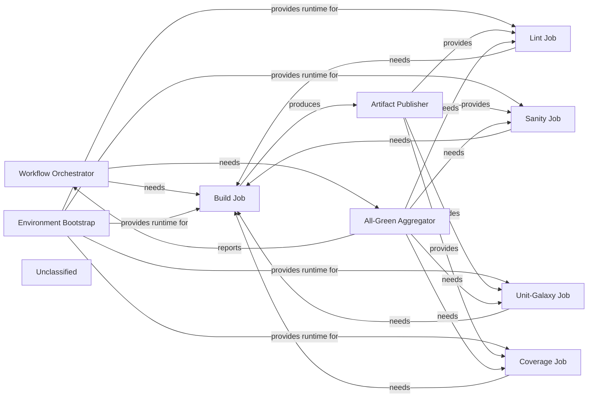

## Details

The CI Pipeline Subsystem – The GitHub‑Actions CI pipeline is encapsulated in the `.github/workflows/` directory. The *Workflow Orchestrator* defines the triggers (push, PR, schedule, manual) and the job dependency graph. A single *Environment Bootstrap* step installs a reproducible Python 3.x interpreter and the matching Ansible version, guaranteeing a uniform runtime for all downstream jobs. The *Build Job* compiles the Ansible collection into a tarball, which the *Artifact Publisher* stores as a GitHub‑Actions artifact. Three consumer jobs – *Lint*, *Sanity* and *Unit‑Galaxy* – each retrieve the built collection from the artifact store and perform static analysis, sanity checks, and unit‑test execution (with coverage) respectively; the *Coverage Job* then forwards the generated `coverage.xml` to Codecov. Finally, the *All‑Green Aggregator* inspects the results of all validation jobs and emits a single success/failure status that the orchestrator reports back to GitHub. External reusable workflows (`ansible‑lint.yaml`, `sanity.yaml`, `unit.yaml`) are imported as black‑box jobs, keeping the subsystem self‑contained while allowing reuse of community‑maintained validation logic.

### Workflow Orchestrator
Declares triggers, concurrency, and the job matrix; wires the job dependency graph for the CI pipeline.

**Related Classes/Methods**:

- <a href="https://github.com/dell/dellemc-openmanage-ansible-modules/blob/collections/.github/workflows/ansible-test.yml" target="_blank" rel="noopener noreferrer">`.github/workflows/ansible-test.yml`</a>

### Environment Bootstrap
Installs the requested Python version and Ansible, providing a consistent runtime for all downstream jobs.

**Related Classes/Methods**:

- <a href="https://github.com/dell/dellemc-openmanage-ansible-modules/blob/collections/.github/workflows/ansible-test.yml" target="_blank" rel="noopener noreferrer">`.github/workflows/ansible-test.yml`</a>
- <a href="https://github.com/dell/dellemc-openmanage-ansible-modules/blob/collections/.github/workflows/build_report.yml" target="_blank" rel="noopener noreferrer">`.github/workflows/build_report.yml`</a>

### Build Job
Executes `ansible‑galaxy collection build` to produce a collection tarball (*.tar.gz).

**Related Classes/Methods**:

- <a href="https://github.com/dell/dellemc-openmanage-ansible-modules/blob/collections/.github/workflows/ansible-test.yml" target="_blank" rel="noopener noreferrer">`.github/workflows/ansible-test.yml`</a>

### Artifact Publisher
Uploads the built collection tarball to the GitHub‑Actions artifact store for later consumption.

**Related Classes/Methods**:

- <a href="https://github.com/dell/dellemc-openmanage-ansible-modules/blob/collections/.github/workflows/ansible-test.yml" target="_blank" rel="noopener noreferrer">`.github/workflows/ansible-test.yml`</a>

### Lint Job
Runs `ansible‑lint` against the built collection to enforce style and best‑practice rules.

**Related Classes/Methods**:

- <a href="https://github.com/dell/dellemc-openmanage-ansible-modules/blob/collections/.github/workflows/ansible-test.yml" target="_blank" rel="noopener noreferrer">`.github/workflows/ansible-test.yml`</a>
- <a href="https://github.com/dell/dellemc-openmanage-ansible-modules/blob/collections/.github/workflows/ansible-test.yml" target="_blank" rel="noopener noreferrer">`ansible/ansible-content-actions/.github/workflows/ansible-lint.yaml`</a>

### Sanity Job
Executes Ansible’s sanity test suite (module import, documentation checks, etc.) on the built collection.

**Related Classes/Methods**:

- <a href="https://github.com/dell/dellemc-openmanage-ansible-modules/blob/collections/.github/workflows/ansible-test.yml" target="_blank" rel="noopener noreferrer">`.github/workflows/ansible-test.yml`</a>
- <a href="https://github.com/dell/dellemc-openmanage-ansible-modules/blob/collections/.github/workflows/ansible-test.yml" target="_blank" rel="noopener noreferrer">`ansible/ansible-content-actions/.github/workflows/sanity.yaml`</a>

### Unit‑Galaxy Job
Runs the collection’s Python‑level unit tests (`pytest`) with coverage enabled.

**Related Classes/Methods**:

- <a href="https://github.com/dell/dellemc-openmanage-ansible-modules/blob/collections/.github/workflows/ansible-test.yml" target="_blank" rel="noopener noreferrer">`.github/workflows/ansible-test.yml`</a>
- <a href="https://github.com/dell/dellemc-openmanage-ansible-modules/blob/collections/.github/workflows/ansible-test.yml" target="_blank" rel="noopener noreferrer">`ansible/ansible-content-actions/.github/workflows/unit.yaml`</a>

### Coverage Job
Publishes the `coverage.xml` generated by the Unit‑Galaxy job to Codecov.

**Related Classes/Methods**:

- <a href="https://github.com/dell/dellemc-openmanage-ansible-modules/blob/collections/.github/workflows/build_report.yml" target="_blank" rel="noopener noreferrer">`.github/workflows/build_report.yml`</a>
- <a href="https://github.com/dell/dellemc-openmanage-ansible-modules/blob/collections/.github/workflows/build_report.yml" target="_blank" rel="noopener noreferrer">`codecov/codecov-action@v5`</a>

### All‑Green Aggregator
Inspects results of all validation jobs and emits a single success/failure status for the whole pipeline.

**Related Classes/Methods**:

- <a href="https://github.com/dell/dellemc-openmanage-ansible-modules/blob/collections/.github/workflows/ansible-test.yml" target="_blank" rel="noopener noreferrer">`.github/workflows/ansible-test.yml`</a>

### Unclassified
Component for all unclassified files and utility functions (Utility functions/External Libraries/Dependencies)

**Related Classes/Methods**: _None_

### [FAQ](https://github.com/CodeBoarding/GeneratedOnBoardings/tree/main?tab=readme-ov-file#faq)