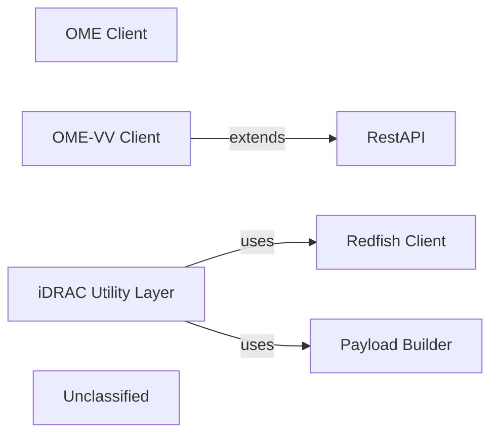

## Details

The Dell OpenManage Ansible collection isolates transport‑level clients from business‑logic helpers. The Redfish Client (class Redfish) and OME Client (class RestOME) are thin wrappers that manage URL construction, session handling and generic HTTP verbs for iDRAC Redfish and OME REST services. A specialised OME‑VV Client (class RestOMEVV) inherits a generic RestAPI base class to add OME‑Virtual‑Volume‑specific header handling. High‑level Ansible modules import the iDRAC Utility Layer, which does not perform HTTP itself but delegates to the Redfish Client and uses Payload Builder helpers (pure functions spread across the idrac_utils/info package) to construct JSON bodies for operations such as firmware upload, BIOS configuration, and lifecycle‑controller jobs. The data‑flow for an iDRAC operation is: Ansible module → iDRAC Utility Layer → Payload Builder (build JSON) → Redfish Client (invoke_request) → iDRAC Redfish service. OME‑related actions follow a similar pattern but bypass the iDRAC Utility Layer, using the OME Client or OME‑VV Client directly. Session handling is encapsulated inside each client, providing a clean separation of concerns and a concise architecture with five primary components and clear directed relationships.

### Redfish Client
Low‑level wrapper around iDRAC Redfish endpoints; handles URL construction, request‑header preparation, session creation (__enter__/__exit__) and JSON response parsing; exposes generic invoke_request for GET/POST/PATCH/DELETE.

**Related Classes/Methods**:

- <a href="https://github.com/dell/dellemc-openmanage-ansible-modules/blob/collections/plugins/module_utils/redfish.py#L95-L251" target="_blank" rel="noopener noreferrer">`plugins.module_utils.redfish.Redfish`:95-251</a>

### OME Client
Low‑level wrapper for Dell OpenManage Enterprise (OME) REST API; provides its own session handling and supplies OME‑specific helper methods (e.g., get_device_id_from_service_tag, get_job_type_id).

**Related Classes/Methods**:

- <a href="https://github.com/dell/dellemc-openmanage-ansible-modules/blob/collections/plugins/module_utils/ome.py#L94-L427" target="_blank" rel="noopener noreferrer">`plugins.module_utils.ome.RestOME`:94-427</a>

### OME‑VV Client
Specialised client for the OME Virtual‑Volume (OME‑VV) service; inherits the generic RestAPI infrastructure and adds a header (x_omivv-api-vcenter-identifier) when a vCenter UUID is supplied.

**Related Classes/Methods**:

- <a href="https://github.com/dell/dellemc-openmanage-ansible-modules/blob/collections/plugins/module_utils/omevv.py#L40-L74" target="_blank" rel="noopener noreferrer">`plugins.module_utils.omevv.RestOMEVV`:40-74</a>
- <a href="https://github.com/dell/dellemc-openmanage-ansible-modules/blob/collections/plugins/module_utils/rest_api.py#L88-L185" target="_blank" rel="noopener noreferrer">`plugins.module_utils.rest_api.RestAPI`:88-185</a>

### iDRAC Utility Layer
High‑level façade that implements Ansible‑module‑level operations (e.g., BIOS update, firmware upload, LC log retrieval); delegates HTTP calls to Redfish Client and uses Payload Builder helpers to create JSON bodies required by Redfish.

**Related Classes/Methods**:

- <a href="https://github.com/dell/dellemc-openmanage-ansible-modules/blob/collections/plugins/module_utils/idrac_utils/__init__.py" target="_blank" rel="noopener noreferrer">`plugins.module_utils.idrac_utils`</a>

### Payload Builder
Collection of pure‑Python helper functions that assemble request payloads for various iDRAC Redfish operations (firmware update, BIOS settings, LC job creation, etc.); kept stateless to make the façade code declarative and easily unit‑tested.

**Related Classes/Methods**:

- <a href="https://github.com/dell/dellemc-openmanage-ansible-modules/blob/collections/plugins/module_utils/idrac_utils/info/firmware.py" target="_blank" rel="noopener noreferrer">`plugins.module_utils.idrac_utils.info.firmware.build_firmware_payload`</a>
- <a href="https://github.com/dell/dellemc-openmanage-ansible-modules/blob/collections/plugins/module_utils/idrac_utils/info/bios.py" target="_blank" rel="noopener noreferrer">`plugins.module_utils.idrac_utils.info.bios.build_bios_payload`</a>

### Unclassified
Component for all unclassified files and utility functions (Utility functions/External Libraries/Dependencies)

**Related Classes/Methods**: _None_

### [FAQ](https://github.com/CodeBoarding/GeneratedOnBoardings/tree/main?tab=readme-ov-file#faq)