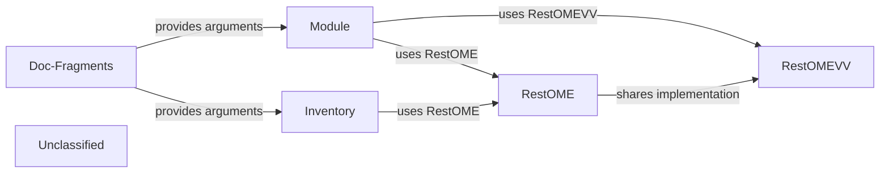

## Details

The OpenManage Enterprise (OME) integration subsystem of the Dell OpenManage Ansible collection consists of a small set of tightly‑coupled components that together expose OME functionality to Ansible playbooks. Reusable documentation fragments (plugins/doc_fragments/ome_auth_options.py) define the common authentication arguments and are imported by every OME‑related module (plugins/modules/ome_*.py) and by the dynamic inventory plug‑in (plugins/inventory/ome_inventory.py). Each module builds an OmeAnsibleModule (which merges the fragment‑provided spec with module‑specific options) and then delegates all REST interactions to the OME client (plugins/module_utils/ome.py → RestOME). RestOME handles session creation, request construction, pagination, job submission and polling, exposing a clean, idempotent API that the modules and the inventory plug‑in consume. VV‑specific modules use a sibling client (plugins/module_utils/omevv.py → RestOMEVV) that shares the same request‑building logic but targets the OME‑Virtual‑Volume service. The inventory plug‑in also uses RestOME to query OME groups and devices, turning the returned JSON into Ansible groups/hosts and optionally attaching host‑ and group‑variables. This architecture isolates the high‑level Ansible‑module logic from the low‑level REST details, promotes reuse of authentication documentation, and provides a clear provider‑to‑consumer flow that can be represented with a concise diagram.

### Module
Ansible module wrapper (e.g., plugins/modules/ome_firmware.py) that parses arguments, builds an OmeAnsibleModule, validates input, and orchestrates the high‑level workflow (payload creation → job submission → polling).

**Related Classes/Methods**:

- <a href="https://github.com/dell/dellemc-openmanage-ansible-modules/blob/collections/plugins/modules/ome_firmware.py" target="_blank" rel="noopener noreferrer">`plugins.modules.ome_firmware`</a>

### RestOME
Client library (plugins/module_utils/ome.py → class RestOME) that encapsulates all OME REST calls, session handling, pagination, job tracking and provides an idempotent API for modules and the inventory plug‑in.

**Related Classes/Methods**:

- <a href="https://github.com/dell/dellemc-openmanage-ansible-modules/blob/collections/plugins/module_utils/ome.py#L94-L427" target="_blank" rel="noopener noreferrer">`plugins.module_utils.ome.RestOME`:94-427</a>

### RestOMEVV
Client library (plugins/module_utils/omevv.py → class RestOMEVV) that mirrors RestOME but targets the OME‑Virtual‑Volume service, used by VV‑specific modules.

**Related Classes/Methods**:

- <a href="https://github.com/dell/dellemc-openmanage-ansible-modules/blob/collections/plugins/module_utils/omevv.py#L40-L74" target="_blank" rel="noopener noreferrer">`plugins.module_utils.omevv.RestOMEVV`:40-74</a>

### Inventory
Dynamic inventory plug‑in (plugins/inventory/ome_inventory.py → class InventoryModule) that implements the Ansible inventory‑plugin API, queries OME via RestOME, and builds groups/hosts with optional variables.

**Related Classes/Methods**:

- <a href="https://github.com/dell/dellemc-openmanage-ansible-modules/blob/collections/plugins/inventory/ome_inventory.py#L94-L208" target="_blank" rel="noopener noreferrer">`plugins.inventory.ome_inventory.InventoryModule`:94-208</a>

### Doc‑Fragments
Reusable documentation‑fragment files (e.g., plugins/doc_fragments/ome_auth_options.py) that supply common argument_spec fragments for authentication and other shared metadata.

**Related Classes/Methods**:

- <a href="https://github.com/dell/dellemc-openmanage-ansible-modules/blob/collections/plugins/doc_fragments/ome_auth_options.py" target="_blank" rel="noopener noreferrer">`plugins.doc_fragments.ome_auth_options`</a>

### Unclassified
Component for all unclassified files and utility functions (Utility functions/External Libraries/Dependencies)

**Related Classes/Methods**: _None_

### [FAQ](https://github.com/CodeBoarding/GeneratedOnBoardings/tree/main?tab=readme-ov-file#faq)