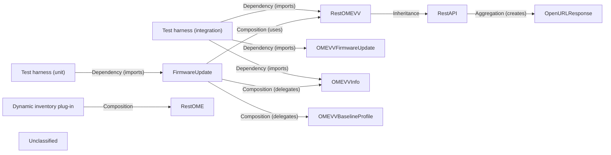

## Details

OME‑VV Firmware Management is a self‑contained sub‑system that enables Ansible users to upload firmware, create baseline profiles and schedule update jobs for Dell OpenManage Enterprise Virtual‑Volume (OME‑VV) clusters. The public entry‑point is the omevv_firmware module, which builds an OMEVVAnsibleModule argument spec and instantiates a RestOMEVV client. RestOMEVV inherits the generic RestAPI class, thereby re‑using the collection’s proven session‑and‑authentication handling without any additional composition. The FirmwareUpdate façade orchestrates the workflow: it resolves target host IDs via OMEVVInfo, prepares baseline objects with OMEVVBaselineProfile, and finally submits the firmware payload through OMEVVFirmwareUpdate. All HTTP interactions flow through the OME‑VV gateway, with the optional dynamic inventory plug‑in (ome_inventory) exposing OME‑VV‑managed hosts to Ansible playbooks. Unit and integration test suites validate the end‑to‑end behaviour, ensuring that the subsystem remains isolated from unrelated utilities such as logging handlers or documentation fragments.

### FirmwareUpdate
Facade/orchestrator that parses module parameters, builds the firmware‑update payload, and drives the update workflow.

**Related Classes/Methods**:

- <a href="https://github.com/dell/dellemc-openmanage-ansible-modules/blob/collections/plugins/modules/omevv_firmware.py#L389-L622" target="_blank" rel="noopener noreferrer">`plugins.modules.omevv_firmware.FirmwareUpdate`:389-622</a>

### RestOMEVV
REST client that sends OME‑VV‑specific HTTP calls (adds the x_omivv‑api‑vcenter‑identifier header) and inherits generic session handling from RestAPI.

**Related Classes/Methods**:

- <a href="https://github.com/dell/dellemc-openmanage-ansible-modules/blob/collections/plugins/module_utils/omevv.py#L40-L74" target="_blank" rel="noopener noreferrer">`plugins.module_utils.omevv.RestOMEVV`:40-74</a>

### RestAPI
Base class that handles authentication (basic or session token), builds URLs, validates input and provides low‑level request helpers.

**Related Classes/Methods**:

- <a href="https://github.com/dell/dellemc-openmanage-ansible-modules/blob/collections/plugins/module_utils/rest_api.py#L88-L185" target="_blank" rel="noopener noreferrer">`plugins.module_utils.rest_api.RestAPI`:88-185</a>

### OMEVVFirmwareUpdate
Utility that implements the concrete “firmware upload / job creation” API calls used by the wrapper.

**Related Classes/Methods**:

- <a href="https://github.com/dell/dellemc-openmanage-ansible-modules/blob/collections/plugins/module_utils/omevv_utils/omevv_firmware_utils.py#L664-L723" target="_blank" rel="noopener noreferrer">`plugins.module_utils.omevv_utils.omevv_firmware_utils.OMEVVFirmwareUpdate`:664-723</a>

### OMEVVInfo
Utility that queries OME‑VV for host‑ID resolution, compliance status and other read‑only data needed before a job.

**Related Classes/Methods**:

- <a href="https://github.com/dell/dellemc-openmanage-ansible-modules/blob/collections/plugins/module_utils/omevv_utils/omevv_info_utils.py#L42-L190" target="_blank" rel="noopener noreferrer">`plugins.module_utils.omevv_utils.omevv_info_utils.OMEVVInfo`:42-190</a>

### OMEVVBaselineProfile
Utility that creates baseline‑profile objects that the firmware job can reference (e.g., for scheduled updates).

**Related Classes/Methods**:

- <a href="https://github.com/dell/dellemc-openmanage-ansible-modules/blob/collections/plugins/module_utils/omevv_utils/omevv_firmware_utils.py#L310-L438" target="_blank" rel="noopener noreferrer">`plugins.module_utils.omevv_utils.omevv_baseline_profile.OMEVVBaselineProfile`:310-438</a>

### Dynamic inventory plug‑in
Plug‑in that discovers OME‑VV‑managed hosts for playbooks by calling the generic RestOME client.

**Related Classes/Methods**:

- <a href="https://github.com/dell/dellemc-openmanage-ansible-modules/blob/collections/plugins/inventory/ome_inventory.py" target="_blank" rel="noopener noreferrer">`plugins.inventory.ome_inventory`</a>

### Test harness (unit)
Unit‑test suite that executes the FirmwareUpdate façade in isolation, mocking the REST client.

**Related Classes/Methods**:

- `tests.unit.modules.test_omevv_firmware`

### Test harness (integration)
Integration‑test suite that runs the full end‑to‑end flow against a real (or containerised) OME‑VV instance.

**Related Classes/Methods**:

- <a href="https://github.com/dell/dellemc-openmanage-ansible-modules/blob/collections/tests/integration/targets/omevv_firmware" target="_blank" rel="noopener noreferrer">`tests.integration.targets.omevv_firmware`</a>

### Unclassified
Component for all unclassified files and utility functions (Utility functions/External Libraries/Dependencies)

**Related Classes/Methods**: _None_

### [FAQ](https://github.com/CodeBoarding/GeneratedOnBoardings/tree/main?tab=readme-ov-file#faq)