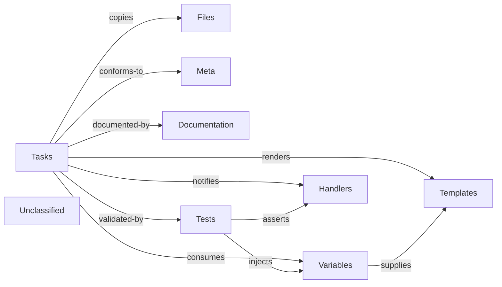

## Details

The iDRAC‑certificate Ansible role provides a facade that orchestrates iDRAC certificate operations such as CSR generation, certificate import, export, and reset. Its single entry‑point (tasks/main.yml) drives the workflow by consuming role‑wide variables, rendering Jinja2 templates into SOAP/WS‑MAN payloads, copying static assets, and notifying handlers when changes occur. Role metadata governs platform support, while comprehensive Molecule test scenarios validate the end‑to‑end behavior, ensuring idempotence and correct handler execution. Documentation in README.md explains the usage, variables, and flow for end users.

### Tasks
Entry‑point tasks (tasks/main.yml and included sub‑tasks) that orchestrate certificate actions by invoking Dell iDRAC collection modules.

**Related Classes/Methods**:

- `tasks/main.yml`
- `tasks/generate_csr.yml`
- `tasks/import.yml`
- `tasks/export.yml`
- `tasks/reset.yml`

### Variables
Role‑wide variables defined in defaults/main.yml (user‑overridable) and vars/main.yml (internal constants).

**Related Classes/Methods**:

- `defaults/main.yml`
- `vars/main.yml`

### Handlers
Notify‑only tasks (handlers/main.yml) that perform follow‑up actions such as reboot or wait when triggered by tasks.

**Related Classes/Methods**:

- `handlers/main.yml`

### Templates
Jinja2 template files used to render SOAP/WS‑MAN payloads for iDRAC API calls.

**Related Classes/Methods**:

- `templates/idrac_delete_job_queue.j2`
- `templates/idrac_delete_job_queue_force.j2`

### Files
Static assets (files/) that are copied or referenced by tasks, e.g., documentation or binary payloads.

**Related Classes/Methods**:

- `files/ansible_doc.txt`

### Meta
Role metadata (meta/main.yml) declaring author, supported platforms, and dependencies.

**Related Classes/Methods**:

- `meta/main.yml`

### Documentation
Human‑readable description of the role, its variables, usage examples, and links (README.md).

**Related Classes/Methods**:

- <a href="https://github.com/dell/dellemc-openmanage-ansible-modules/blob/collections/README.md" target="_blank" rel="noopener noreferrer">`README.md`</a>

### Tests
Molecule test scenarios that drive the role with concrete variable values and assert correct behavior.

**Related Classes/Methods**:

- `molecule/reset_bios-10573/converge.yml`
- `molecule/reset_bios-10573/molecule.yml`
- `molecule/update_attributes_immediate-10580/converge.yml`
- `molecule/update_attributes_immediate-10580/molecule.yml`

### Unclassified
Component for all unclassified files and utility functions (Utility functions/External Libraries/Dependencies)

**Related Classes/Methods**: _None_

### [FAQ](https://github.com/CodeBoarding/GeneratedOnBoardings/tree/main?tab=readme-ov-file#faq)