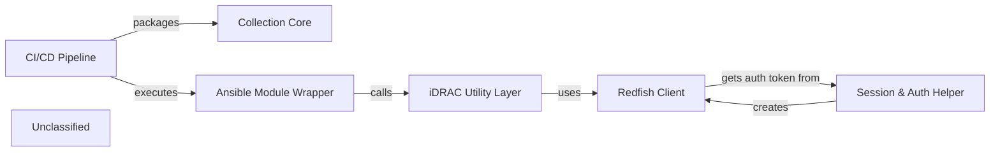

## Details

The Dell OpenManage Ansible collection is organized as a thin‑layered functional stack. The Collection Core (galaxy.yml) defines the collection metadata and entry‑points, which the CI/CD pipeline packages and publishes. Users invoke Ansible Module Wrappers (e.g., plugins/modules/idrac_bios.py) that handle argument parsing, validation, and idempotence, then delegate to the iDRAC Utility Layer (plugins/module_utils/dellemc_idrac.py and related sub‑modules) which implements business‑logic adapters translating high‑level intent into Redfish operations. The Utility Layer uses the Redfish Client (plugins/module_utils/redfish.py) for low‑level HTTP communication, obtaining authentication tokens from the Session & Auth Helper (plugins/module_utils/session_utils.py), a singleton‑style factory that creates and caches authenticated Redfish client instances. The CI/CD pipeline (GitHub Actions workflows) runs linting, unit/integration tests by executing the Ansible modules, and finally builds the collection artefact defined by the Collection Core. The overall execution flow is: User → Ansible Playbook → Ansible Module Wrapper → iDRAC Utility Layer → Session & Auth Helper → Redfish Client → iDRAC Redfish service, with the CI/CD pipeline mirroring this flow for verification and packaging.

### Collection Core
Defines the collection's namespace, version, dependencies and entry‑points; the artefact packaged and published by the CI/CD pipeline.

**Related Classes/Methods**:

- <a href="https://github.com/dell/dellemc-openmanage-ansible-modules/blob/collections/galaxy.yml" target="_blank" rel="noopener noreferrer">`galaxy.yml`</a>

### Ansible Module Wrapper
Public Ansible module that receives user parameters, validates them, handles check‑mode/idempotence and forwards the request to the iDRAC Utility Layer.

**Related Classes/Methods**:

- <a href="https://github.com/dell/dellemc-openmanage-ansible-modules/blob/collections/plugins/modules/idrac_bios.py" target="_blank" rel="noopener noreferrer">`plugins.modules.idrac_bios`</a>

### iDRAC Utility Layer
Business‑logic adapters that translate high‑level module intent into concrete Redfish operations; calls the Redfish Client to perform HTTP calls.

**Related Classes/Methods**:

- <a href="https://github.com/dell/dellemc-openmanage-ansible-modules/blob/collections/plugins/module_utils/dellemc_idrac.py" target="_blank" rel="noopener noreferrer">`plugins.module_utils.dellemc_idrac`</a>
- <a href="https://github.com/dell/dellemc-openmanage-ansible-modules/blob/collections/plugins/module_utils/idrac_utils/info/bios.py" target="_blank" rel="noopener noreferrer">`plugins.module_utils.idrac_utils.info.bios`</a>

### Redfish Client
Low‑level driver that builds REST requests, injects authentication tokens and parses HTTP responses.

**Related Classes/Methods**:

- <a href="https://github.com/dell/dellemc-openmanage-ansible-modules/blob/collections/plugins/module_utils/redfish.py" target="_blank" rel="noopener noreferrer">`plugins.module_utils.redfish`</a>

### Session & Auth Helper
Singleton‑style factory that creates, caches and refreshes authenticated Redfish client instances; supplies auth tokens to the Redfish Client.

**Related Classes/Methods**:

- <a href="https://github.com/dell/dellemc-openmanage-ansible-modules/blob/collections/plugins/module_utils/session_utils.py" target="_blank" rel="noopener noreferrer">`plugins.module_utils.session_utils`</a>

### CI/CD Pipeline [[Expand]](./CI_CD_Pipeline.md)
GitHub Actions workflows that orchestrate linting, unit/integration testing and packaging; invokes Ansible modules via ansible-test and builds the collection artefact.

**Related Classes/Methods**:

- <a href="https://github.com/dell/dellemc-openmanage-ansible-modules/blob/collections/.github/workflows/ansible-test.yml" target="_blank" rel="noopener noreferrer">`.github.workflows.ansible_test`</a>
- <a href="https://github.com/dell/dellemc-openmanage-ansible-modules/blob/collections/.github/workflows/build_report.yml" target="_blank" rel="noopener noreferrer">`.github.workflows.build_report`</a>

### Unclassified
Component for all unclassified files and utility functions (Utility functions/External Libraries/Dependencies)

**Related Classes/Methods**: _None_

### [FAQ](https://github.com/CodeBoarding/GeneratedOnBoardings/tree/main?tab=readme-ov-file#faq)