```mermaid
graph LR
    User_Layer_Playbooks_CLI["User Layer – Playbooks / CLI"]
    Collection_Facade["Collection Facade"]
    iDRAC_Module_Suite["iDRAC Module Suite"]
    OME_Module_Suite["OME Module Suite"]
    OME_VV_Module_Suite["OME‑VV Module Suite"]
    Module_Utils_Library["Module‑Utils Library"]
    Roles_Reusable_Workflows["Roles – Reusable Workflows"]
    CI_CD_Pipeline["CI/CD Pipeline"]
    Unclassified["Unclassified"]
    User_Layer_Playbooks_CLI -- "Playbook → Collection Facade" --> Collection_Facade
    Collection_Facade -- "Collection Facade → iDRAC Module Suite" --> iDRAC_Module_Suite
    Collection_Facade -- "Collection Facade → OME Module Suite" --> OME_Module_Suite
    Collection_Facade -- "Collection Facade → OME‑VV Module Suite" --> OME_VV_Module_Suite
    iDRAC_Module_Suite -- "iDRAC Module Suite → Module‑Utils Library" --> Module_Utils_Library
    OME_Module_Suite -- "OME Module Suite → Module‑Utils Library" --> Module_Utils_Library
    OME_VV_Module_Suite -- "OME‑VV Module Suite → Module‑Utils Library" --> Module_Utils_Library
    Module_Utils_Library -- "Module‑Utils Library → External Dell OMSDK / Redfish client" --> External_Dell_OMSDK_Redfish_client
    Roles_Reusable_Workflows -- "Roles → iDRAC / OME / OME‑VV Suites" --> iDRAC_Module_Suite
    Roles_Reusable_Workflows -- "Roles → iDRAC / OME / OME‑VV Suites" --> OME_Module_Suite
    Roles_Reusable_Workflows -- "Roles → iDRAC / OME / OME‑VV Suites" --> OME_VV_Module_Suite
    CI_CD_Pipeline -- "CI/CD Pipeline → Collection Facade" --> Collection_Facade
    click iDRAC_Module_Suite href "https://github.com/CodeBoarding/GeneratedOnBoardings/blob/main/dellemc-openmanage-ansible-modules/iDRAC_Module_Suite.md" "Details"
    click OME_Module_Suite href "https://github.com/CodeBoarding/GeneratedOnBoardings/blob/main/dellemc-openmanage-ansible-modules/OME_Module_Suite.md" "Details"
    click OME_VV_Module_Suite href "https://github.com/CodeBoarding/GeneratedOnBoardings/blob/main/dellemc-openmanage-ansible-modules/OME_VV_Module_Suite.md" "Details"
    click Module_Utils_Library href "https://github.com/CodeBoarding/GeneratedOnBoardings/blob/main/dellemc-openmanage-ansible-modules/Module_Utils_Library.md" "Details"
    click Roles_Reusable_Workflows href "https://github.com/CodeBoarding/GeneratedOnBoardings/blob/main/dellemc-openmanage-ansible-modules/Roles_Reusable_Workflows.md" "Details"
    click CI_CD_Pipeline href "https://github.com/CodeBoarding/GeneratedOnBoardings/blob/main/dellemc-openmanage-ansible-modules/CI_CD_Pipeline.md" "Details"
```

## Details

The Dell OpenManage Ansible Collection provides a structured automation framework where end‑users invoke playbooks (User Layer) that import the collection facade, which registers a set of device‑management modules for iDRAC, OpenManage Enterprise (OME) and OME Virtual‑Volume (OME‑VV). Each module delegates low‑level API interactions to a shared Module‑Utils library that abstracts Redfish and OMSDK calls to the hardware. Reusable roles orchestrate higher‑level workflows by chaining modules, while a CI/CD pipeline validates, builds, and publishes the collection. Data flows from a playbook → collection → specific module → utils → external SDK, with results propagating back, and the CI/CD process ensures continuous delivery of the artefacts.

### User Layer – Playbooks / CLI
End‑user entry point that invokes Ansible playbooks to orchestrate one or more collection modules/roles.

**Related Classes/Methods**:

- <a href="https://github.com/dell/dellemc-openmanage-ansible-modules/blob/collections/playbooks/idrac/idrac_firmware.yml" target="_blank" rel="noopener noreferrer">`playbooks/idrac/idrac_firmware.yml`</a>
- `playbooks/ome/ome_firmware.yml`

### Collection Facade
Publishes the Ansible collection, exposing all modules, roles and utils under the namespace dellemc.openmanage.

**Related Classes/Methods**:

- <a href="https://github.com/dell/dellemc-openmanage-ansible-modules/blob/collections/galaxy.yml" target="_blank" rel="noopener noreferrer">`galaxy.yml`</a>
- `plugins.__init__`

### iDRAC Module Suite [[Expand]](./iDRAC_Module_Suite.md)
Implements iDRAC‑specific management actions such as BIOS, firmware, network, and user configuration.

**Related Classes/Methods**:

- <a href="https://github.com/dell/dellemc-openmanage-ansible-modules/blob/collections/plugins/modules/idrac_firmware.py" target="_blank" rel="noopener noreferrer">`dellemc.openmanage.idrac_firmware`</a>
- <a href="https://github.com/dell/dellemc-openmanage-ansible-modules/blob/collections/plugins/modules/idrac_bios.py" target="_blank" rel="noopener noreferrer">`dellemc.openmanage.idrac_bios`</a>

### OME Module Suite [[Expand]](./OME_Module_Suite.md)
Implements OpenManage Enterprise‑wide operations such as device inventory, firmware management, and alerts.

**Related Classes/Methods**:

- <a href="https://github.com/dell/dellemc-openmanage-ansible-modules/blob/collections/plugins/modules/ome_firmware.py" target="_blank" rel="noopener noreferrer">`dellemc.openmanage.ome_firmware`</a>
- <a href="https://github.com/dell/dellemc-openmanage-ansible-modules/blob/collections/plugins/inventory/ome_inventory.py" target="_blank" rel="noopener noreferrer">`dellemc.openmanage.ome_inventory`</a>

### OME‑VV Module Suite [[Expand]](./OME_VV_Module_Suite.md)
Handles OME Virtual‑Volume resources such as baseline, firmware repository, and profile management.

**Related Classes/Methods**:

- <a href="https://github.com/dell/dellemc-openmanage-ansible-modules/blob/collections/plugins/modules/omevv_firmware.py" target="_blank" rel="noopener noreferrer">`dellemc.openmanage.omevv_firmware`</a>
- <a href="https://github.com/dell/dellemc-openmanage-ansible-modules/blob/collections/plugins/modules/omevv_firmware_repository_profile.py#L195-L205" target="_blank" rel="noopener noreferrer">`dellemc.openmanage.omevv_profile`:195-205</a>

### Module‑Utils Library [[Expand]](./Module_Utils_Library.md)
Provides low‑level session, payload, and response handling for Dell OMSDK and Redfish APIs, abstracting HTTP/SDK calls for the three module suites.

**Related Classes/Methods**:

- <a href="https://github.com/dell/dellemc-openmanage-ansible-modules/blob/collections/plugins/module_utils/idrac_utils/__init__.py" target="_blank" rel="noopener noreferrer">`plugins.module_utils.idrac_utils`</a>
- <a href="https://github.com/dell/dellemc-openmanage-ansible-modules/blob/collections/plugins/module_utils/ome.py" target="_blank" rel="noopener noreferrer">`plugins.module_utils.ome`</a>
- <a href="https://github.com/dell/dellemc-openmanage-ansible-modules/blob/collections/plugins/module_utils/redfish.py" target="_blank" rel="noopener noreferrer">`plugins.module_utils.redfish`</a>

### Roles – Reusable Workflows [[Expand]](./Roles_Reusable_Workflows.md)
Higher‑level workflow orchestration that chains multiple modules into a single logical operation, such as applying a BIOS profile.

**Related Classes/Methods**:

- <a href="https://github.com/dell/dellemc-openmanage-ansible-modules/blob/collections/roles/idrac_bios/tasks/main.yml" target="_blank" rel="noopener noreferrer">`roles.idrac_bios.tasks.main`</a>

### CI/CD Pipeline [[Expand]](./CI_CD_Pipeline.md)
GitHub‑Actions workflows that lint, test, build, and publish the collection, validating module/role contracts and generating documentation.

**Related Classes/Methods**:

- <a href="https://github.com/dell/dellemc-openmanage-ansible-modules/blob/collections/.github/workflows/ansible-test.yml" target="_blank" rel="noopener noreferrer">`.github.workflows.ansible-test`</a>
- <a href="https://github.com/dell/dellemc-openmanage-ansible-modules/blob/collections/.github/workflows/build_report.yml" target="_blank" rel="noopener noreferrer">`.github.workflows.build-report`</a>

### Unclassified
Component for all unclassified files and utility functions (Utility functions/External Libraries/Dependencies)

**Related Classes/Methods**: _None_

### [FAQ](https://github.com/CodeBoarding/GeneratedOnBoardings/tree/main?tab=readme-ov-file#faq)