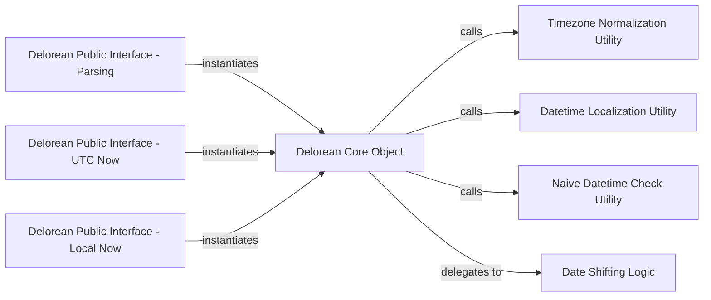

## Details

The `Delorean Core Object` subsystem is centered around the `delorean.dates.Delorean` class. Its boundaries encompass the public interface functions that instantiate `Delorean` objects and the internal utility functions that `Delorean` itself utilizes or delegates to for its core functionalities.

### Delorean Core Object [[Expand]](./Delorean_Core_Object.md)
The fundamental, immutable, timezone-aware datetime object. It encapsulates a standard `datetime` object and provides a rich set of methods for datetime manipulation (addition, subtraction, shifting), conversion (to naive, epoch), and human-readable output. It serves as the primary data structure and orchestrator for datetime operations within the library.

**Related Classes/Methods**:

- <a href="https://github.com/myusuf3/delorean/blob/master/delorean/dates.py#L174-L613" target="_blank" rel="noopener noreferrer">`delorean.dates.Delorean`:174-613</a>

### Delorean Public Interface - Parsing
A key public API function that acts as a factory for `Delorean` objects. It is responsible for parsing various input formats (e.g., strings, timestamps) into a `Delorean` instance, abstracting the underlying conversion logic.

**Related Classes/Methods**:

- <a href="https://github.com/myusuf3/delorean/blob/master/delorean/interface.py#L15-L105" target="_blank" rel="noopener noreferrer">`delorean.interface.parse`:15-105</a>

### Delorean Public Interface - UTC Now
A public API function providing a convenient way to instantiate a `Delorean` object representing the current Coordinated Universal Time (UTC).

**Related Classes/Methods**:

- <a href="https://github.com/myusuf3/delorean/blob/master/delorean/interface.py#L182-L186" target="_blank" rel="noopener noreferrer">`delorean.interface.utcnow`:182-186</a>

### Delorean Public Interface - Local Now
A public API function for creating a `Delorean` object representing the current local time, handling timezone considerations automatically.

**Related Classes/Methods**:

- <a href="https://github.com/myusuf3/delorean/blob/master/delorean/interface.py#L189-L197" target="_blank" rel="noopener noreferrer">`delorean.interface.now`:189-197</a>

### Timezone Normalization Utility
An internal helper function primarily used by `delorean.dates.Delorean` to normalize and consistently handle timezone information across different datetime operations, ensuring timezone awareness.

**Related Classes/Methods**:

- <a href="https://github.com/myusuf3/delorean/blob/master/delorean/dates.py#L137-L146" target="_blank" rel="noopener noreferrer">`delorean.dates.datetime_timezone`:137-146</a>

### Datetime Localization Utility
An internal utility function that `delorean.dates.Delorean` uses to apply specific timezone information to a naive datetime object, converting it into a timezone-aware datetime.

**Related Classes/Methods**:

- <a href="https://github.com/myusuf3/delorean/blob/master/delorean/dates.py#L149-L157" target="_blank" rel="noopener noreferrer">`delorean.dates.localize`:149-157</a>

### Naive Datetime Check Utility
An internal helper function called by `delorean.dates.Delorean` to determine if a given `datetime` object lacks timezone information, which is crucial for correct timezone handling.

**Related Classes/Methods**:

- <a href="https://github.com/myusuf3/delorean/blob/master/delorean/dates.py#L28-L35" target="_blank" rel="noopener noreferrer">`delorean.dates.is_datetime_naive`:28-35</a>

### Date Shifting Logic
An internal utility function to which `delorean.dates.Delorean` delegates the complex calculations involved in shifting dates by various intervals (e.g., days, months, years), encapsulating this specific logic.

**Related Classes/Methods**:

- <a href="https://github.com/myusuf3/delorean/blob/master/delorean/dates.py#L292-L315" target="_blank" rel="noopener noreferrer">`delorean.dates._shift_date`:292-315</a>

### [FAQ](https://github.com/CodeBoarding/GeneratedOnBoardings/tree/main?tab=readme-ov-file#faq)