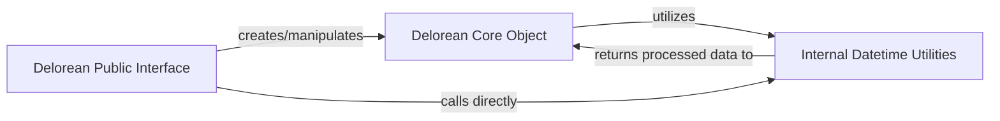

## Details

The `delorean` project is a Python utility library designed to simplify datetime operations through a clear, facade-driven architecture. It centers around the `Delorean Core Object`, a timezone-aware datetime wrapper, which is primarily accessed and manipulated via the `Delorean Public Interface`. This interface provides a user-friendly API, abstracting the complexities of datetime handling. Supporting these two main components are the `Internal Datetime Utilities`, a set of helper functions responsible for low-level timezone management and precise datetime calculations. This structure ensures a robust and easy-to-use library for managing time-related data, with distinct component boundaries that facilitate clear data and control flow for diagrammatic representation.

### Delorean Public Interface
Serves as the primary facade, offering a simplified and consistent API for common datetime operations. It acts as the user's direct entry point into the library, abstracting the underlying complexities of datetime handling and the `Delorean` core object.

**Related Classes/Methods**:

- <a href="https://github.com/myusuf3/delorean/blob/master/delorean/interface.py#L15-L105" target="_blank" rel="noopener noreferrer">`delorean.interface.parse`:15-105</a>
- <a href="https://github.com/myusuf3/delorean/blob/master/delorean/interface.py#L108-L113" target="_blank" rel="noopener noreferrer">`delorean.interface.range_daily`:108-113</a>
- <a href="https://github.com/myusuf3/delorean/blob/master/delorean/interface.py#L116-L121" target="_blank" rel="noopener noreferrer">`delorean.interface.range_hourly`:116-121</a>
- <a href="https://github.com/myusuf3/delorean/blob/master/delorean/interface.py#L124-L129" target="_blank" rel="noopener noreferrer">`delorean.interface.range_monthly`:124-129</a>
- <a href="https://github.com/myusuf3/delorean/blob/master/delorean/interface.py#L132-L137" target="_blank" rel="noopener noreferrer">`delorean.interface.range_yearly`:132-137</a>
- <a href="https://github.com/myusuf3/delorean/blob/master/delorean/interface.py#L140-L170" target="_blank" rel="noopener noreferrer">`delorean.interface.stops`:140-170</a>
- <a href="https://github.com/myusuf3/delorean/blob/master/delorean/interface.py#L173-L175" target="_blank" rel="noopener noreferrer">`delorean.interface.epoch`:173-175</a>
- <a href="https://github.com/myusuf3/delorean/blob/master/delorean/interface.py#L182-L186" target="_blank" rel="noopener noreferrer">`delorean.interface.utcnow`:182-186</a>
- <a href="https://github.com/myusuf3/delorean/blob/master/delorean/interface.py#L189-L197" target="_blank" rel="noopener noreferrer">`delorean.interface.now`:189-197</a>

### Delorean Core Object [[Expand]](./Delorean_Core_Object.md)
The central component of the library, encapsulating a timezone-aware datetime object. It provides the core manipulation capabilities and serves as the primary data structure around which most operations revolve. This object is often instantiated or returned by functions in the `Delorean Public Interface`.

**Related Classes/Methods**:

- <a href="https://github.com/myusuf3/delorean/blob/master/delorean/dates.py#L174-L613" target="_blank" rel="noopener noreferrer">`delorean.dates.Delorean`:174-613</a>
- <a href="https://github.com/myusuf3/delorean/blob/master/delorean/dates.py" target="_blank" rel="noopener noreferrer">`delorean.dates.Delorean.__init__`</a>
- <a href="https://github.com/myusuf3/delorean/blob/master/delorean/dates.py" target="_blank" rel="noopener noreferrer">`delorean.dates.Delorean.__add__`</a>
- <a href="https://github.com/myusuf3/delorean/blob/master/delorean/dates.py" target="_blank" rel="noopener noreferrer">`delorean.dates.Delorean.__sub__`</a>
- <a href="https://github.com/myusuf3/delorean/blob/master/delorean/dates.py" target="_blank" rel="noopener noreferrer">`delorean.dates.Delorean._shift_date`</a>
- <a href="https://github.com/myusuf3/delorean/blob/master/delorean/dates.py" target="_blank" rel="noopener noreferrer">`delorean.dates.Delorean.naive`</a>
- <a href="https://github.com/myusuf3/delorean/blob/master/delorean/dates.py" target="_blank" rel="noopener noreferrer">`delorean.dates.Delorean.start_of_day`</a>
- <a href="https://github.com/myusuf3/delorean/blob/master/delorean/dates.py" target="_blank" rel="noopener noreferrer">`delorean.dates.Delorean.epoch`</a>
- <a href="https://github.com/myusuf3/delorean/blob/master/delorean/dates.py" target="_blank" rel="noopener noreferrer">`delorean.dates.Delorean.replace`</a>
- <a href="https://github.com/myusuf3/delorean/blob/master/delorean/dates.py" target="_blank" rel="noopener noreferrer">`delorean.dates.Delorean.humanize`</a>

### Internal Datetime Utilities
This component consists of internal helper functions that support the `Delorean Core Object` by handling low-level datetime and timezone operations. These functions are crucial for ensuring correct timezone awareness, precise datetime manipulations, and interoperability with standard Python `datetime` objects. They are generally not exposed directly to the end-user.

**Related Classes/Methods**:

- <a href="https://github.com/myusuf3/delorean/blob/master/delorean/dates.py#L28-L35" target="_blank" rel="noopener noreferrer">`delorean.dates.is_datetime_naive`:28-35</a>
- <a href="https://github.com/myusuf3/delorean/blob/master/delorean/dates.py#L137-L146" target="_blank" rel="noopener noreferrer">`delorean.dates.datetime_timezone`:137-146</a>
- <a href="https://github.com/myusuf3/delorean/blob/master/delorean/dates.py#L160-L171" target="_blank" rel="noopener noreferrer">`delorean.dates.normalize`:160-171</a>
- <a href="https://github.com/myusuf3/delorean/blob/master/delorean/dates.py#L149-L157" target="_blank" rel="noopener noreferrer">`delorean.dates.localize`:149-157</a>
- <a href="https://github.com/myusuf3/delorean/blob/master/delorean/dates.py#L45-L56" target="_blank" rel="noopener noreferrer">`delorean.dates._move_datetime`:45-56</a>
- <a href="https://github.com/myusuf3/delorean/blob/master/delorean/dates.py#L20-L25" target="_blank" rel="noopener noreferrer">`delorean.dates.get_total_second`:20-25</a>

### [FAQ](https://github.com/CodeBoarding/GeneratedOnBoardings/tree/main?tab=readme-ov-file#faq)