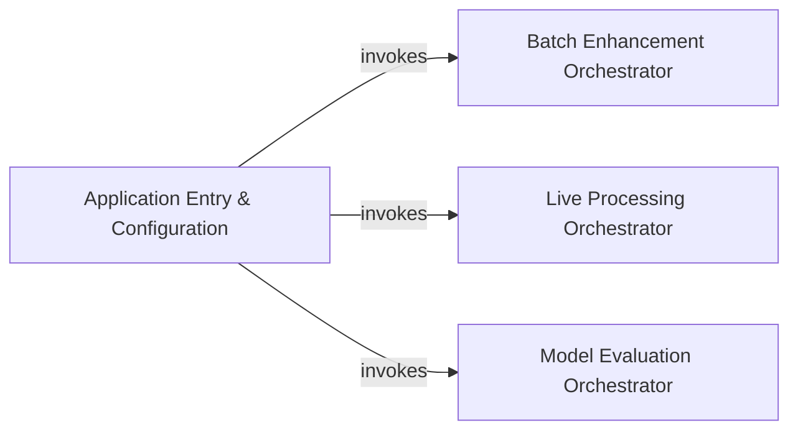

## Details

The Application Entry & Configuration subsystem acts as the primary interface and control hub for the denoiser application. Its boundaries encompass the initial setup, configuration parsing, and the high-level dispatching of control to the specific operational modes: batch enhancement, live processing, and model evaluation.

### Application Entry & Configuration [[Expand]](./Application_Entry_Configuration.md)
This component serves as the primary entry point for the denoiser application. It is responsible for parsing command-line arguments, initializing and managing the application's configuration using Hydra, and dynamically dispatching control to the appropriate operational module (batch enhancement, live processing, or model evaluation) based on the parsed configuration and user commands. It acts as the central orchestrator that sets up the environment and directs the overall execution flow.

**Related Classes/Methods**:

- <a href="https://github.com/facebookresearch/denoiser/blob/main/denoiser/enhance.py" target="_blank" rel="noopener noreferrer">`denoiser.enhance`</a>
- <a href="https://github.com/facebookresearch/denoiser/blob/main/denoiser/live.py" target="_blank" rel="noopener noreferrer">`denoiser.live`</a>
- <a href="https://github.com/facebookresearch/denoiser/blob/main/denoiser/evaluate.py" target="_blank" rel="noopener noreferrer">`denoiser.evaluate`</a>

### Batch Enhancement Orchestrator
This component is responsible for orchestrating the batch enhancement process. It takes configured parameters and manages the flow of applying the denoising model to a set of audio inputs in a non-real-time, batch-oriented manner.

**Related Classes/Methods**:

- <a href="https://github.com/facebookresearch/denoiser/blob/main/denoiser/enhance.py" target="_blank" rel="noopener noreferrer">`denoiser.enhance`</a>

### Live Processing Orchestrator
This component orchestrates the real-time live audio processing. It handles the setup of audio input/output streams, applies the denoising model with low latency, and manages the continuous flow of audio data.

**Related Classes/Methods**:

- <a href="https://github.com/facebookresearch/denoiser/blob/main/denoiser/live.py" target="_blank" rel="noopener noreferrer">`denoiser.live`</a>

### Model Evaluation Orchestrator
This component is responsible for orchestrating the model evaluation process. It manages the loading of evaluation datasets, running the denoising model against them, and collecting metrics to assess model performance.

**Related Classes/Methods**:

- <a href="https://github.com/facebookresearch/denoiser/blob/main/denoiser/evaluate.py" target="_blank" rel="noopener noreferrer">`denoiser.evaluate`</a>

### [FAQ](https://github.com/CodeBoarding/GeneratedOnBoardings/tree/main?tab=readme-ov-file#faq)