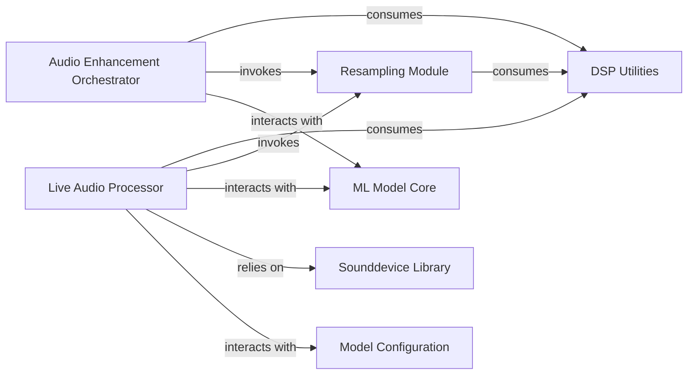

## Details

The denoiser project is structured around a core ML Model Core for audio enhancement, supported by specialized components for both batch and real-time processing. The Audio Enhancement Orchestrator manages file-based audio processing, while the Live Audio Processor handles real-time audio streams using the Sounddevice Library. Both processing paths rely on DSP Utilities for fundamental signal processing and the Resampling Module for sample rate adjustments. Model Configuration provides essential parameters to the ML Model Core, ensuring its proper operation across all modes. This architecture enables flexible and efficient audio denoising for various applications.

### DSP Utilities
Provides foundational digital signal processing functions, including low-level operations such as frequency conversions (e.g., Mel scale transformations) and basic audio channel manipulations. It serves as a toolkit for preparing audio data for further processing or feature extraction.

**Related Classes/Methods**:

- <a href="https://github.com/facebookresearch/denoiser/blob/main/denoiser/dsp.py" target="_blank" rel="noopener noreferrer">`denoiser.dsp`</a>

### Resampling Module
Manages the upsampling and downsampling of audio signals, typically using sinc interpolation. This is critical for adapting audio data to specific sample rates required by the ML Model Core or output audio devices, ensuring audio quality is maintained during conversion.

**Related Classes/Methods**:

- <a href="https://github.com/facebookresearch/denoiser/blob/main/denoiser/resample.py" target="_blank" rel="noopener noreferrer">`denoiser.resample`</a>

### Audio Enhancement Orchestrator
Orchestrates the end-to-end batch audio enhancement pipeline. This component handles loading audio datasets from files, performing inference using the ML Model Core, and saving the processed output. It acts as the primary interface for non-real-time, file-based audio enhancement tasks, embodying the 'ML Toolkit/Library' aspect of the project.

**Related Classes/Methods**:

- <a href="https://github.com/facebookresearch/denoiser/blob/main/denoiser/enhance.py" target="_blank" rel="noopener noreferrer">`denoiser.enhance`</a>

### Live Audio Processor
Manages real-time audio input and output streams, typically facilitated by the Sounddevice Library. It parses command-line arguments to configure audio devices and integrates with the ML Model Core for live, low-latency audio enhancement, providing the interactive 'CLI Tool' experience.

**Related Classes/Methods**:

- <a href="https://github.com/facebookresearch/denoiser/blob/main/denoiser/live.py" target="_blank" rel="noopener noreferrer">`denoiser.live`</a>

### ML Model Core
This component encapsulates the trained machine learning model responsible for the core audio denoising or enhancement logic. It receives processed audio features and outputs enhanced audio, acting as the central intelligence for the system.

**Related Classes/Methods**: _None_

### Sounddevice Library
An external dependency that provides low-level access to audio input and output devices. It is crucial for real-time audio processing, enabling the Live Audio Processor to capture and play back audio streams.

**Related Classes/Methods**: _None_

### Model Configuration
This component is responsible for loading, parsing, and managing the configuration parameters and weights for the ML Model Core. It ensures the model is correctly initialized and behaves as expected based on predefined settings.

**Related Classes/Methods**: _None_

### [FAQ](https://github.com/CodeBoarding/GeneratedOnBoardings/tree/main?tab=readme-ov-file#faq)