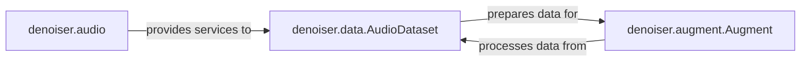

## Details

The `Data Management & Augmentation` subsystem is responsible for preparing and augmenting audio datasets, feeding processed data to the model operations. It primarily involves the `denoiser.data`, `denoiser.audio`, and `denoiser.augment` modules.

### denoiser.data.AudioDataset
This component acts as the central orchestrator of the data pipeline. Its core responsibility is to load raw audio files, match noisy and clean audio pairs, and structure them into a dataset suitable for consumption by the model's training or inference modules. It serves as the primary interface for data provisioning.

**Related Classes/Methods**:

- <a href="https://github.com/facebookresearch/denoiser/blob/main/denoiser/data.py" target="_blank" rel="noopener noreferrer">`denoiser.data.AudioDataset`</a>

### denoiser.augment.Augment
This component is dedicated to applying various data augmentation techniques to the prepared audio data. Its role is critical for enhancing the diversity and robustness of the training dataset, which in turn helps improve the generalization capabilities of the model. It processes data received from the `AudioDataset`.

**Related Classes/Methods**:

- <a href="https://github.com/facebookresearch/denoiser/blob/main/denoiser/augment.py" target="_blank" rel="noopener noreferrer">`denoiser.augment.Augment`</a>

### denoiser.audio
This module functions as a foundational utility layer, providing low-level operations for interacting with audio files. It is responsible for discovering audio files within the file system and extracting essential metadata required for data loading and pairing. It supports the `AudioDataset` by providing the raw information needed.

**Related Classes/Methods**:

- <a href="https://github.com/facebookresearch/denoiser/blob/main/denoiser/audio.py" target="_blank" rel="noopener noreferrer">`denoiser.audio`</a>

### [FAQ](https://github.com/CodeBoarding/GeneratedOnBoardings/tree/main?tab=readme-ov-file#faq)