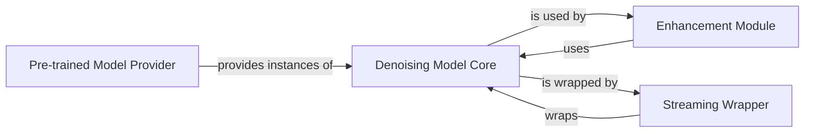

## Details

The Denoising Model Core subsystem is centered around the denoiser.demucs module, specifically the Demucs class, which encapsulates the core encoder-decoder deep learning model. This subsystem extends to components that directly interact with, wrap, or provide instances of this core model, enabling its application in various contexts such as general enhancement, streaming, and pre-trained model loading.

### Denoising Model Core [[Expand]](./Denoising_Model_Core.md)
The foundational deep learning model for audio denoising, implementing an encoder-decoder neural network architecture with skip connections. It contains the core forward pass logic and internal mechanisms for processing audio data. This is the primary component, embodying the project's core ML functionality.

**Related Classes/Methods**:

- <a href="https://github.com/facebookresearch/denoiser/blob/main/denoiser/demucs.py" target="_blank" rel="noopener noreferrer">`denoiser.demucs.Demucs`</a>
- <a href="https://github.com/facebookresearch/denoiser/blob/main/denoiser/demucs.py" target="_blank" rel="noopener noreferrer">`denoiser.demucs.Demucs:__init__`</a>
- <a href="https://github.com/facebookresearch/denoiser/blob/main/denoiser/demucs.py" target="_blank" rel="noopener noreferrer">`denoiser.demucs.Demucs:feed`</a>
- <a href="https://github.com/facebookresearch/denoiser/blob/main/denoiser/demucs.py" target="_blank" rel="noopener noreferrer">`denoiser.demucs.Demucs:_separate_frame`</a>
- <a href="https://github.com/facebookresearch/denoiser/blob/main/denoiser/demucs.py" target="_blank" rel="noopener noreferrer">`denoiser.demucs.Demucs:BLSTM`</a>
- <a href="https://github.com/facebookresearch/denoiser/blob/main/denoiser/demucs.py" target="_blank" rel="noopener noreferrer">`denoiser.demucs.Demucs:rescale_module`</a>
- <a href="https://github.com/facebookresearch/denoiser/blob/main/denoiser/demucs.py" target="_blank" rel="noopener noreferrer">`denoiser.demucs.Demucs:valid_length`</a>
- <a href="https://github.com/facebookresearch/denoiser/blob/main/denoiser/demucs.py" target="_blank" rel="noopener noreferrer">`denoiser.demucs.Demucs:fast_conv`</a>
- <a href="https://github.com/facebookresearch/denoiser/blob/main/denoiser/demucs.py" target="_blank" rel="noopener noreferrer">`denoiser.demucs.Demucs:time_per_frame`</a>

### Enhancement Module
This component is responsible for applying the denoising process to input audio by directly interacting with the Denoising Model Core. It serves as a high-level interface for users or other system components to utilize the trained model for inference on audio files or streams.

**Related Classes/Methods**:

- <a href="https://github.com/facebookresearch/denoiser/blob/main/denoiser/enhance.py" target="_blank" rel="noopener noreferrer">`denoiser.enhance`</a>

### Streaming Wrapper
Wraps the Denoising Model Core to provide streaming inference capabilities. It manages internal state and buffers, enabling continuous, real-time processing of audio data, which is crucial for the CLI tool's live processing features.

**Related Classes/Methods**:

- <a href="https://github.com/facebookresearch/denoiser/blob/main/denoiser/demucs.py#L219-L417" target="_blank" rel="noopener noreferrer">`denoiser.demucs.DemucsStreamer`:219-417</a>

### Pre-trained Model Provider
Acts as a factory or registry, providing pre-configured instances of Demucs models. This component simplifies the loading and management of pre-trained weights, making it easier for users to get started without extensive training.

**Related Classes/Methods**:

- <a href="https://github.com/facebookresearch/denoiser/blob/main/denoiser/pretrained.py" target="_blank" rel="noopener noreferrer">`denoiser.pretrained`</a>

### [FAQ](https://github.com/CodeBoarding/GeneratedOnBoardings/tree/main?tab=readme-ov-file#faq)