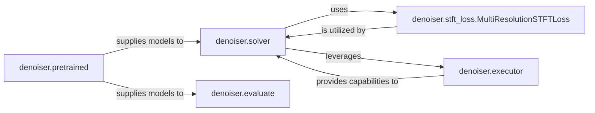

## Details

Model Operations & Evaluation subsystem

### denoiser.solver
Manages the entire training process, including epoch iteration, model state management (serialization, copying, swapping), and metric collection. It acts as the central training loop controller.

**Related Classes/Methods**:

- <a href="https://github.com/facebookresearch/denoiser/blob/main/denoiser/solver.py" target="_blank" rel="noopener noreferrer">`denoiser.solver`</a>

### denoiser.stft_loss.MultiResolutionSTFTLoss
Computes the Short-Time Fourier Transform (STFT) based loss, which is a critical metric for training audio denoising models. It aggregates various STFT loss components.

**Related Classes/Methods**:

- <a href="https://github.com/facebookresearch/denoiser/blob/main/denoiser/stft_loss.py#L102-L144" target="_blank" rel="noopener noreferrer">`denoiser.stft_loss.MultiResolutionSTFTLoss`:102-144</a>

### denoiser.executor
Manages the setup and execution of distributed data parallel (DDP) workers, crucial for scaling training operations.

**Related Classes/Methods**:

- <a href="https://github.com/facebookresearch/denoiser/blob/main/denoiser/executor.py" target="_blank" rel="noopener noreferrer">`denoiser.executor`</a>

### denoiser.evaluate
Orchestrates the evaluation of denoising models, running various audio quality metrics (e.g., STOI, PESQ) to assess performance.

**Related Classes/Methods**:

- <a href="https://github.com/facebookresearch/denoiser/blob/main/denoiser/evaluate.py" target="_blank" rel="noopener noreferrer">`denoiser.evaluate`</a>

### denoiser.pretrained
Provides an interface for loading pre-trained denoising models, acting as a factory for different model variants. This allows users to easily access and utilize pre-trained weights.

**Related Classes/Methods**:

- <a href="https://github.com/facebookresearch/denoiser/blob/main/denoiser/pretrained.py" target="_blank" rel="noopener noreferrer">`denoiser.pretrained`</a>

### [FAQ](https://github.com/CodeBoarding/GeneratedOnBoardings/tree/main?tab=readme-ov-file#faq)