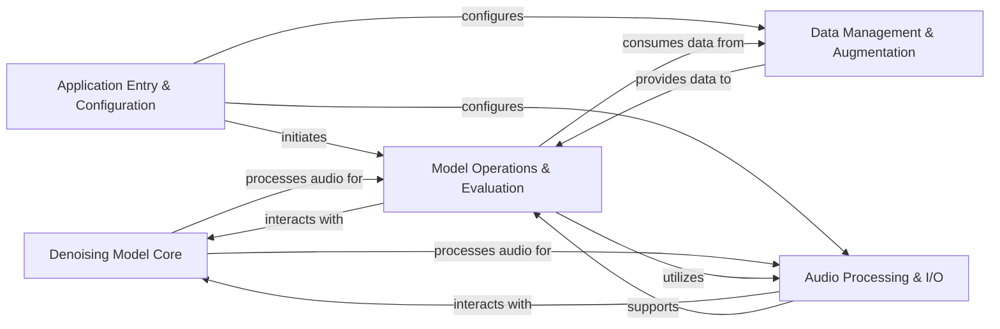

## Details

The `denoiser` project is structured around a core `Denoising Model Core` (an encoder-decoder deep learning model) that performs the primary audio denoising. The `Application Entry & Configuration` component acts as the central control, interpreting user commands and configurations to orchestrate various operational flows, including initiating training, batch enhancement, real-time processing, and model evaluation. It configures and directs data flow to other key components.

`Data Management & Augmentation` is responsible for preparing and augmenting audio datasets, providing the necessary input to the `Model Operations & Evaluation` component. This `Model Operations & Evaluation` component manages the entire lifecycle of the denoising model, encompassing training, loss computation, distributed execution, and performance assessment, and also handles the loading of pre-trained models. It interacts directly with the `Denoising Model Core` and consumes data from `Data Management & Augmentation`.

Finally, `Audio Processing & I/O` provides low-level signal manipulation, resampling, and handles audio device interactions. It supports both the `Denoising Model Core` and various operational modules, ensuring efficient audio input and output throughout the system. This architecture promotes clear separation of concerns, facilitating maintainability and scalability, with data flowing from configuration and data preparation through model operations and evaluation, leveraging the core denoising model and audio processing utilities.

### Denoising Model Core [[Expand]](./Denoising_Model_Core.md)
an encoder-decoder deep learning model

**Related Classes/Methods**:

- <a href="https://github.com/facebookresearch/denoiser/blob/main/denoiser/demucs.py" target="_blank" rel="noopener noreferrer">`denoiser.demucs`</a>

### Application Entry & Configuration [[Expand]](./Application_Entry_Configuration.md)
acts as the central orchestrator, interpreting user commands and configurations (leveraging Hydra) to direct control to specific operational flows: batch enhancement, real-time live processing, or model evaluation. It initiates the training process, which is then handled by the Model Operations & Evaluation component.

**Related Classes/Methods**:

- <a href="https://github.com/facebookresearch/denoiser/blob/main/denoiser/enhance.py" target="_blank" rel="noopener noreferrer">`denoiser.enhance`</a>
- <a href="https://github.com/facebookresearch/denoiser/blob/main/denoiser/live.py" target="_blank" rel="noopener noreferrer">`denoiser.live`</a>
- <a href="https://github.com/facebookresearch/denoiser/blob/main/denoiser/evaluate.py" target="_blank" rel="noopener noreferrer">`denoiser.evaluate`</a>

### Data Management & Augmentation [[Expand]](./Data_Management_Augmentation.md)
responsible for preparing and augmenting audio datasets, feeding processed data to the model operations.

**Related Classes/Methods**:

- <a href="https://github.com/facebookresearch/denoiser/blob/main/denoiser/data.py" target="_blank" rel="noopener noreferrer">`denoiser.data`</a>
- <a href="https://github.com/facebookresearch/denoiser/blob/main/denoiser/audio.py" target="_blank" rel="noopener noreferrer">`denoiser.audio`</a>
- <a href="https://github.com/facebookresearch/denoiser/blob/main/denoiser/augment.py" target="_blank" rel="noopener noreferrer">`denoiser.augment`</a>

### Model Operations & Evaluation [[Expand]](./Model_Operations_Evaluation.md)
manages the complete lifecycle of the denoising model, including training, loss computation, distributed execution, and performance assessment, and also handles the loading of pre-trained models.

**Related Classes/Methods**:

- <a href="https://github.com/facebookresearch/denoiser/blob/main/denoiser/solver.py" target="_blank" rel="noopener noreferrer">`denoiser.solver`</a>
- <a href="https://github.com/facebookresearch/denoiser/blob/main/denoiser/stft_loss.py" target="_blank" rel="noopener noreferrer">`denoiser.stft_loss`</a>
- <a href="https://github.com/facebookresearch/denoiser/blob/main/denoiser/executor.py" target="_blank" rel="noopener noreferrer">`denoiser.executor`</a>
- <a href="https://github.com/facebookresearch/denoiser/blob/main/denoiser/evaluate.py" target="_blank" rel="noopener noreferrer">`denoiser.evaluate`</a>
- <a href="https://github.com/facebookresearch/denoiser/blob/main/denoiser/pretrained.py" target="_blank" rel="noopener noreferrer">`denoiser.pretrained`</a>

### Audio Processing & I/O [[Expand]](./Audio_Processing_I_O.md)
provides essential low-level signal manipulation, resampling, and handles audio device interactions for both input and output, supporting the model core and various operational modules.

**Related Classes/Methods**:

- <a href="https://github.com/facebookresearch/denoiser/blob/main/denoiser/dsp.py" target="_blank" rel="noopener noreferrer">`denoiser.dsp`</a>
- <a href="https://github.com/facebookresearch/denoiser/blob/main/denoiser/resample.py" target="_blank" rel="noopener noreferrer">`denoiser.resample`</a>
- <a href="https://github.com/facebookresearch/denoiser/blob/main/denoiser/enhance.py" target="_blank" rel="noopener noreferrer">`denoiser.enhance`</a>
- <a href="https://github.com/facebookresearch/denoiser/blob/main/denoiser/live.py" target="_blank" rel="noopener noreferrer">`denoiser.live`</a>

### [FAQ](https://github.com/CodeBoarding/GeneratedOnBoardings/tree/main?tab=readme-ov-file#faq)