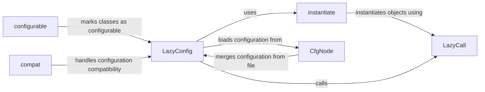

## Component Details

The Configuration Management subsystem in Detectron2 provides a flexible and extensible way to manage the configuration of the entire system. It uses a hierarchical configuration object (CfgNode) to store configuration values, and it provides mechanisms for loading configurations from files, applying overrides, and instantiating objects based on the configuration. The LazyConfig system allows for lazy loading and instantiation of objects, which can improve performance. The configurable decorator allows classes and functions to be easily integrated into the configuration system. The compat module ensures compatibility between different versions of the configuration format.

### LazyConfig
LazyConfig is responsible for managing the configuration data in a lazy manner. It handles loading, saving, and applying overrides to configuration files. Values are computed only when accessed, optimizing performance. It provides methods for loading configurations from files, saving them, applying overrides, and converting the configuration to a Python dictionary.
- **Related Classes/Methods**: `detectron2.config.lazy.LazyConfig:load_rel`, `detectron2.config.lazy.LazyConfig:load`, `detectron2.config.lazy.LazyConfig:save`, `detectron2.config.lazy.LazyConfig:apply_overrides`, `detectron2.config.lazy.LazyConfig:to_py`

### LazyCall
LazyCall is a callable object that delays the instantiation of a class or function until it is actually called. It stores the class or function to be called, along with its arguments, and only instantiates the object when the LazyCall is invoked. This allows for lazy instantiation of objects, which can improve performance by avoiding unnecessary object creation.
- **Related Classes/Methods**: `detectron2.config.lazy.LazyCall:__call__`

### instantiate
The `instantiate` function is responsible for creating instances of objects based on a given configuration. It takes a configuration dictionary as input and uses it to determine the class to instantiate and the arguments to pass to the constructor. It handles the instantiation process and returns the created object.
- **Related Classes/Methods**: `detectron2.config.instantiate:instantiate`

### CfgNode
CfgNode is a class that represents a hierarchical configuration object. It allows for storing and accessing configuration values in a structured manner. The `merge_from_file` method allows loading configuration values from a file and merging them into the existing configuration.
- **Related Classes/Methods**: `detectron2.config.config.CfgNode:merge_from_file`

### configurable
The `configurable` decorator is used to mark classes or functions as configurable. It allows the configuration system to recognize and handle these classes or functions during the instantiation process. It essentially registers the class/function with the configuration system.
- **Related Classes/Methods**: `detectron2.config.config:configurable`

### compat
The `compat` module handles compatibility between different versions of the configuration format. It provides functions for upgrading and downgrading configurations to ensure that they are compatible with the current version of the software. It includes version guessing and renaming utilities.
- **Related Classes/Methods**: `detectron2.config.compat:guess_version`, `detectron2.config.compat:_rename`, `detectron2.config.compat._RenameConverter:upgrade`, `detectron2.config.compat._RenameConverter:downgrade`, `detectron2.config.compat.ConverterV2:upgrade`, `detectron2.config.compat.ConverterV2:downgrade`
