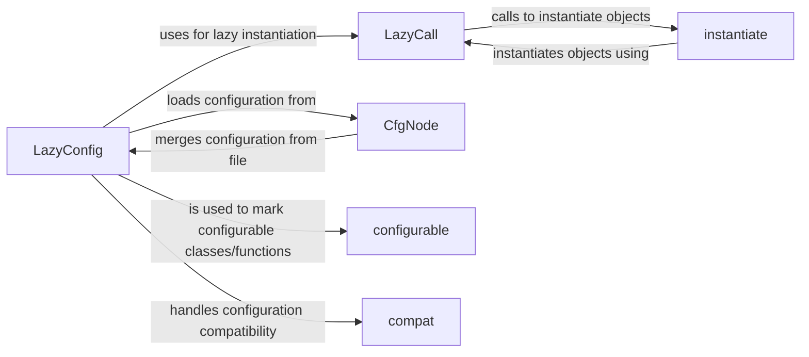

## Component Details

The configuration management system in Detectron2 provides a flexible and extensible way to manage the configuration of the entire system. It uses a combination of CfgNodes, LazyConfig, LazyCall, and the instantiate function to allow users to easily modify and experiment with different settings without changing the code. The system supports loading configurations from files, saving them to files, applying overrides to the configuration values, and converting the configuration to a Python dictionary. It also handles compatibility between different versions of the configuration system.

### LazyConfig
LazyConfig is responsible for managing the configuration data in a lazy manner. It handles loading, saving, and applying overrides to configuration files. Values are computed only when accessed, improving performance and reducing memory usage. It interacts with CfgNode for storing configuration data, LazyCall for lazy instantiation, and the compat module for handling compatibility between different versions of the configuration system.
- **Related Classes/Methods**: `detectron2.config.lazy.LazyConfig:load_rel`, `detectron2.config.lazy.LazyConfig:load`, `detectron2.config.lazy.LazyConfig:save`, `detectron2.config.lazy.LazyConfig:apply_overrides`, `detectron2.config.lazy.LazyConfig:to_py`

### LazyCall
LazyCall defers the instantiation of an object until it is actually needed. It stores the function or class to be called, along with its arguments, and only instantiates the object when the LazyCall is called. This enables lazy evaluation of configuration values, improving performance and reducing memory usage. It interacts with the instantiate function to create objects when called.
- **Related Classes/Methods**: `detectron2.config.lazy.LazyCall:__call__`

### instantiate
The `instantiate` function creates instances of objects based on a configuration. It takes a configuration object as input and returns an instance of the object specified in the configuration. It handles the instantiation of objects with complex dependencies and ensures that all required arguments are provided. It is used by LazyCall to instantiate objects and relies on the configuration data provided by LazyConfig.
- **Related Classes/Methods**: `detectron2.config.instantiate:instantiate`

### CfgNode
CfgNode represents a configuration node, storing configuration values and providing methods for accessing and modifying them. It supports merging configurations from files and overriding configuration values. It is the primary data structure for storing configuration information and is used by LazyConfig to manage configuration data.
- **Related Classes/Methods**: `detectron2.config.config.CfgNode:merge_from_file`

### configurable
The `configurable` decorator marks functions or classes as configurable, allowing the configuration system to automatically discover and configure them. It provides a way to specify the arguments that can be configured for a function or class. LazyConfig uses this to identify configurable components.
- **Related Classes/Methods**: `detectron2.config.config:configurable`

### compat
The `compat` module handles compatibility between different versions of the configuration system. It provides functions for upgrading and downgrading configurations, as well as for renaming configuration options. This ensures that configurations created with older versions of the system can be used with newer versions, and vice versa. LazyConfig uses this module to ensure compatibility.
- **Related Classes/Methods**: `detectron2.config.compat:guess_version`, `detectron2.config.compat:_rename`, `detectron2.config.compat._RenameConverter:upgrade`, `detectron2.config.compat._RenameConverter:downgrade`, `detectron2.config.compat.ConverterV2:upgrade`, `detectron2.config.compat.ConverterV2:downgrade`
