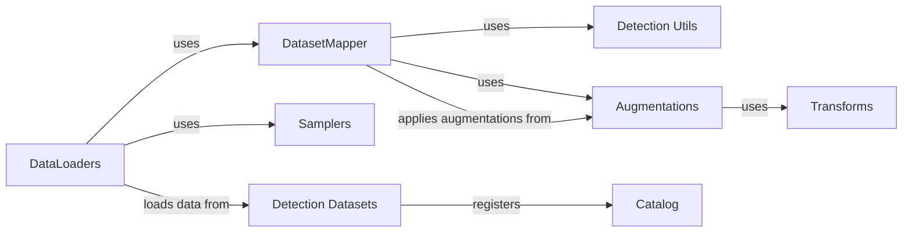

## Component Details

The Data Processing Pipeline in Detectron2 is responsible for efficiently loading, transforming, and augmenting training and evaluation data to prepare it for model training and inference. It encompasses dataset loading, data transformation, and augmentation techniques to enhance model performance and generalization. The pipeline ensures data consistency and facilitates seamless integration with various datasets and augmentation strategies.

### DatasetMapper
The DatasetMapper transforms dataset items (images and annotations) into the format expected by the model. It applies augmentations and transformations defined in the configuration, using `detection_utils` to transform annotations and `build_augmentation` to create augmentations. It acts as a bridge between the raw dataset and the model's input requirements.
- **Related Classes/Methods**: `detectron2.data.dataset_mapper.DatasetMapper`

### DataLoaders
The data loaders (`build_detection_train_loader`, `build_detection_test_loader`) create iterators that yield batches of data for training and testing. They utilize the `DatasetMapper` to process individual data items and apply augmentations. They also employ samplers to control the order in which data is loaded, supporting distributed training. These loaders are essential for feeding data to the model during training and evaluation.
- **Related Classes/Methods**: `detectron2.data.build.build_detection_train_loader`, `detectron2.data.build.build_detection_test_loader`

### Detection Datasets
These modules define functions for loading and registering various detection datasets, such as COCO, Cityscapes, and LVIS. They handle reading the dataset annotations and converting them into a standard format that Detectron2 can use. The datasets are registered with the `Catalog`, making them accessible to the data loaders.
- **Related Classes/Methods**: `detectron2.data.datasets.coco`, `detectron2.data.datasets.cityscapes`, `detectron2.data.datasets.lvis`, `detectron2.data.datasets.builtin`

### Augmentations
This module defines the Augmentation class and related functions for applying augmentations to images and annotations. It combines basic transformations into more complex augmentation pipelines. These augmentations are used by the `DatasetMapper` to increase the diversity of the training data and improve the model's generalization ability.
- **Related Classes/Methods**: `detectron2.data.transforms.augmentation`

### Transforms
This module defines basic transformation operations, such as resize and rotation, used in augmentations. These transformations are building blocks for more complex augmentations. They provide the fundamental operations for manipulating images and annotations.
- **Related Classes/Methods**: `detectron2.data.transforms.transform`

### Catalog
This module provides a way to register and access metadata about datasets, such as the location of the data and the format of the annotations. It allows Detectron2 to easily access and manage different datasets. The Catalog acts as a central registry for datasets.
- **Related Classes/Methods**: `detectron2.data.catalog`

### Samplers
This module implements samplers that control the order in which data is loaded. It includes samplers for training and inference, as well as samplers that support distributed training. The samplers are used by the data loaders to control data access patterns.
- **Related Classes/Methods**: `detectron2.data.samplers.distributed_sampler`

### Detection Utils
This module provides utility functions for data loading and processing, such as reading images, transforming annotations, and converting between different annotation formats. It is used by the `DatasetMapper` and dataset loading functions to perform common data manipulation tasks.
- **Related Classes/Methods**: `detectron2.data.detection_utils`
