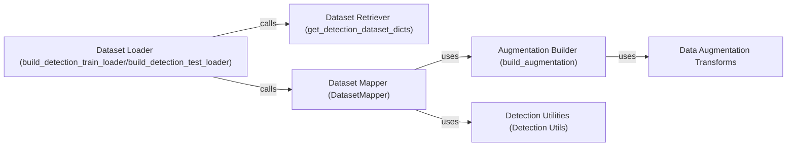

## Component Details

The Data Processing Pipeline is responsible for preparing data for training and evaluation in Detectron2. It encompasses loading datasets, transforming them into a suitable format, and applying data augmentations to enhance model robustness and generalization. The pipeline consists of several key components that work together to efficiently process and deliver data to the model.

### Dataset Loader (build_detection_train_loader/build_detection_test_loader)
This component is responsible for creating data loaders for both training and testing phases. It takes dataset configurations as input and uses internal functions (`_train_loader_from_config`, `_test_loader_from_config`) to instantiate the data loaders. These data loaders yield batches of data ready for consumption by the model during training or evaluation.
- **Related Classes/Methods**: `detectron2.data.build:build_detection_train_loader`, `detectron2.data.build:build_detection_test_loader`, `detectron2.data.build:_train_loader_from_config`, `detectron2.data.build:_test_loader_from_config`

### Dataset Retriever (get_detection_dataset_dicts)
This component focuses on retrieving dataset dictionaries, which contain essential information about images and their annotations. It loads the dataset from a specified source and returns a list of dictionaries. Each dictionary represents an image and its associated metadata, providing a structured representation of the dataset.
- **Related Classes/Methods**: `detectron2.data.build:get_detection_dataset_dicts`

### Dataset Mapper (DatasetMapper)
The DatasetMapper component transforms dataset items (images and annotations) into a format suitable for training or inference. It applies augmentations, converts annotations to instances, and performs other necessary data preprocessing steps. It orchestrates the data transformation process, ensuring that the data is in the correct format for the model.
- **Related Classes/Methods**: `detectron2.data.dataset_mapper.DatasetMapper`

### Augmentation Builder (build_augmentation)
This component constructs the augmentation pipeline based on the provided configuration. It defines the sequence of transformations to be applied to images and annotations, such as resizing, flipping, and color jittering. It acts as a factory for creating the augmentation pipeline, enabling flexible data augmentation strategies.
- **Related Classes/Methods**: `detectron2.data.detection_utils:build_augmentation`

### Data Augmentation Transforms
This component encompasses the individual transformation operations that are applied to images and annotations. These transformations, such as RandomFlip, Resize, and RandomRotation, increase the diversity of the training data and improve the model's robustness. They are the building blocks of the augmentation pipeline, providing a wide range of data augmentation techniques.
- **Related Classes/Methods**: `detectron2.data.transforms.augmentation_impl.RandomFlip`, `detectron2.data.transforms.augmentation_impl.Resize`, `detectron2.data.transforms.augmentation_impl.RandomRotation`, `detectron2.data.transforms.augmentation_impl.RandomCrop`, `detectron2.data.transforms.augmentation_impl.RandomExtent`, `detectron2.data.transforms.augmentation_impl.RandomContrast`, `detectron2.data.transforms.augmentation_impl.RandomBrightness`, `detectron2.data.transforms.augmentation_impl.RandomSaturation`, `detectron2.data.transforms.augmentation_impl.RandomLighting`, `detectron2.data.transforms.augmentation_impl.RandomResize`

### Detection Utilities (Detection Utils)
This component provides utility functions for data loading, image processing, and annotation handling. It includes functions for reading images, checking image sizes, transforming instance annotations, and converting annotations to instances. It offers a set of tools for common data processing tasks, simplifying the implementation of the data pipeline.
- **Related Classes/Methods**: `detectron2.data.detection_utils:read_image`, `detectron2.data.detection_utils:check_image_size`, `detectron2.data.detection_utils:transform_instance_annotations`, `detectron2.data.detection_utils:annotations_to_instances`, `detectron2.data.detection_utils:annotations_to_instances_rotated`, `detectron2.data.detection_utils:transform_proposals`
