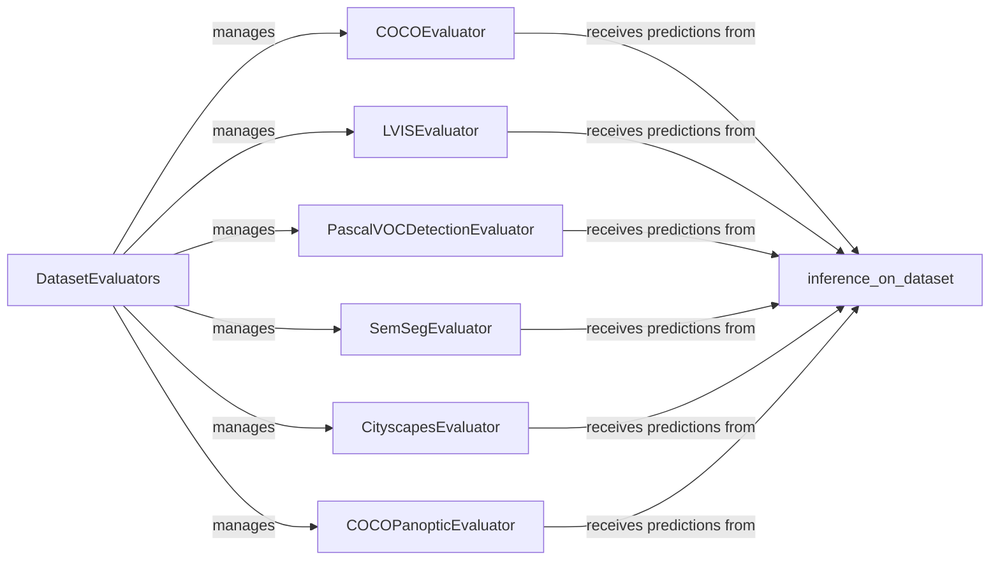

## Component Details

The evaluation and metrics component in Detectron2 is responsible for assessing the performance of trained models on various datasets. It provides a suite of evaluators tailored for different tasks such as object detection, segmentation, and pose estimation. The core flow involves feeding model predictions and ground truth data to the appropriate evaluator, which then computes relevant metrics like mAP, mIoU, and PQ. These metrics provide a quantitative measure of the model's accuracy and are crucial for model selection and improvement.

### DatasetEvaluators
This component manages a collection of evaluators, each responsible for evaluating a specific dataset or aspect of the model's performance. It orchestrates the evaluation process by iterating through the registered evaluators and calling their `evaluate` methods. This allows for a modular and extensible evaluation pipeline.
- **Related Classes/Methods**: `detectron2.evaluation.evaluator.DatasetEvaluators`

### COCOEvaluator
The COCOEvaluator is designed to evaluate object detection and segmentation results in the COCO format. It takes model predictions, converts them into the COCO JSON format, and then utilizes the COCO API (pycocotools) to calculate standard metrics such as mean Average Precision (mAP) and Average Recall (AR).
- **Related Classes/Methods**: `detectron2.evaluation.coco_evaluation.COCOEvaluator`

### LVISEvaluator
The LVISEvaluator is similar to the COCOEvaluator but is specifically adapted for evaluating object detection results on the LVIS dataset. LVIS is characterized by a large vocabulary of object categories with varying frequencies, and this evaluator is designed to handle the challenges posed by this dataset.
- **Related Classes/Methods**: `detectron2.evaluation.lvis_evaluation.LVISEvaluator`

### PascalVOCDetectionEvaluator
This evaluator assesses object detection performance in the Pascal VOC format. It calculates precision and recall for each object class and then computes the average precision (AP) as the primary metric. It follows the evaluation protocol established by the Pascal VOC challenge.
- **Related Classes/Methods**: `detectron2.evaluation.pascal_voc_evaluation.PascalVOCDetectionEvaluator`, `detectron2.evaluation.pascal_voc_evaluation.parse_rec`, `detectron2.evaluation.pascal_voc_evaluation.voc_eval`

### SemSegEvaluator
The SemSegEvaluator evaluates semantic segmentation results by computing pixel-wise accuracy and Intersection over Union (IoU) for each semantic class. It provides a detailed assessment of the model's ability to accurately classify each pixel in an image.
- **Related Classes/Methods**: `detectron2.evaluation.sem_seg_evaluation.SemSegEvaluator`

### CityscapesEvaluator
This component is specialized for evaluating instance and semantic segmentation results on the Cityscapes dataset. It incorporates metrics and tools specifically designed for this dataset, taking into account its unique characteristics and evaluation protocols.
- **Related Classes/Methods**: `detectron2.evaluation.cityscapes_evaluation.CityscapesEvaluator`, `detectron2.evaluation.cityscapes_evaluation.CityscapesInstanceEvaluator`, `detectron2.evaluation.cityscapes_evaluation.CityscapesSemSegEvaluator`

### COCOPanopticEvaluator
The COCOPanopticEvaluator evaluates panoptic segmentation results in the COCO format. It computes the Panoptic Quality (PQ) metric, which combines segmentation quality and recognition accuracy into a single measure.
- **Related Classes/Methods**: `detectron2.evaluation.panoptic_evaluation.COCOPanopticEvaluator`

### inference_on_dataset
This function is responsible for performing inference on a given dataset using a Detectron2 model. It generates predictions that are then passed to the appropriate evaluators for performance assessment. It serves as the bridge between the model and the evaluation components.
- **Related Classes/Methods**: `detectron2.evaluation.evaluator.inference_on_dataset`
