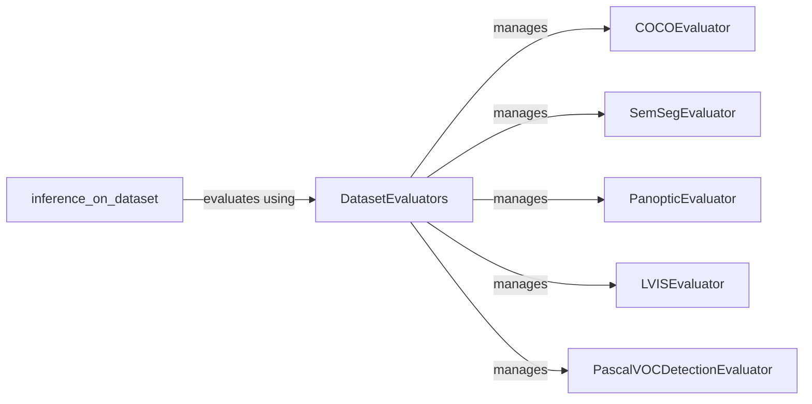

## Component Details

The evaluation and metrics component in Detectron2 is responsible for assessing the performance of trained models on various tasks such as object detection, segmentation, and pose estimation. It provides a standardized way to compute and report evaluation metrics, enabling users to compare different models and configurations. The core of this component lies in the `DatasetEvaluators` class, which manages a collection of individual evaluators tailored to specific datasets or evaluation protocols. The `inference_on_dataset` function orchestrates the evaluation process by running inference on a dataset and feeding the results to the appropriate evaluator. Individual evaluators, such as `COCOEvaluator`, `SemSegEvaluator`, and `PanopticEvaluator`, implement the evaluation logic for specific tasks and datasets, leveraging APIs like the COCO API to compute standard metrics.

### DatasetEvaluators
Manages a collection of evaluators, each responsible for evaluating a specific dataset or aspect of the model's performance. It orchestrates the evaluation process by iterating through the evaluators and calling their `evaluate` methods. It aggregates the results from individual evaluators to provide a comprehensive performance summary.
- **Related Classes/Methods**: `detectron2.evaluation.evaluator.DatasetEvaluators`

### inference_on_dataset
Executes the model's inference on a given dataset and subsequently evaluates the results using a provided evaluator. It encapsulates the process of feeding data to the model and then passing the model's predictions to the appropriate evaluator. This function serves as the entry point for the evaluation process.
- **Related Classes/Methods**: `detectron2.evaluation.evaluator:inference_on_dataset`

### COCOEvaluator
Evaluates object detection and segmentation results in the COCO format. It converts model predictions into the COCO JSON format, leverages the COCO API to compute standard metrics like mAP, and then summarizes the evaluation results. It is a widely used evaluator for object detection tasks.
- **Related Classes/Methods**: `detectron2.evaluation.coco_evaluation.COCOEvaluator`

### SemSegEvaluator
Evaluates semantic segmentation results by comparing predicted segmentation maps with ground truth maps. It computes pixel accuracy and Intersection-over-Union (IoU) metrics to quantify the accuracy of the segmentation. It provides detailed statistics on the segmentation performance.
- **Related Classes/Methods**: `detectron2.evaluation.sem_seg_evaluation.SemSegEvaluator`

### PanopticEvaluator
Evaluates panoptic segmentation results, which combines semantic and instance segmentation. It compares predicted panoptic segmentation maps with ground truth and computes Panoptic Quality (PQ), Segmentation Quality (SQ), and Recognition Quality (RQ) metrics. It provides a comprehensive evaluation of panoptic segmentation performance.
- **Related Classes/Methods**: `detectron2.evaluation.panoptic_evaluation.COCOPanopticEvaluator`

### LVISEvaluator
Evaluates object detection and segmentation results in the LVIS format, designed for long-tailed instance segmentation. Similar to COCOEvaluator, it converts predictions, uses the LVIS API for metric computation, and summarizes the results. It is suitable for datasets with imbalanced class distributions.
- **Related Classes/Methods**: `detectron2.evaluation.lvis_evaluation.LVISEvaluator`

### PascalVOCDetectionEvaluator
Evaluates object detection results following the Pascal VOC evaluation protocol. It parses ground truth annotations, compares them with model predictions, and calculates precision and recall to assess performance. It is a classic evaluator for object detection tasks.
- **Related Classes/Methods**: `detectron2.evaluation.pascal_voc_evaluation.PascalVOCDetectionEvaluator`
