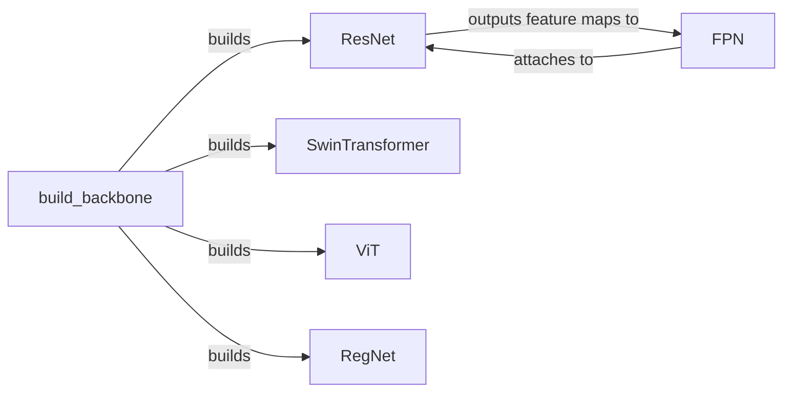

## Component Details

The Feature Extraction Backbone component is responsible for extracting feature maps from input images at different scales. It provides a foundation for object detection and other vision tasks by offering various backbone architectures like ResNet, Swin Transformer, ViT, and RegNet, along with a Feature Pyramid Network (FPN) for multi-scale feature aggregation. The process begins with the `build_backbone` function, which instantiates the selected backbone based on configuration parameters. The chosen backbone (e.g., ResNet) processes the input image, generating feature maps at different stages. FPN then takes these feature maps and combines them to create a multi-scale feature pyramid, which is used for object detection at various scales. The extracted features are then passed to subsequent components in the object detection pipeline.

### build_backbone
This function serves as the entry point for constructing the backbone network. It takes configuration parameters and uses them to instantiate the appropriate backbone architecture (e.g., ResNet, SwinTransformer, ViT, RegNet).
- **Related Classes/Methods**: `detectron2.modeling.backbone.build`

### ResNet
ResNet is a deep convolutional neural network architecture that forms the basis for many object detection backbones. It consists of multiple stages, each containing residual blocks (BasicBlock or BottleneckBlock). It takes an image as input and outputs feature maps at different scales.
- **Related Classes/Methods**: `detectron2.modeling.backbone.resnet.ResNet`, `detectron2.modeling.backbone.resnet.BasicBlock`, `detectron2.modeling.backbone.resnet.BottleneckBlock`

### FPN
FPN (Feature Pyramid Network) enhances the backbone by creating a multi-scale feature pyramid. It takes feature maps from different stages of the backbone (e.g., ResNet) and combines them to produce feature maps at multiple resolutions. These multi-scale feature maps are then used for object detection at different scales.
- **Related Classes/Methods**: `detectron2.modeling.backbone.fpn.FPN`, `detectron2.modeling.backbone.fpn.build_resnet_fpn_backbone`

### SwinTransformer
Swin Transformer is a hierarchical Transformer whose representation is computed with shifted windows. The shifted windowing scheme brings greater efficiency by limiting self-attention computation to non-overlapping local windows while also allowing for cross-window connection. It takes an image as input and outputs feature maps at different scales.
- **Related Classes/Methods**: `detectron2.modeling.backbone.swin.SwinTransformer`, `detectron2.modeling.backbone.swin.SwinTransformerBlock`

### ViT
Vision Transformer. ViT splits an image into patches and directly feeds the sequence of linear embeddings of these patches into a Transformer encoder. It takes an image as input and outputs feature maps at different scales.
- **Related Classes/Methods**: `detectron2.modeling.backbone.vit.ViT`, `detectron2.modeling.backbone.vit.Block`, `detectron2.modeling.backbone.vit.Attention`

### RegNet
RegNet is a network that uses design space exploration to find good network architectures. It uses a population of networks and evolves them over time. It takes an image as input and outputs feature maps at different scales.
- **Related Classes/Methods**: `detectron2.modeling.backbone.regnet.RegNet`, `detectron2.modeling.backbone.regnet.AnyNet`
