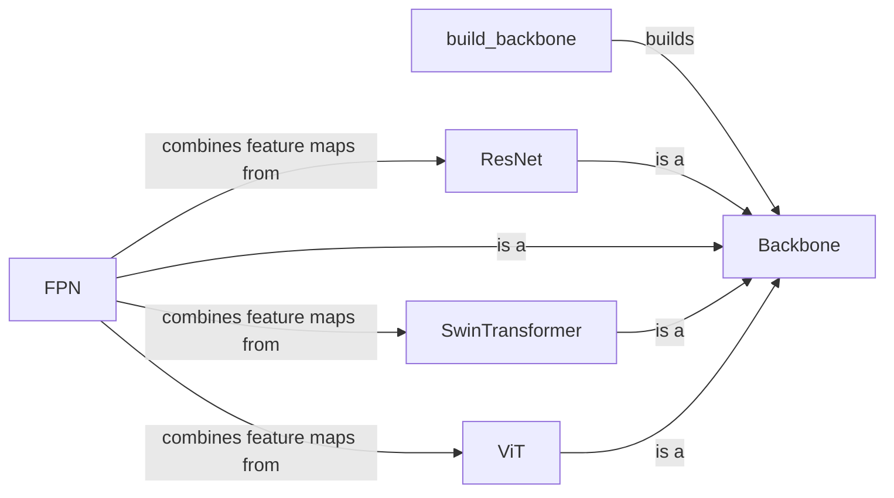

## Component Details

The Feature Extraction Backbone component is responsible for extracting feature maps from input images at different scales. It provides a foundation for object detection and other vision tasks by offering various backbone architectures like ResNet, Swin Transformer, and ViT, often combined with FPN for multi-scale feature aggregation. The `build_backbone` function acts as the entry point, selecting the appropriate backbone based on configuration and returning a `Backbone` object. The chosen backbone then processes the input image, generating feature maps that are passed to subsequent components in the object detection pipeline.

### build_backbone
This function serves as the entry point for constructing the backbone network. It takes a configuration object, determines the backbone architecture based on the configuration, and returns a `Backbone` object.
- **Related Classes/Methods**: `detectron2.modeling.backbone.build`

### Backbone
An abstract base class for all backbone networks. It defines the interface for backbones, including the `output_shape` method, which returns the shape of the feature maps produced at different stages.
- **Related Classes/Methods**: `detectron2.modeling.backbone.backbone`

### ResNet
Implementation of the ResNet backbone architecture. It consists of a stem (initial convolutional layers) followed by several stages, each containing multiple residual blocks. Different depths (e.g., ResNet-50, ResNet-101) and block types (e.g., BasicBlock, BottleneckBlock) are supported.
- **Related Classes/Methods**: `detectron2.modeling.backbone.resnet.ResNet`

### FPN
Feature Pyramid Network (FPN) implementation. It takes feature maps from different stages of the backbone and combines them to create a multi-scale feature pyramid, enabling the model to detect objects at different scales.
- **Related Classes/Methods**: `detectron2.modeling.backbone.fpn.FPN`

### SwinTransformer
Implementation of the Swin Transformer backbone architecture. It uses shifted windows for self-attention, capturing long-range dependencies efficiently.
- **Related Classes/Methods**: `detectron2.modeling.backbone.swin.SwinTransformer`

### ViT
Implementation of the Vision Transformer (ViT) backbone architecture. It splits the input image into patches and treats them as tokens, which are then fed into a transformer encoder.
- **Related Classes/Methods**: `detectron2.modeling.backbone.vit.ViT`
