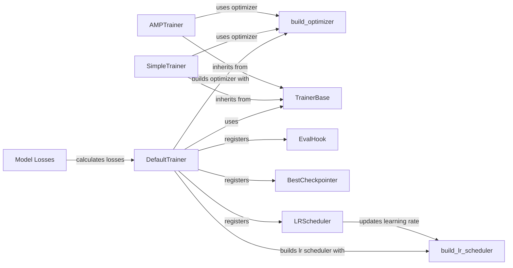

## Component Details

The Loss and Optimization component is responsible for calculating the loss between the model's predictions and the ground truth, and then optimizing the model parameters to minimize this loss. It encompasses various loss functions defined within the model architectures, optimizers that adjust model weights based on gradients, and learning rate schedulers that dynamically modify the learning rate during training. This component is central to the learning process, enabling the model to improve its performance iteratively.

### DefaultTrainer
The DefaultTrainer class provides a high-level training loop, encapsulating the common steps involved in training a Detectron2 model. It builds the model, optimizer, learning rate scheduler, data loaders, and registers hooks for various training functionalities like evaluation and checkpointing. It orchestrates the entire training process, making it easier to train models with default settings.
- **Related Classes/Methods**: `detectron2.engine.defaults.DefaultTrainer`, `detectron2.engine.defaults:default_setup`, `detectron2.engine.defaults:default_writers`

### build_optimizer
The `build_optimizer` function constructs the optimizer used for training the model. It takes the model parameters and configuration options as input and returns an optimizer object. It also handles gradient clipping to prevent exploding gradients during training. The function allows for customization of optimizer parameters and supports different optimization algorithms.
- **Related Classes/Methods**: `detectron2.solver.build:build_optimizer`, `detectron2.solver.build:get_default_optimizer_params`, `detectron2.solver.build:maybe_add_gradient_clipping`, `detectron2.solver.build:reduce_param_groups`

### build_lr_scheduler
The `build_lr_scheduler` function creates the learning rate scheduler, which adjusts the learning rate during training. It takes the optimizer and configuration options as input and returns a learning rate scheduler object. Learning rate schedulers are crucial for achieving optimal convergence during training.
- **Related Classes/Methods**: `detectron2.solver.build:build_lr_scheduler`

### TrainerBase
The TrainerBase class serves as an abstract base class for trainers. It defines the basic structure and interface for a training loop, providing a foundation for more specialized trainer implementations. It handles the core training logic and provides methods for managing the training process.
- **Related Classes/Methods**: `detectron2.engine.train_loop.TrainerBase`

### SimpleTrainer
The SimpleTrainer class implements a straightforward training loop. It inherits from TrainerBase and provides a basic implementation of the training process. It's suitable for simple training scenarios without advanced features like automatic mixed precision.
- **Related Classes/Methods**: `detectron2.engine.train_loop.SimpleTrainer`

### AMPTrainer
The AMPTrainer class implements a training loop with Automatic Mixed Precision (AMP). It inherits from TrainerBase and utilizes AMP to accelerate training by using mixed precision floating-point numbers. This can significantly reduce training time and memory consumption.
- **Related Classes/Methods**: `detectron2.engine.train_loop.AMPTrainer`

### EvalHook
The EvalHook class is a hook that performs evaluation during training. It runs the evaluation process at specified intervals to monitor the model's performance on a validation dataset. This allows for tracking the model's progress and identifying potential overfitting.
- **Related Classes/Methods**: `detectron2.engine.hooks.EvalHook`

### BestCheckpointer
The BestCheckpointer hook saves the best checkpoint during training based on a specified metric. It monitors the model's performance and saves the model weights that achieve the best performance on the validation set. This ensures that the best performing model is saved for later use.
- **Related Classes/Methods**: `detectron2.engine.hooks.BestCheckpointer`

### LRScheduler
The LRScheduler hook updates the learning rate during training based on the configured learning rate scheduler. It adjusts the learning rate according to a predefined schedule, which can help to improve convergence and prevent overfitting.
- **Related Classes/Methods**: `detectron2.engine.hooks.LRScheduler`

### Model Losses
The model losses component encompasses the loss functions specific to different model architectures like RetinaNet, Fast R-CNN, and RPN. These loss functions calculate the difference between the model's predictions and the ground truth, providing a measure of the model's performance. The calculated loss is then used to update the model's parameters during training.
- **Related Classes/Methods**: `detectron2.modeling.meta_arch.retinanet.RetinaNet:losses`, `detectron2.modeling.roi_heads.fast_rcnn.FastRCNNOutputLayers:losses`, `detectron2.modeling.proposal_generator.rpn.RPN:losses`
