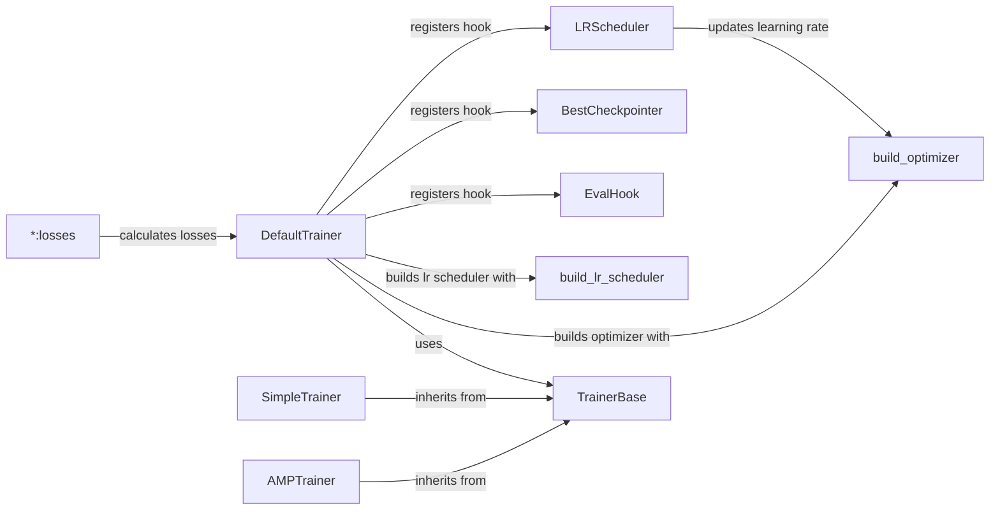

## Component Details

The Loss and Optimization component is responsible for calculating the loss between the model's predictions and the ground truth, and then optimizing the model parameters to minimize this loss. It encompasses various loss functions defined within the model architectures, optimizers that adjust model weights based on gradients, and learning rate schedulers that dynamically modify the learning rate during training. This component is central to the learning process, enabling the model to improve its performance iteratively.

### DefaultTrainer
The DefaultTrainer class provides a high-level training loop, encapsulating the common steps involved in training a Detectron2 model. It builds the model, optimizer, learning rate scheduler, data loaders, and registers hooks for various training functionalities like evaluation and checkpointing. It orchestrates the entire training process, making it easier to train models with default settings.
- **Related Classes/Methods**: `detectron2.engine.defaults.DefaultTrainer`, `detectron2.engine.defaults:default_setup`, `detectron2.engine.defaults:default_writers`

### build_optimizer
The `build_optimizer` function constructs the optimizer used for training the model. It takes the model parameters and configuration options as input and returns an optimizer object. It also handles gradient clipping, which prevents exploding gradients during training. The function allows for customization of optimizer parameters and supports different optimization algorithms.
- **Related Classes/Methods**: `detectron2.solver.build:build_optimizer`, `detectron2.solver.build:get_default_optimizer_params`, `detectron2.solver.build:maybe_add_gradient_clipping`, `detectron2.solver.build:reduce_param_groups`

### build_lr_scheduler
The `build_lr_scheduler` function creates the learning rate scheduler, which adjusts the learning rate during training. It takes the optimizer and configuration options as input and returns a learning rate scheduler object. Learning rate schedulers help to improve the convergence and performance of the model by dynamically adjusting the learning rate during training.
- **Related Classes/Methods**: `detectron2.solver.build:build_lr_scheduler`

### TrainerBase
The TrainerBase class serves as an abstract base class for trainers. It defines the basic structure and methods for a training loop, providing a foundation for more specialized trainer implementations. It handles the core training logic, such as data loading, forward and backward passes, and parameter updates.
- **Related Classes/Methods**: `detectron2.engine.train_loop.TrainerBase`

### SimpleTrainer
The SimpleTrainer class implements a straightforward training loop. It inherits from TrainerBase and provides a basic implementation of the training process without advanced features like automatic mixed precision. It's suitable for simple training scenarios where performance optimization is not a primary concern.
- **Related Classes/Methods**: `detectron2.engine.train_loop.SimpleTrainer`

### AMPTrainer
The AMPTrainer class implements a training loop with Automatic Mixed Precision (AMP). It inherits from TrainerBase and utilizes AMP to accelerate training by using lower precision floating-point numbers where appropriate. This can significantly reduce training time and memory consumption.
- **Related Classes/Methods**: `detectron2.engine.train_loop.AMPTrainer`

### EvalHook
The EvalHook class is a hook that performs evaluation during training. It runs the evaluation process at specified intervals, allowing you to monitor the model's performance on a validation dataset during training. This helps to identify overfitting and track the progress of the training process.
- **Related Classes/Methods**: `detectron2.engine.hooks.EvalHook`

### BestCheckpointer
The BestCheckpointer hook saves the best checkpoint during training based on a specified metric. It monitors a chosen metric (e.g., validation loss) and saves the model's weights whenever the metric improves. This ensures that you have access to the model with the best performance on the validation set.
- **Related Classes/Methods**: `detectron2.engine.hooks.BestCheckpointer`

### LRScheduler
The LRScheduler hook updates the learning rate during training based on the configured learning rate scheduler. It retrieves the learning rate from the scheduler and applies it to the optimizer. This hook ensures that the learning rate is adjusted according to the scheduler's policy throughout the training process.
- **Related Classes/Methods**: `detectron2.engine.hooks.LRScheduler`

### *:losses
The `*:losses` methods (e.g., `RetinaNet:losses`, `FastRCNNOutputLayers:losses`, `RPN:losses`) calculate the losses specific to different components or models. These methods compute the loss between the model's predictions and the ground truth labels, providing a measure of how well the model is performing. The calculated losses are then used to update the model's parameters during training.
- **Related Classes/Methods**: `detectron2.modeling.meta_arch.retinanet.RetinaNet:losses`, `detectron2.modeling.roi_heads.fast_rcnn.FastRCNNOutputLayers:losses`, `detectron2.modeling.proposal_generator.rpn.RPN:losses`
