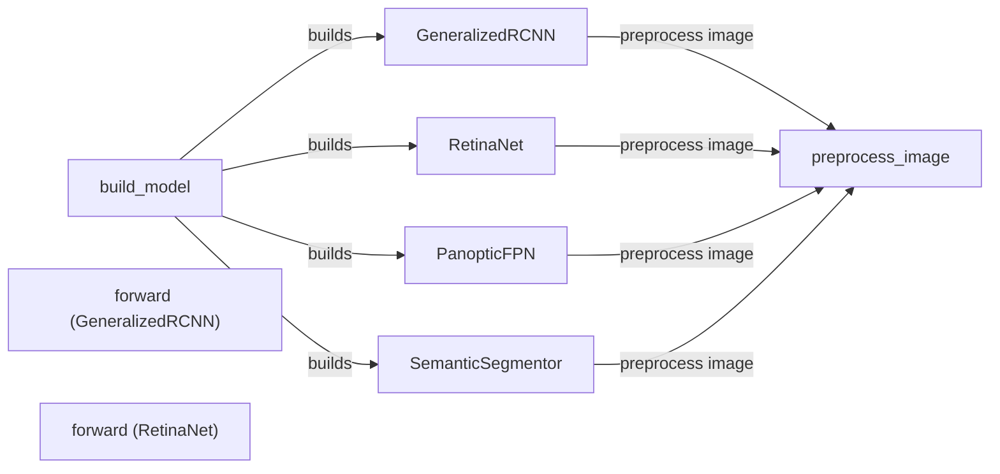

## Component Details

The Meta-Architecture component in Detectron2 defines the overall structure of object detection and segmentation models. It acts as a central orchestrator, connecting a backbone network with task-specific heads like RCNN, RetinaNet, and PanopticFPN. The meta-architecture manages the flow of data and computation between these components, enabling the model to perform tasks such as object detection, instance segmentation, and panoptic segmentation. It handles image pre-processing, feature extraction via the backbone, and prediction generation through the task-specific heads, ultimately producing the desired output based on the chosen architecture.

### build_model
This function serves as the entry point for constructing the complete model based on the provided configuration. It determines the appropriate meta-architecture (e.g., RetinaNet, PanopticFPN, GeneralizedRCNN, or SemanticSegmentor) to instantiate according to the configuration settings.
- **Related Classes/Methods**: `detectron2.modeling.meta_arch.build`

### GeneralizedRCNN
GeneralizedRCNN is a foundational two-stage object detection model. It first employs a Region Proposal Network (RPN) to generate potential object bounding boxes (proposals). Subsequently, it refines these proposals and classifies them into specific object categories using an RCNN head.
- **Related Classes/Methods**: `detectron2.modeling.meta_arch.rcnn.GeneralizedRCNN`

### RetinaNet
RetinaNet is a single-stage dense object detector that directly predicts object classes and bounding boxes from feature maps extracted by a backbone network. It comprises a backbone, a RetinaNetHead for prediction, and logic for matching predictions to ground truth and computing losses.
- **Related Classes/Methods**: `detectron2.modeling.meta_arch.retinanet.RetinaNet`

### PanopticFPN
PanopticFPN is a model designed for panoptic segmentation, a task that simultaneously segments all objects and background regions within an image. It integrates a Feature Pyramid Network (FPN) with a specialized panoptic segmentation head to achieve this comprehensive segmentation.
- **Related Classes/Methods**: `detectron2.modeling.meta_arch.panoptic_fpn.PanopticFPN`

### SemanticSegmentor
SemanticSegmentor is a model dedicated to semantic segmentation, which involves assigning a class label to each pixel in an image, effectively categorizing every pixel into a specific semantic class.
- **Related Classes/Methods**: `detectron2.modeling.meta_arch.semantic_seg.SemanticSegmentor`

### preprocess_image
This function is responsible for pre-processing the input image before it is fed into the model. This typically involves resizing, normalization, and other image transformations to ensure optimal performance.
- **Related Classes/Methods**: `detectron2.modeling.meta_arch.dense_detector.DenseDetector`, `detectron2.modeling.meta_arch.rcnn.GeneralizedRCNN`

### forward (GeneralizedRCNN)
The forward method in GeneralizedRCNN processes input images and performs object detection. It generates region proposals, refines them, and classifies them into object categories.
- **Related Classes/Methods**: `detectron2.modeling.meta_arch.rcnn.GeneralizedRCNN`

### forward (RetinaNet)
The forward method in RetinaNet is the main entry point for processing input images. It handles both training and inference modes. During training, it calculates losses based on the model's predictions and ground truth annotations. During inference, it generates object detections.
- **Related Classes/Methods**: `detectron2.modeling.meta_arch.retinanet.RetinaNet`
