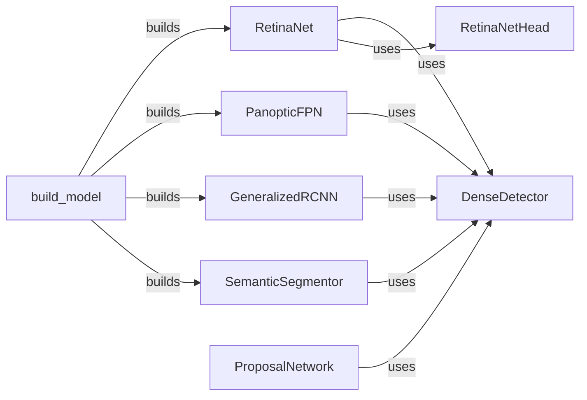

## Component Details

The Meta-Architecture component in Detectron2 defines the overall structure of object detection and segmentation models. It acts as a central orchestrator, connecting a backbone network with task-specific heads to form a complete model. The meta-architecture determines the flow of data through the model, from image input to final predictions, and manages the interaction between different sub-components like the backbone, proposal generators, and prediction heads. It supports various architectures like RCNN, RetinaNet, and PanopticFPN, allowing for flexibility in model design and task specialization.

### build_model
This function serves as the entry point for constructing the object detection or segmentation model. Based on the configuration, it instantiates the appropriate meta-architecture (e.g., GeneralizedRCNN, RetinaNet, PanopticFPN, or SemanticSegmentor) and initializes its components. It effectively acts as a factory for creating the complete model.
- **Related Classes/Methods**: `detectron2.modeling.meta_arch.build`

### GeneralizedRCNN
GeneralizedRCNN is a foundational two-stage object detection framework. It first generates region proposals using a Region Proposal Network (RPN) and then refines and classifies these proposals using a detection head. It encapsulates the entire two-stage detection process, including feature extraction, proposal generation, and box classification/regression.
- **Related Classes/Methods**: `detectron2.modeling.meta_arch.rcnn.GeneralizedRCNN`

### RetinaNet
RetinaNet is a single-stage dense object detector that directly predicts object classes and bounding boxes from feature maps extracted by a backbone network. It employs a Feature Pyramid Network (FPN) to handle objects at different scales and uses focal loss to address class imbalance during training. It includes methods for both training (loss calculation) and inference (prediction generation).
- **Related Classes/Methods**: `detectron2.modeling.meta_arch.retinanet.RetinaNet`

### PanopticFPN
PanopticFPN is a model designed for panoptic segmentation, a task that unifies semantic segmentation and instance segmentation. It predicts both the semantic class and instance ID for each pixel in an image, providing a comprehensive scene understanding. It leverages a Feature Pyramid Network (FPN) to process features at multiple scales and combines semantic and instance segmentation heads to generate the final panoptic segmentation output.
- **Related Classes/Methods**: `detectron2.modeling.meta_arch.panoptic_fpn.PanopticFPN`

### SemanticSegmentor
SemanticSegmentor is a model dedicated to performing semantic segmentation, which involves assigning a semantic class label to each pixel in an image. It typically consists of a backbone network for feature extraction and a segmentation head that predicts the class labels for each pixel. It focuses solely on pixel-level classification without considering individual object instances.
- **Related Classes/Methods**: `detectron2.modeling.meta_arch.semantic_seg.SemanticSegmentor`

### DenseDetector
DenseDetector serves as a base class for dense object detectors like RetinaNet and PanopticFPN. It provides common functionalities such as image preprocessing, prediction decoding, and visualization tools. It encapsulates shared logic and utilities used by various dense detectors, promoting code reuse and simplifying the implementation of new dense detection models.
- **Related Classes/Methods**: `detectron2.modeling.meta_arch.dense_detector.DenseDetector`

### RetinaNetHead
The RetinaNetHead is the prediction head of the RetinaNet model. It takes feature maps from the backbone network and generates predictions for object classes and bounding box regressions. It consists of multiple convolutional layers that process the feature maps and output the predicted class probabilities and box coordinates.
- **Related Classes/Methods**: `detectron2.modeling.meta_arch.retinanet.RetinaNetHead`

### ProposalNetwork
ProposalNetwork is a component within the GeneralizedRCNN framework responsible for generating region proposals. These proposals are candidate bounding boxes that may contain objects of interest. The ProposalNetwork uses a Region Proposal Network (RPN) to efficiently scan the feature maps and identify potential object locations.
- **Related Classes/Methods**: `detectron2.modeling.meta_arch.rcnn.ProposalNetwork`
