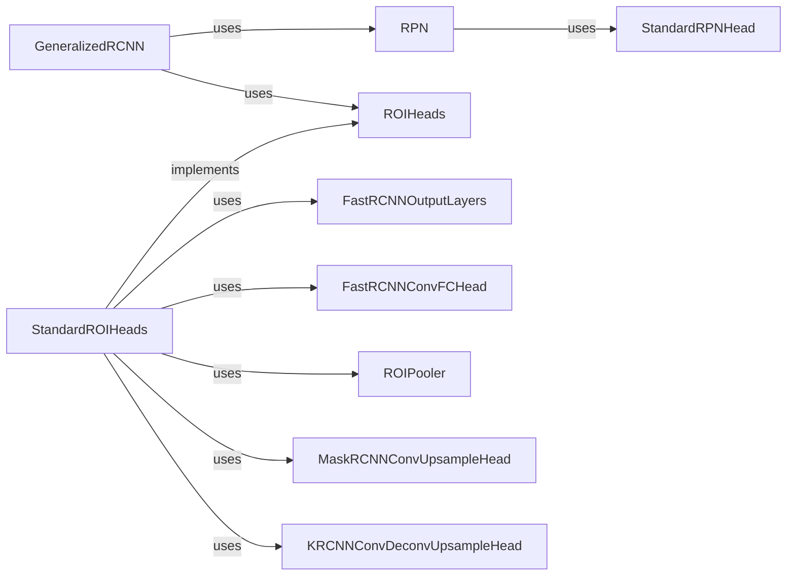

## Component Details

The Prediction Refinement component focuses on generating and refining object proposals to achieve accurate object detection and segmentation. It encompasses the Region Proposal Network (RPN) for generating initial proposals and the ROIHeads for refining these proposals into final bounding boxes, classes, and masks. This two-stage process allows the model to efficiently narrow down potential object locations and then accurately classify and localize them.

### GeneralizedRCNN
The GeneralizedRCNN meta-architecture orchestrates the entire object detection process. It takes an image as input, extracts features using a backbone network, generates region proposals using the RPN, refines these proposals using the ROIHeads, and finally outputs the detected objects with their corresponding classes, bounding boxes, and masks.
- **Related Classes/Methods**: `detectron2.modeling.meta_arch.rcnn.GeneralizedRCNN`

### RPN
The Region Proposal Network (RPN) is responsible for generating initial object proposals from the feature maps extracted by the backbone network. It predicts objectness scores and bounding box regressions for a set of anchor boxes, effectively identifying potential regions of interest in the image.
- **Related Classes/Methods**: `detectron2.modeling.proposal_generator.rpn.RPN`

### StandardRPNHead
The StandardRPNHead is a specific implementation of the RPN head, responsible for predicting objectness logits and box deltas for each anchor. It takes feature maps as input and outputs the predicted objectness scores and bounding box adjustments.
- **Related Classes/Methods**: `detectron2.modeling.proposal_generator.rpn.StandardRPNHead`

### ROIHeads
The ROIHeads component refines the object proposals generated by the RPN. It performs box classification, box regression, mask prediction, and keypoint prediction for each proposal, providing accurate object detection and segmentation results.
- **Related Classes/Methods**: `detectron2.modeling.roi_heads.roi_heads.ROIHeads`

### StandardROIHeads
The StandardROIHeads is a standard implementation of the ROIHeads, incorporating box, mask, and keypoint heads. It provides a comprehensive set of refinement operations for the object proposals.
- **Related Classes/Methods**: `detectron2.modeling.roi_heads.roi_heads.StandardROIHeads`

### FastRCNNOutputLayers
The FastRCNNOutputLayers predict the class scores and bounding box regressions for each ROI. It takes the pooled features from the ROIPooler and outputs the final classification and bounding box predictions.
- **Related Classes/Methods**: `detectron2.modeling.roi_heads.fast_rcnn.FastRCNNOutputLayers`

### FastRCNNConvFCHead
The FastRCNNConvFCHead is a head with several conv and fc layers for box prediction. It processes the ROI features through convolutional and fully connected layers to refine the bounding box predictions.
- **Related Classes/Methods**: `detectron2.modeling.roi_heads.box_head.FastRCNNConvFCHead`

### ROIPooler
The ROIPooler extracts fixed-size feature maps from the feature maps extracted by the backbone for each ROI. It enables the ROIHeads to process proposals of varying sizes by converting them into a uniform representation.
- **Related Classes/Methods**: `detectron2.modeling.poolers.ROIPooler`

### MaskRCNNConvUpsampleHead
The MaskRCNNConvUpsampleHead is a standard mask R-CNN head. It predicts pixel-level masks for each ROI, enabling instance segmentation.
- **Related Classes/Methods**: `detectron2.modeling.roi_heads.mask_head.MaskRCNNConvUpsampleHead`

### KRCNNConvDeconvUpsampleHead
The KRCNNConvDeconvUpsampleHead is a standard keypoint R-CNN head. It predicts keypoints for each ROI, enabling pose estimation.
- **Related Classes/Methods**: `detectron2.modeling.roi_heads.keypoint_head.KRCNNConvDeconvUpsampleHead`
