```mermaid
graph LR
    Configuration_Management["Configuration Management"]
    Data_Processing_Pipeline["Data Processing Pipeline"]
    Feature_Extraction_Backbone["Feature Extraction Backbone"]
    Meta_Architecture["Meta-Architecture"]
    Prediction_Refinement["Prediction Refinement"]
    Loss_and_Optimization["Loss and Optimization"]
    Evaluation_and_Metrics["Evaluation and Metrics"]
    Configuration_Management -- "configures" --> Data_Processing_Pipeline
    Configuration_Management -- "configures" --> Feature_Extraction_Backbone
    Configuration_Management -- "configures" --> Meta_Architecture
    Configuration_Management -- "configures" --> Prediction_Refinement
    Configuration_Management -- "configures" --> Loss_and_Optimization
    Configuration_Management -- "configures" --> Evaluation_and_Metrics
    Data_Processing_Pipeline -- "loads and preprocesses" --> Feature_Extraction_Backbone
    Feature_Extraction_Backbone -- "extracts features" --> Meta_Architecture
    Meta_Architecture -- "refines predictions" --> Prediction_Refinement
    Prediction_Refinement -- "performs detection/segmentation" --> Loss_and_Optimization
    Loss_and_Optimization -- "optimizes" --> Feature_Extraction_Backbone
    Loss_and_Optimization -- "optimizes" --> Meta_Architecture
    Loss_and_Optimization -- "optimizes" --> Prediction_Refinement
    Evaluation_and_Metrics -- "evaluates" --> Meta_Architecture
    click Configuration_Management href "https://github.com/CodeBoarding/GeneratedOnBoardings/blob/main/detectron2/Configuration Management.md" "Details"
    click Data_Processing_Pipeline href "https://github.com/CodeBoarding/GeneratedOnBoardings/blob/main/detectron2/Data Processing Pipeline.md" "Details"
    click Feature_Extraction_Backbone href "https://github.com/CodeBoarding/GeneratedOnBoardings/blob/main/detectron2/Feature Extraction Backbone.md" "Details"
    click Meta_Architecture href "https://github.com/CodeBoarding/GeneratedOnBoardings/blob/main/detectron2/Meta-Architecture.md" "Details"
    click Prediction_Refinement href "https://github.com/CodeBoarding/GeneratedOnBoardings/blob/main/detectron2/Prediction Refinement.md" "Details"
    click Loss_and_Optimization href "https://github.com/CodeBoarding/GeneratedOnBoardings/blob/main/detectron2/Loss and Optimization.md" "Details"
    click Evaluation_and_Metrics href "https://github.com/CodeBoarding/GeneratedOnBoardings/blob/main/detectron2/Evaluation and Metrics.md" "Details"
```

## Component Details

Detectron2 is a modular object detection and image segmentation framework. The main flow involves configuring the system, loading and preprocessing data, extracting features using backbone networks, generating object proposals, refining these proposals using ROI heads, computing loss, optimizing the model, and evaluating its performance. The framework supports various models and datasets, and it is designed to be flexible and extensible.

### Configuration Management
This component is responsible for managing the configuration of the entire system. It handles reading configuration files, setting default values, and providing a unified interface for accessing configuration parameters. It allows users to easily modify and experiment with different settings without changing the code.
- **Related Classes/Methods**: `detectron2.config.config`, `detectron2.config.defaults`, `detectron2.config.lazy`

### Data Processing Pipeline
This component handles the loading, preprocessing, and augmentation of training and evaluation data. It supports various datasets and data augmentation techniques to improve model performance. The pipeline transforms raw data into a format suitable for training and evaluation, ensuring data consistency and efficiency.
- **Related Classes/Methods**: `detectron2.data.build`, `detectron2.data.datasets`, `detectron2.data.dataset_mapper`, `detectron2.data.transforms`

### Feature Extraction Backbone
This component implements various backbone networks, such as ResNet, Swin Transformer, and ViT, which are used to extract features from the input images. It also includes FPN (Feature Pyramid Network) for multi-scale feature extraction. The backbone provides feature maps at different scales for subsequent processing by the meta-architecture.
- **Related Classes/Methods**: `detectron2.modeling.backbone.build`, `detectron2.modeling.backbone.resnet`, `detectron2.modeling.backbone.fpn`, `detectron2.modeling.backbone.swin`, `detectron2.modeling.backbone.vit`

### Meta-Architecture
This component defines the overall architecture of the object detection or segmentation model. It combines a backbone network with task-specific heads, such as RCNN, RetinaNet, and Panoptic FPN. The meta-architecture orchestrates the interaction between different components of the model, defining the overall flow of data and computation.
- **Related Classes/Methods**: `detectron2.modeling.meta_arch.build`, `detectron2.modeling.meta_arch.rcnn`, `detectron2.modeling.meta_arch.retinanet`, `detectron2.modeling.meta_arch.panoptic_fpn`, `detectron2.modeling.meta_arch.semantic_seg`

### Prediction Refinement
This component encompasses both proposal generation and ROI heads. Proposal generation creates candidate bounding boxes, while ROI heads refine these proposals to predict final bounding boxes, classes, and masks. This two-stage process allows for efficient and accurate object detection and segmentation.
- **Related Classes/Methods**: `detectron2.modeling.proposal_generator.rpn`, `detectron2.modeling.proposal_generator.proposal_utils`, `detectron2.modeling.roi_heads.roi_heads`, `detectron2.modeling.roi_heads.fast_rcnn`, `detectron2.modeling.roi_heads.mask_head`, `detectron2.modeling.roi_heads.keypoint_head`

### Loss and Optimization
This component calculates the loss between the model's predictions and the ground truth, and then optimizes the model parameters to minimize this loss. It includes various loss functions, optimizers, and learning rate schedulers. This component drives the learning process, enabling the model to improve its performance over time.
- **Related Classes/Methods**: `detectron2.layers.losses`, `detectron2.modeling.box_regression`, `detectron2.solver.build`, `detectron2.solver.lr_scheduler`, `detectron2.engine.train_loop`, `detectron2.engine.defaults`, `detectron2.engine.hooks`

### Evaluation and Metrics
This component evaluates the performance of the trained model on the evaluation data. It supports various evaluation metrics, such as mAP (mean Average Precision) for object detection and mIoU (mean Intersection over Union) for segmentation. It provides a quantitative assessment of the model's performance, allowing users to compare different models and configurations.
- **Related Classes/Methods**: `detectron2.evaluation.evaluator`, `detectron2.evaluation.coco_evaluation`, `detectron2.evaluation.panoptic_evaluation`, `detectron2.evaluation.sem_seg_evaluation`