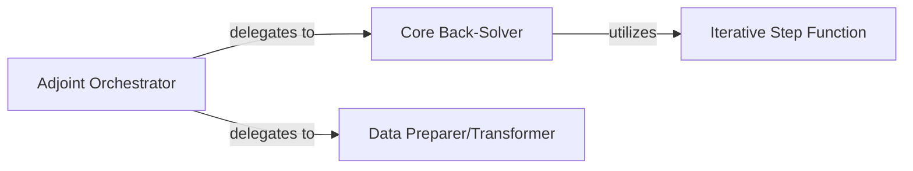

## Details

The `Adjoint Computation` subsystem is primarily encapsulated within the `diffrax/_adjoint.py` file. It provides the core functionality for computing gradients of solutions with respect to parameters, which is essential for optimization and machine learning applications within the `diffrax` library.

### Adjoint Orchestrator
This component acts as the high-level entry point for adjoint computation. It manages the overall flow, coordinating the forward integration, checkpointing, and the subsequent backward integration of the adjoint system. It aligns with the "Solver Orchestrator/Engine" pattern, directing the adjoint "solver" process.

**Related Classes/Methods**:

- <a href="https://github.com/patrick-kidger/diffrax/blob/main/diffrax/_adjoint.py#L893-L918" target="_blank" rel="noopener noreferrer">`diffrax._adjoint.loop`:893-918</a>
- <a href="https://github.com/patrick-kidger/diffrax/blob/main/diffrax/_adjoint.py#L39-L75" target="_blank" rel="noopener noreferrer">`diffrax._adjoint._nondiff_solver_controller_state`:39-75</a>

### Core Back-Solver
This component is responsible for the fundamental numerical integration backward in time, which is the essence of the adjoint method. It solves the adjoint differential equations to compute the gradients. This directly reflects the "Numerical Solvers" pattern, specifically tailored for the adjoint system.

**Related Classes/Methods**:

- <a href="https://github.com/patrick-kidger/diffrax/blob/main/diffrax/_adjoint.py#L539-L552" target="_blank" rel="noopener noreferrer">`diffrax._adjoint._loop_backsolve`:539-552</a>
- <a href="https://github.com/patrick-kidger/diffrax/blob/main/diffrax/_adjoint.py#L555-L563" target="_blank" rel="noopener noreferrer">`diffrax._adjoint._loop_backsolve_fwd`:555-563</a>
- <a href="https://github.com/patrick-kidger/diffrax/blob/main/diffrax/_adjoint.py#L573-L735" target="_blank" rel="noopener noreferrer">`diffrax._adjoint._loop_backsolve_bwd`:573-735</a>

### Data Preparer/Transformer
Handles necessary data transformations, particularly transposing solution (`y`) values. This is a crucial pre-processing or in-process step in numerical methods, especially when dealing with vector-Jacobian products or specific data layouts required by the adjoint equations.

**Related Classes/Methods**:

- <a href="https://github.com/patrick-kidger/diffrax/blob/main/diffrax/_adjoint.py#L78-L115" target="_blank" rel="noopener noreferrer">`diffrax._adjoint._only_transpose_ys`:78-115</a>
- <a href="https://github.com/patrick-kidger/diffrax/blob/main/diffrax/_adjoint.py#L83-L87" target="_blank" rel="noopener noreferrer">`diffrax._adjoint.get_ys`:83-87</a>

### Iterative Step Function
Represents a single, atomic step within an iterative or scan-based computation (likely `jax.lax.scan`). It performs a part of the backward integration or a specific update required for the adjoint state. This aligns with the modular design and functional composition often found in JAX-based numerical libraries.

**Related Classes/Methods**:

- <a href="https://github.com/patrick-kidger/diffrax/blob/main/diffrax/_adjoint.py#L647-L675" target="_blank" rel="noopener noreferrer">`diffrax._adjoint._scan_fun`:647-675</a>

### [FAQ](https://github.com/CodeBoarding/GeneratedOnBoardings/tree/main?tab=readme-ov-file#faq)