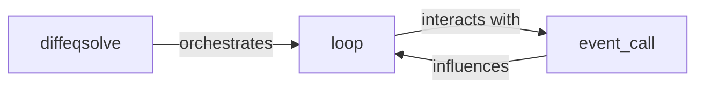

## Details

The `Integration Engine` subsystem is the core orchestrator for solving differential equations within `diffrax`. It encapsulates the primary control flow, managing the integration loop and handling events that occur during the solution process.

### diffeqsolve
This component serves as the primary public interface and orchestrator for initiating and managing the differential equation solving process. It initializes the solver, sets up the initial state, and oversees the entire integration workflow. It embodies the "Solver Orchestrator/Engine" pattern, providing a unified entry point for users.

**Related Classes/Methods**:

- <a href="https://github.com/patrick-kidger/diffrax/blob/main/diffrax/_integrate.py#L830-L1467" target="_blank" rel="noopener noreferrer">`diffrax._integrate.diffeqsolve`:830-1467</a>

### loop
The `loop` component implements the core iterative time-stepping mechanism. It is responsible for advancing the solution through the integration interval by repeatedly executing individual integration steps. This component is fundamental to the "Numerical Solvers" and "Pipeline/Workflow" patterns, representing the iterative nature inherent in numerical integration algorithms.

**Related Classes/Methods**:

- <a href="https://github.com/patrick-kidger/diffrax/blob/main/diffrax/_integrate.py#L289-L827" target="_blank" rel="noopener noreferrer">`diffrax._integrate.loop`:289-827</a>

### event_call
This component manages and processes events that may occur during the integration process. It handles the detection of specific conditions (e.g., steady-state, discontinuities, reaching a specific time point) and facilitates dynamic control or termination of the integration based on these events. This directly supports the "Event Handling" pattern, crucial for robust and flexible solvers.

**Related Classes/Methods**:

- <a href="https://github.com/patrick-kidger/diffrax/blob/main/diffrax/_event.py" target="_blank" rel="noopener noreferrer">`diffrax._event.event_call`</a>

### [FAQ](https://github.com/CodeBoarding/GeneratedOnBoardings/tree/main?tab=readme-ov-file#faq)