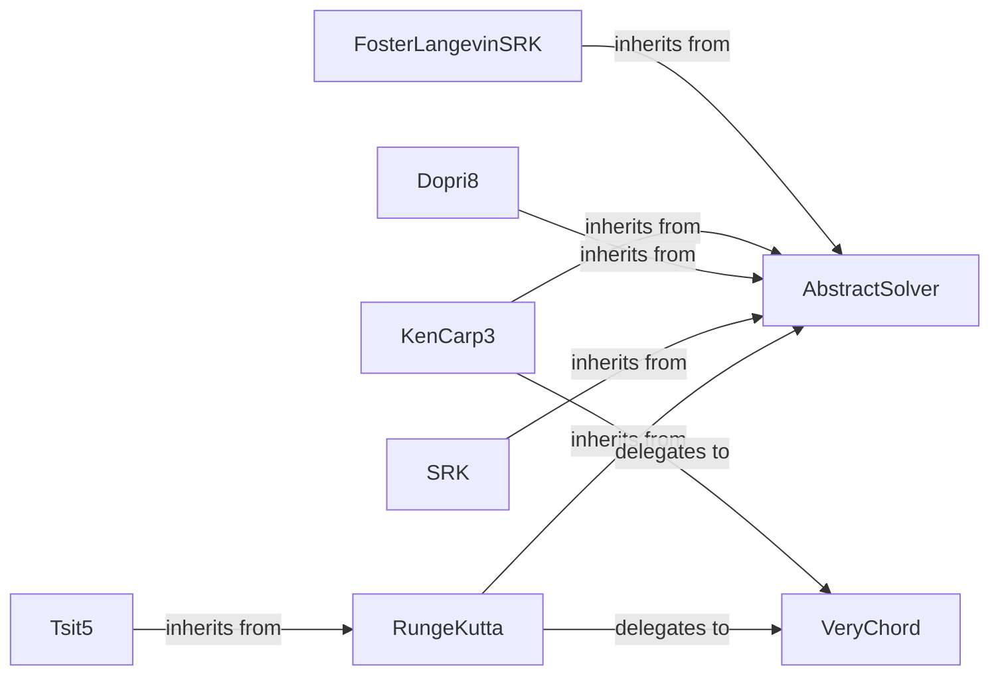

## Details

The `Numerical Solvers` subsystem in `diffrax` is designed to provide a modular and extensible framework for solving differential equations using various numerical integration techniques. It adheres to the "Strategy Pattern" by defining a common `AbstractSolver` interface, allowing different concrete solver implementations to be plugged in. The subsystem also incorporates internal root-finding capabilities for implicit methods, demonstrating a clear separation of concerns.

### AbstractSolver
The foundational abstract base class that defines the common interface and contract for all numerical solvers within the `diffrax` library. It ensures consistency across different integration methods.

**Related Classes/Methods**:

- <a href="https://github.com/patrick-kidger/diffrax/blob/main/diffrax/_solver/base.py#L72-L204" target="_blank" rel="noopener noreferrer">`diffrax._solver.base.AbstractSolver`:72-204</a>

### RungeKutta
Implements the general framework for explicit and implicit Runge-Kutta methods, providing the core logic for stage calculations and step progression.

**Related Classes/Methods**:

- <a href="https://github.com/patrick-kidger/diffrax/blob/main/diffrax/_solver/runge_kutta.py" target="_blank" rel="noopener noreferrer">`diffrax._solver.runge_kutta.RungeKutta`</a>

### SRK
Implements the general framework for Stratonovich Runge-Kutta methods, specifically tailored for solving Stochastic Differential Equations (SDEs).

**Related Classes/Methods**:

- <a href="https://github.com/patrick-kidger/diffrax/blob/main/diffrax/_solver/srk.py" target="_blank" rel="noopener noreferrer">`diffrax._solver.srk.SRK`</a>

### VeryChord
An iterative root-finding algorithm used internally by implicit numerical solvers to solve non-linear equations that arise during the integration step.

**Related Classes/Methods**:

- <a href="https://github.com/patrick-kidger/diffrax/blob/main/diffrax/_root_finder/_verychord.py#L55-L185" target="_blank" rel="noopener noreferrer">`diffrax._root_finder._verychord.VeryChord`:55-185</a>

### Dopri8
A specific, high-order (8th order) adaptive Runge-Kutta method, known for its efficiency and accuracy in solving Ordinary Differential Equations (ODEs).

**Related Classes/Methods**:

- <a href="https://github.com/patrick-kidger/diffrax/blob/main/diffrax/_solver/dopri8.py#L306-L349" target="_blank" rel="noopener noreferrer">`diffrax._solver.dopri8.Dopri8`:306-349</a>

### KenCarp3
A specific implicit Runge-Kutta method, often used for stiff differential equations where explicit methods are unstable or inefficient.

**Related Classes/Methods**:

- <a href="https://github.com/patrick-kidger/diffrax/blob/main/diffrax/_solver/kencarp3.py#L136-L175" target="_blank" rel="noopener noreferrer">`diffrax._solver.kencarp3.KenCarp3`:136-175</a>

### FosterLangevinSRK
A specialized Stratonovich Runge-Kutta solver, likely optimized for specific types of stochastic differential equations, such as those encountered in Langevin dynamics.

**Related Classes/Methods**:

- <a href="https://github.com/patrick-kidger/diffrax/blob/main/diffrax/_solver/foster_langevin_srk.py" target="_blank" rel="noopener noreferrer">`diffrax._solver.foster_langevin_srk.FosterLangevinSRK`</a>

### Tsit5
A specific adaptive Runge-Kutta method (5th order), balancing accuracy and performance for general ODEs.

**Related Classes/Methods**:

- <a href="https://github.com/patrick-kidger/diffrax/blob/main/diffrax/_solver/tsit5.py#L159-L189" target="_blank" rel="noopener noreferrer">`diffrax._solver.tsit5.Tsit5`:159-189</a>

### [FAQ](https://github.com/CodeBoarding/GeneratedOnBoardings/tree/main?tab=readme-ov-file#faq)