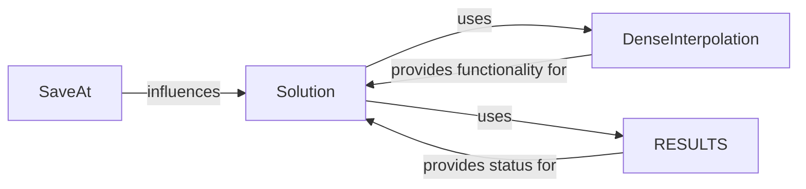

## Details

The `Solution Management` subsystem is primarily defined by the modules `diffrax._solution`, `diffrax._saveat`, and `diffrax._global_interpolation`. These files collectively manage the storage, access, validation, and presentation of the computed numerical solution.

### Solution
The core data structure encapsulating the complete numerical solution. It stores initial/final time points, discrete saved time points and values, an optional `DenseInterpolation` object, solver statistics, the solve result, and final solver/controller states. This component is fundamental as it represents the output of any numerical integration.

**Related Classes/Methods**:

- <a href="https://github.com/patrick-kidger/diffrax/blob/main/diffrax/_solution.py#L82-L201" target="_blank" rel="noopener noreferrer">`diffrax._solution.Solution`:82-201</a>

### RESULTS
An enumeration defining various outcomes of a differential equation solve (e.g., `successful`, `max_steps_reached`, `event_occurred`). It provides utility functions to query the status. This component is crucial for conveying the success or failure state of the numerical process to the user.

**Related Classes/Methods**:

- <a href="https://github.com/patrick-kidger/diffrax/blob/main/diffrax/_solution.py#L13-L31" target="_blank" rel="noopener noreferrer">`diffrax._solution.RESULTS`:13-31</a>

### SaveAt
A configuration object that specifies the strategy for saving intermediate solution points during numerical integration. It allows for saving at specific times, at every step, or enabling dense output. This component is vital for controlling the granularity and type of data collected during the solve, directly influencing the `Solution`'s content.

**Related Classes/Methods**:

- <a href="https://github.com/patrick-kidger/diffrax/blob/main/diffrax/_saveat.py#L55-L95" target="_blank" rel="noopener noreferrer">`diffrax._saveat.SaveAt`:55-95</a>

### DenseInterpolation
Represents the mechanism (e.g., cubic Hermite, linear) used to reconstruct the solution at arbitrary time points between discrete saved steps. This component provides the capability for continuous querying of the solution, a common requirement in scientific computing for analysis and plotting.

**Related Classes/Methods**:

- <a href="https://github.com/patrick-kidger/diffrax/blob/main/diffrax/_global_interpolation.py#L315-L392" target="_blank" rel="noopener noreferrer">`diffrax._global_interpolation.DenseInterpolation`:315-392</a>

### [FAQ](https://github.com/CodeBoarding/GeneratedOnBoardings/tree/main?tab=readme-ov-file#faq)