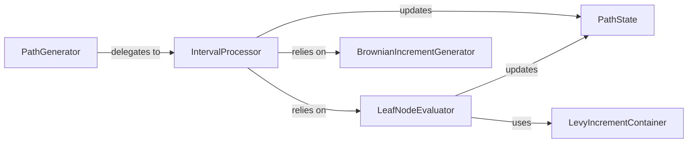

## Details

The `diffrax._brownian.tree` subsystem orchestrates the generation of Brownian paths through a hierarchical, tree-based evaluation. The `PathGenerator` serves as the primary entry point, delegating the core recursive processing to the `IntervalProcessor`. The `IntervalProcessor` is responsible for breaking down time intervals, coordinating the generation of Brownian increments using the `BrownianIncrementGenerator`, and updating the `PathState` as the path evolves. At the smallest time steps (leaf nodes), the `IntervalProcessor` relies on the `LeafNodeEvaluator` to compute the final Brownian values, which in turn utilizes the `LevyIncrementContainer` for fundamental random components and updates the `PathState`. This design ensures a clear separation of concerns, with `PathGenerator` managing the overall flow, `IntervalProcessor` handling recursive decomposition, and `LeafNodeEvaluator` performing terminal computations, all while maintaining the path's dynamic state via `PathState`.

### PathGenerator
Serves as the public entry point and orchestrator for the entire stochastic path generation process. It initiates the recursive/iterative evaluation of the Brownian path across the tree structure and may perform final adjustments like increment normalization.

**Related Classes/Methods**:

- <a href="https://github.com/patrick-kidger/diffrax/blob/main/diffrax/_brownian/tree.py" target="_blank" rel="noopener noreferrer">`PathGenerator`</a>

### IntervalProcessor
Handles the processing of intermediate time intervals within the tree-based path generation. It recursively divides larger intervals into smaller ones and coordinates the generation of corresponding Brownian increments.

**Related Classes/Methods**:

- <a href="https://github.com/patrick-kidger/diffrax/blob/main/diffrax/_brownian/tree.py" target="_blank" rel="noopener noreferrer">`IntervalProcessor`</a>

### LeafNodeEvaluator
Computes the specific Brownian values at the terminal (leaf) nodes of the tree, representing the smallest time steps in the path. It utilizes pre-generated or computed Levy increments for this purpose.

**Related Classes/Methods**:

- <a href="https://github.com/patrick-kidger/diffrax/blob/main/diffrax/_brownian/tree.py" target="_blank" rel="noopener noreferrer">`LeafNodeEvaluator`</a>

### PathState
A data structure (likely a PyTree, given JAX integration) responsible for maintaining the dynamic state during the path generation, such as the current time, path values, and other contextual information.

**Related Classes/Methods**:

- <a href="https://github.com/patrick-kidger/diffrax/blob/main/diffrax/_brownian/tree.py" target="_blank" rel="noopener noreferrer">`PathState`</a>

### BrownianIncrementGenerator
Generates the raw Brownian increments based on a specific archival or generation algorithm. These are the fundamental random components that build the stochastic path.

**Related Classes/Methods**:

- <a href="https://github.com/patrick-kidger/diffrax/blob/main/diffrax/_brownian/tree.py" target="_blank" rel="noopener noreferrer">`BrownianIncrementGenerator`</a>

### LevyIncrementContainer
A data structure that encapsulates the Levy increments, which are the fundamental random components used at the leaf nodes of the Brownian path tree.

**Related Classes/Methods**:

- <a href="https://github.com/patrick-kidger/diffrax/blob/main/diffrax/_brownian/tree.py" target="_blank" rel="noopener noreferrer">`LevyIncrementContainer`</a>

### [FAQ](https://github.com/CodeBoarding/GeneratedOnBoardings/tree/main?tab=readme-ov-file#faq)