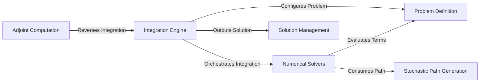

## Details

The `diffrax` library is designed around a modular architecture for solving differential equations. The `Integration Engine` acts as the central orchestrator, managing the overall integration process and event handling. It interacts with the `Problem Definition` component to understand the mathematical structure of the differential equation. The core numerical computations are performed by the `Numerical Solvers`, which approximate the solution step-by-step and can utilize `Stochastic Path Generation` for stochastic differential equations. The `Solution Management` component is responsible for handling, storing, and presenting the computed results. Finally, the `Adjoint Computation` component provides crucial functionality for gradient calculations, enabling optimization and machine learning applications. This clear separation of concerns facilitates both maintainability and extensibility, making it suitable for generating comprehensive data flow diagrams.

### Integration Engine [[Expand]](./Integration_Engine.md)
The central control unit that initiates, manages, and orchestrates the entire differential equation solving process, including the main integration loop and event handling.

**Related Classes/Methods**:

- <a href="https://github.com/patrick-kidger/diffrax/blob/main/diffrax/_integrate.py" target="_blank" rel="noopener noreferrer">`Integration Engine`</a>
- <a href="https://github.com/patrick-kidger/diffrax/blob/main/diffrax/_event.py" target="_blank" rel="noopener noreferrer">`Integration Engine`</a>

### Problem Definition
Defines the mathematical structure of the differential equation, including its terms (e.g., vector fields, control inputs), providing the interface for users to specify the problem.

**Related Classes/Methods**:

- <a href="https://github.com/patrick-kidger/diffrax/blob/main/diffrax/_term.py" target="_blank" rel="noopener noreferrer">`Problem Definition`</a>

### Numerical Solvers [[Expand]](./Numerical_Solvers.md)
Implements various numerical algorithms (e.g., Runge-Kutta, SRK methods) to approximate the solution step-by-step, incorporating adaptive step size control and internal root-finding for implicit methods.

**Related Classes/Methods**:

- <a href="https://github.com/patrick-kidger/diffrax/blob/main/diffrax/_solver/base.py" target="_blank" rel="noopener noreferrer">`Numerical Solvers`</a>
- <a href="https://github.com/patrick-kidger/diffrax/blob/main/diffrax/_solver/runge_kutta.py" target="_blank" rel="noopener noreferrer">`Numerical Solvers`</a>
- <a href="https://github.com/patrick-kidger/diffrax/blob/main/diffrax/_solver/srk.py" target="_blank" rel="noopener noreferrer">`Numerical Solvers`</a>
- <a href="https://github.com/patrick-kidger/diffrax/blob/main/diffrax/_root_finder/_verychord.py" target="_blank" rel="noopener noreferrer">`Numerical Solvers`</a>

### Solution Management [[Expand]](./Solution_Management.md)
Handles the storage, access, validation, and interpolation of the computed solution, presenting the results to the user in a structured format.

**Related Classes/Methods**:

- <a href="https://github.com/patrick-kidger/diffrax/blob/main/diffrax/_solution.py" target="_blank" rel="noopener noreferrer">`Solution Management`</a>
- <a href="https://github.com/patrick-kidger/diffrax/blob/main/diffrax/_saveat.py" target="_blank" rel="noopener noreferrer">`Solution Management`</a>
- <a href="https://github.com/patrick-kidger/diffrax/blob/main/diffrax/_global_interpolation.py" target="_blank" rel="noopener noreferrer">`Solution Management`</a>

### Adjoint Computation [[Expand]](./Adjoint_Computation.md)
Provides functionality for computing gradients of the solution with respect to parameters, crucial for optimization and machine learning applications.

**Related Classes/Methods**:

- <a href="https://github.com/patrick-kidger/diffrax/blob/main/diffrax/_adjoint.py" target="_blank" rel="noopener noreferrer">`Adjoint Computation`</a>

### Stochastic Path Generation [[Expand]](./Stochastic_Path_Generation.md)
Specializes in generating and evaluating paths for stochastic processes, particularly Brownian motion, which are essential for Stochastic Differential Equations (SDEs).

**Related Classes/Methods**:

- <a href="https://github.com/patrick-kidger/diffrax/blob/main/diffrax/_brownian/tree.py" target="_blank" rel="noopener noreferrer">`Stochastic Path Generation`</a>

### [FAQ](https://github.com/CodeBoarding/GeneratedOnBoardings/tree/main?tab=readme-ov-file#faq)