```mermaid
graph LR
    StableVideoDiffusionPipelineComponent["StableVideoDiffusionPipelineComponent"]
    StableDiffusionXLAdapterPipelineComponent["StableDiffusionXLAdapterPipelineComponent"]
    AudioLDMPipelineComponent["AudioLDMPipelineComponent"]
    ShapEPipelineComponent["ShapEPipelineComponent"]
    StableDiffusionPipelineComponent["StableDiffusionPipelineComponent"]
    BaseDiffusionPipeline["BaseDiffusionPipeline"]
    ImageVideoProcessor["ImageVideoProcessor"]
    ImageTransformationUtilities["ImageTransformationUtilities"]
    TorchTensorUtilities["TorchTensorUtilities"]
    PromptEmbeddingManagement["PromptEmbeddingManagement"]
    SchedulerManagement["SchedulerManagement"]
    ConfigurationAndUtilities["ConfigurationAndUtilities"]
    StableVideoDiffusionPipelineComponent -- "initializes with" --> BaseDiffusionPipeline
    StableVideoDiffusionPipelineComponent -- "uses" --> ImageVideoProcessor
    StableVideoDiffusionPipelineComponent -- "uses" --> ImageTransformationUtilities
    StableVideoDiffusionPipelineComponent -- "uses" --> TorchTensorUtilities
    StableVideoDiffusionPipelineComponent -- "uses" --> SchedulerManagement
    StableVideoDiffusionPipelineComponent -- "uses" --> ConfigurationAndUtilities
    StableDiffusionXLAdapterPipelineComponent -- "initializes with" --> BaseDiffusionPipeline
    StableDiffusionXLAdapterPipelineComponent -- "uses" --> ConfigurationAndUtilities
    StableDiffusionXLAdapterPipelineComponent -- "uses" --> ImageVideoProcessor
    StableDiffusionXLAdapterPipelineComponent -- "uses" --> PromptEmbeddingManagement
    StableDiffusionXLAdapterPipelineComponent -- "uses" --> TorchTensorUtilities
    StableDiffusionXLAdapterPipelineComponent -- "uses" --> ImageTransformationUtilities
    StableDiffusionXLAdapterPipelineComponent -- "uses" --> SchedulerManagement
    AudioLDMPipelineComponent -- "initializes with" --> BaseDiffusionPipeline
    AudioLDMPipelineComponent -- "uses" --> TorchTensorUtilities
    AudioLDMPipelineComponent -- "uses" --> ConfigurationAndUtilities
    ShapEPipelineComponent -- "initializes with" --> BaseDiffusionPipeline
    ShapEPipelineComponent -- "uses" --> TorchTensorUtilities
    ShapEPipelineComponent -- "uses" --> ConfigurationAndUtilities
    StableDiffusionPipelineComponent -- "initializes with" --> BaseDiffusionPipeline
    StableDiffusionPipelineComponent -- "uses" --> ConfigurationAndUtilities
    StableDiffusionPipelineComponent -- "uses" --> ImageVideoProcessor
    StableDiffusionPipelineComponent -- "uses" --> PromptEmbeddingManagement
    StableDiffusionPipelineComponent -- "uses" --> TorchTensorUtilities
    StableDiffusionPipelineComponent -- "uses" --> SchedulerManagement
    TorchTensorUtilities -- "provides utilities to" --> StableVideoDiffusionPipelineComponent
    TorchTensorUtilities -- "provides utilities to" --> StableDiffusionXLAdapterPipelineComponent
    TorchTensorUtilities -- "provides utilities to" --> AudioLDMPipelineComponent
    TorchTensorUtilities -- "provides utilities to" --> ShapEPipelineComponent
    TorchTensorUtilities -- "provides utilities to" --> StableDiffusionPipelineComponent
    PromptEmbeddingManagement -- "manages embeddings for" --> StableDiffusionXLAdapterPipelineComponent
    PromptEmbeddingManagement -- "manages embeddings for" --> StableDiffusionPipelineComponent
    SchedulerManagement -- "manages timesteps for" --> StableVideoDiffusionPipelineComponent
    SchedulerManagement -- "manages timesteps for" --> StableDiffusionXLAdapterPipelineComponent
    ConfigurationAndUtilities -- "provides general utilities to" --> StableVideoDiffusionPipelineComponent
    ConfigurationAndUtilities -- "provides general utilities to" --> StableDiffusionXLAdapterPipelineComponent
    ConfigurationAndUtilities -- "provides general utilities to" --> AudioLDMPipelineComponent
    ConfigurationAndUtilities -- "provides general utilities to" --> ShapEPipelineComponent
    ConfigurationAndUtilities -- "provides general utilities to" --> StableDiffusionPipelineComponent
    ImageVideoProcessor -- "processes images/videos for" --> StableVideoDiffusionPipelineComponent
    ImageVideoProcessor -- "processes images for" --> StableDiffusionXLAdapterPipelineComponent
    ImageVideoProcessor -- "processes images for" --> StableDiffusionPipelineComponent
    BaseDiffusionPipeline -- "is base for" --> StableVideoDiffusionPipelineComponent
    BaseDiffusionPipeline -- "is base for" --> StableDiffusionXLAdapterPipelineComponent
    BaseDiffusionPipeline -- "is base for" --> AudioLDMPipelineComponent
    BaseDiffusionPipeline -- "is base for" --> ShapEPipelineComponent
    BaseDiffusionPipeline -- "is base for" --> StableDiffusionPipelineComponent
```

## Component Details

This section provides an overview of the Application Pipelines subsystem within the diffusers project. It details the high-level interfaces for various diffusion models, encapsulating the entire generation process from input to output. These pipelines combine Neural Network Modules, Diffusion Schedulers, and Data Processors to perform specific tasks like text-to-image, image-to-image, video, and audio generation. The core flow involves initializing a specific pipeline, preparing inputs (e.g., encoding prompts, preprocessing images), executing the denoising process through a series of steps managed by a scheduler, and finally post-processing the generated latents into the desired output format (e.g., images, video, audio).

### StableVideoDiffusionPipelineComponent
This component encapsulates the Stable Video Diffusion pipeline, responsible for generating video sequences from a single input image. It handles the entire video generation workflow, including image encoding, latent preparation, denoising, and video post-processing.

**Related Classes/Methods**:

- <a href="https://github.com/huggingface/diffusers/blob/master/src/diffusers/pipelines/stable_video_diffusion/pipeline_stable_video_diffusion.py#L147-L628" target="_blank" rel="noopener noreferrer">`diffusers.src.diffusers.pipelines.stable_video_diffusion.pipeline_stable_video_diffusion.StableVideoDiffusionPipeline` (147:628)</a>
- <a href="https://github.com/huggingface/diffusers/blob/master/src/diffusers/pipelines/stable_video_diffusion/pipeline_stable_video_diffusion.py#L134-L144" target="_blank" rel="noopener noreferrer">`diffusers.src.diffusers.pipelines.stable_video_diffusion.pipeline_stable_video_diffusion.StableVideoDiffusionPipelineOutput` (134:144)</a>

### StableDiffusionXLAdapterPipelineComponent
This component implements the Stable Diffusion XL pipeline with T2I (Text-to-Image) adapter capabilities. It manages the process of generating high-resolution images conditioned by text prompts and adapter images, including prompt encoding, latent preparation, and image post-processing.

**Related Classes/Methods**:

- <a href="https://github.com/huggingface/diffusers/blob/master/src/diffusers/pipelines/t2i_adapter/pipeline_stable_diffusion_xl_adapter.py#L216-L1311" target="_blank" rel="noopener noreferrer">`diffusers.src.diffusers.pipelines.t2i_adapter.pipeline_stable_diffusion_xl_adapter.StableDiffusionXLAdapterPipeline` (216:1311)</a>
- <a href="https://github.com/huggingface/diffusers/blob/master/src/diffusers/pipelines/stable_diffusion_xl/pipeline_output.py#L11-L21" target="_blank" rel="noopener noreferrer">`diffusers.src.diffusers.pipelines.stable_diffusion_xl.pipeline_output.StableDiffusionXLPipelineOutput` (11:21)</a>

### AudioLDMPipelineComponent
This component represents the AudioLDM pipeline, which is designed for generating audio from text prompts. It orchestrates the audio generation process, including prompt encoding, latent preparation, denoising, and conversion of mel spectrograms to waveforms.

**Related Classes/Methods**:

- <a href="https://github.com/huggingface/diffusers/blob/master/src/diffusers/pipelines/audioldm/pipeline_audioldm.py#L60-L557" target="_blank" rel="noopener noreferrer">`diffusers.src.diffusers.pipelines.audioldm.pipeline_audioldm.AudioLDMPipeline` (60:557)</a>
- <a href="https://github.com/huggingface/diffusers/blob/master/src/diffusers/pipelines/pipeline_utils.py#L130-L139" target="_blank" rel="noopener noreferrer">`diffusers.src.diffusers.pipelines.pipeline_utils.AudioPipelineOutput` (130:139)</a>

### ShapEPipelineComponent
This component encompasses the Shap-E pipelines for generating 3D objects. It includes both text-to-3D and image-to-3D functionalities, managing the encoding of prompts or images, latent preparation, denoising, and outputting 3D representations.

**Related Classes/Methods**:

- <a href="https://github.com/huggingface/diffusers/blob/master/src/diffusers/pipelines/shap_e/pipeline_shap_e.py#L88-L346" target="_blank" rel="noopener noreferrer">`diffusers.src.diffusers.pipelines.shap_e.pipeline_shap_e.ShapEPipeline` (88:346)</a>
- <a href="https://github.com/huggingface/diffusers/blob/master/src/diffusers/pipelines/shap_e/pipeline_shap_e_img2img.py#L89-L333" target="_blank" rel="noopener noreferrer">`diffusers.src.diffusers.pipelines.shap_e.pipeline_shap_e_img2img.ShapEImg2ImgPipeline` (89:333)</a>
- <a href="https://github.com/huggingface/diffusers/blob/master/src/diffusers/pipelines/shap_e/pipeline_shap_e_img2img.py#L77-L86" target="_blank" rel="noopener noreferrer">`diffusers.src.diffusers.pipelines.shap_e.pipeline_shap_e_img2img.ShapEPipelineOutput` (77:86)</a>

### StableDiffusionPipelineComponent
This component provides the core Stable Diffusion pipeline for generating images from text prompts. It handles prompt encoding, latent preparation, denoising, and optional safety checking and image post-processing.

**Related Classes/Methods**:

- <a href="https://github.com/huggingface/diffusers/blob/master/src/diffusers/pipelines/stable_diffusion/pipeline_stable_diffusion.py#L154-L1103" target="_blank" rel="noopener noreferrer">`diffusers.src.diffusers.pipelines.stable_diffusion.pipeline_stable_diffusion.StableDiffusionPipeline` (154:1103)</a>
- <a href="https://github.com/huggingface/diffusers/blob/master/src/diffusers/pipelines/stable_diffusion/pipeline_output.py#L11-L25" target="_blank" rel="noopener noreferrer">`diffusers.src.diffusers.pipelines.stable_diffusion.pipeline_output.StableDiffusionPipelineOutput` (11:25)</a>

### BaseDiffusionPipeline
This component serves as the foundational class for all diffusion pipelines, providing common functionalities such as module registration, progress bar management, and model hook handling.

**Related Classes/Methods**:

- <a href="https://github.com/huggingface/diffusers/blob/master/src/diffusers/pipelines/pipeline_utils.py#L142-L1994" target="_blank" rel="noopener noreferrer">`diffusers.src.diffusers.pipelines.pipeline_utils.DiffusionPipeline` (142:1994)</a>

### ImageVideoProcessor
This component is responsible for various image and video preprocessing and post-processing operations, including converting between PIL images, NumPy arrays, and PyTorch tensors, as well as handling video-specific processing.

**Related Classes/Methods**:

- <a href="https://github.com/huggingface/diffusers/blob/master/src/diffusers/image_processor.py#L88-L838" target="_blank" rel="noopener noreferrer">`diffusers.src.diffusers.image_processor.VaeImageProcessor` (88:838)</a>
- <a href="https://github.com/huggingface/diffusers/blob/master/src/diffusers/video_processor.py#L25-L113" target="_blank" rel="noopener noreferrer">`diffusers.src.diffusers.video_processor.VideoProcessor` (25:113)</a>

### ImageTransformationUtilities
This component provides a set of utility functions for image transformations, specifically focusing on resizing with antialiasing and Gaussian blurring, which are crucial for maintaining image quality during scaling operations.

**Related Classes/Methods**:

- <a href="https://github.com/huggingface/diffusers/blob/master/src/diffusers/pipelines/stable_video_diffusion/pipeline_stable_video_diffusion.py#L633-L659" target="_blank" rel="noopener noreferrer">`diffusers.src.diffusers.pipelines.stable_video_diffusion.pipeline_stable_video_diffusion._resize_with_antialiasing` (633:659)</a>
- <a href="https://github.com/huggingface/diffusers/blob/master/src/diffusers/pipelines/stable_video_diffusion/pipeline_stable_video_diffusion.py#L724-L737" target="_blank" rel="noopener noreferrer">`diffusers.src.diffusers.pipelines.stable_video_diffusion.pipeline_stable_video_diffusion._gaussian_blur2d` (724:737)</a>
- <a href="https://github.com/huggingface/diffusers/blob/master/src/diffusers/pipelines/stable_video_diffusion/pipeline_stable_video_diffusion.py#L685-L705" target="_blank" rel="noopener noreferrer">`diffusers.src.diffusers.pipelines.stable_video_diffusion.pipeline_stable_video_diffusion._filter2d` (685:705)</a>
- <a href="https://github.com/huggingface/diffusers/blob/master/src/diffusers/pipelines/stable_video_diffusion/pipeline_stable_video_diffusion.py#L662-L682" target="_blank" rel="noopener noreferrer">`diffusers.src.diffusers.pipelines.stable_video_diffusion.pipeline_stable_video_diffusion._compute_padding` (662:682)</a>
- <a href="https://github.com/huggingface/diffusers/blob/master/src/diffusers/pipelines/stable_video_diffusion/pipeline_stable_video_diffusion.py#L708-L721" target="_blank" rel="noopener noreferrer">`diffusers.src.diffusers.pipelines.stable_video_diffusion.pipeline_stable_video_diffusion._gaussian` (708:721)</a>
- <a href="https://github.com/huggingface/diffusers/blob/master/src/diffusers/pipelines/t2i_adapter/pipeline_stable_diffusion_xl_adapter.py#L102-L126" target="_blank" rel="noopener noreferrer">`diffusers.src.diffusers.pipelines.t2i_adapter.pipeline_stable_diffusion_xl_adapter._preprocess_adapter_image` (102:126)</a>

### TorchTensorUtilities
This component offers fundamental utility functions for PyTorch tensors, including checking if a module is compiled, generating random tensors, and appending dimensions to tensors, which are common operations in deep learning models.

**Related Classes/Methods**:

- <a href="https://github.com/huggingface/diffusers/blob/master/src/diffusers/utils/torch_utils.py#L88-L92" target="_blank" rel="noopener noreferrer">`diffusers.src.diffusers.utils.torch_utils.is_compiled_module` (88:92)</a>
- <a href="https://github.com/huggingface/diffusers/blob/master/src/diffusers/utils/torch_utils.py#L38-L85" target="_blank" rel="noopener noreferrer">`diffusers.src.diffusers.utils.torch_utils.randn_tensor` (38:85)</a>
- <a href="https://github.com/huggingface/diffusers/blob/master/src/diffusers/pipelines/stable_video_diffusion/pipeline_stable_video_diffusion.py#L65-L70" target="_blank" rel="noopener noreferrer">`diffusers.src.diffusers.pipelines.stable_video_diffusion.pipeline_stable_video_diffusion._append_dims` (65:70)</a>

### PromptEmbeddingManagement
This component is responsible for managing prompt encoding and adjusting embeddings, particularly for LoRA (Low-Rank Adaptation) and PEFT (Parameter-Efficient Fine-Tuning) layers, and handling textual inversion during prompt processing.

**Related Classes/Methods**:

- <a href="https://github.com/huggingface/diffusers/blob/master/src/diffusers/models/lora.py#L69-L80" target="_blank" rel="noopener noreferrer">`diffusers.src.diffusers.models.lora.adjust_lora_scale_text_encoder` (69:80)</a>
- <a href="https://github.com/huggingface/diffusers/blob/master/src/diffusers/utils/peft_utils.py#L103-L120" target="_blank" rel="noopener noreferrer">`diffusers.src.diffusers.utils.peft_utils.scale_lora_layers` (103:120)</a>
- <a href="https://github.com/huggingface/diffusers/blob/master/src/diffusers/utils/peft_utils.py#L123-L147" target="_blank" rel="noopener noreferrer">`diffusers.src.diffusers.utils.peft_utils.unscale_lora_layers` (123:147)</a>
- <a href="https://github.com/huggingface/diffusers/blob/master/src/diffusers/loaders/textual_inversion.py#L115-L140" target="_blank" rel="noopener noreferrer">`diffusers.src.diffusers.loaders.textual_inversion.TextualInversionLoaderMixin.maybe_convert_prompt` (115:140)</a>

### SchedulerManagement
This component provides utilities for managing diffusion schedulers, including retrieving timesteps for the denoising process and rescaling noise configurations, which are critical for controlling the diffusion process.

**Related Classes/Methods**:

- <a href="https://github.com/huggingface/diffusers/blob/master/src/diffusers/pipelines/stable_video_diffusion/pipeline_stable_video_diffusion.py#L74-L130" target="_blank" rel="noopener noreferrer">`diffusers.src.diffusers.pipelines.stable_video_diffusion.pipeline_stable_video_diffusion.retrieve_timesteps` (74:130)</a>
- <a href="https://github.com/huggingface/diffusers/blob/master/src/diffusers/pipelines/t2i_adapter/pipeline_stable_diffusion_xl_adapter.py#L130-L153" target="_blank" rel="noopener noreferrer">`diffusers.src.diffusers.pipelines.t2i_adapter.pipeline_stable_diffusion_xl_adapter.rescale_noise_cfg` (130:153)</a>

### ConfigurationAndUtilities
This component groups general utility functions related to configuration, documentation, and deprecation warnings, providing foundational support for various parts of the diffusers library.

**Related Classes/Methods**:

- <a href="https://github.com/huggingface/diffusers/blob/master/src/diffusers/utils/doc_utils.py#L21-L39" target="_blank" rel="noopener noreferrer">`diffusers.src.diffusers.utils.doc_utils.replace_example_docstring` (21:39)</a>
- <a href="https://github.com/huggingface/diffusers/blob/master/src/diffusers/utils/deprecation_utils.py#L8-L49" target="_blank" rel="noopener noreferrer">`diffusers.src.diffusers.utils.deprecation_utils.deprecate` (8:49)</a>
- <a href="https://github.com/huggingface/diffusers/blob/master/src/diffusers/configuration_utils.py#L88-L645" target="_blank" rel="noopener noreferrer">`diffusers.src.diffusers.configuration_utils.ConfigMixin` (88:645)</a>
- <a href="https://github.com/huggingface/diffusers/blob/master/src/diffusers/configuration_utils.py#L56-L85" target="_blank" rel="noopener noreferrer">`diffusers.src.diffusers.configuration_utils.FrozenDict` (56:85)</a>

### [FAQ](https://github.com/CodeBoarding/GeneratedOnBoardings/tree/main?tab=readme-ov-file#faq)