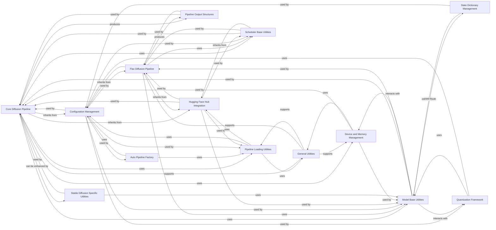

## Component Details

The Core Pipeline Framework is the central subsystem responsible for orchestrating the overall diffusion process within the Diffusers library. It provides the foundational classes for both PyTorch and JAX/Flax-based diffusion pipelines, managing essential functionalities such as model loading, saving, device placement, and configuration. This framework integrates seamlessly with the Hugging Face Hub for model and pipeline management, and includes utilities for memory optimization, attention mechanisms, and state dictionary handling. It also defines standardized output structures and incorporates specialized features for Stable Diffusion models, ensuring a robust and extensible architecture for various diffusion tasks.

### Core Diffusion Pipeline
The foundational class for all PyTorch-based diffusion models, providing core functionalities for managing component loading, saving, device placement, and attention mechanisms. It serves as the primary interface for users to interact with pretrained diffusion models.

**Related Classes/Methods**:

- <a href="https://github.com/huggingface/diffusers/blob/master/src/diffusers/pipelines/pipeline_utils.py#L142-L1994" target="_blank" rel="noopener noreferrer">`diffusers.src.diffusers.pipelines.pipeline_utils.DiffusionPipeline` (142:1994)</a>
- <a href="https://github.com/huggingface/diffusers/blob/master/src/diffusers/pipelines/pipeline_utils.py#L168-L181" target="_blank" rel="noopener noreferrer">`diffusers.pipelines.pipeline_utils.DiffusionPipeline.register_modules` (168:181)</a>
- <a href="https://github.com/huggingface/diffusers/blob/master/src/diffusers/pipelines/pipeline_utils.py#L198-L329" target="_blank" rel="noopener noreferrer">`diffusers.pipelines.pipeline_utils.DiffusionPipeline.save_pretrained` (198:329)</a>
- <a href="https://github.com/huggingface/diffusers/blob/master/src/diffusers/pipelines/pipeline_utils.py#L331-L518" target="_blank" rel="noopener noreferrer">`diffusers.pipelines.pipeline_utils.DiffusionPipeline.to` (331:518)</a>
- <a href="https://github.com/huggingface/diffusers/blob/master/src/diffusers/pipelines/pipeline_utils.py#L552-L1063" target="_blank" rel="noopener noreferrer">`diffusers.pipelines.pipeline_utils.DiffusionPipeline.from_pretrained` (552:1063)</a>
- <a href="https://github.com/huggingface/diffusers/blob/master/src/diffusers/pipelines/pipeline_utils.py#L1314-L1643" target="_blank" rel="noopener noreferrer">`diffusers.pipelines.pipeline_utils.DiffusionPipeline.download` (1314:1643)</a>
- <a href="https://github.com/huggingface/diffusers/blob/master/src/diffusers/pipelines/pipeline_utils.py#L1113-L1206" target="_blank" rel="noopener noreferrer">`diffusers.pipelines.pipeline_utils.DiffusionPipeline.enable_model_cpu_offload` (1113:1206)</a>
- <a href="https://github.com/huggingface/diffusers/blob/master/src/diffusers/pipelines/pipeline_utils.py#L1231-L1297" target="_blank" rel="noopener noreferrer">`diffusers.pipelines.pipeline_utils.DiffusionPipeline.enable_sequential_cpu_offload` (1231:1297)</a>
- <a href="https://github.com/huggingface/diffusers/blob/master/src/diffusers/pipelines/pipeline_utils.py#L1104-L1111" target="_blank" rel="noopener noreferrer">`diffusers.pipelines.pipeline_utils.DiffusionPipeline.remove_all_hooks` (1104:1111)</a>
- <a href="https://github.com/huggingface/diffusers/blob/master/src/diffusers/pipelines/pipeline_utils.py#L1299-L1310" target="_blank" rel="noopener noreferrer">`diffusers.pipelines.pipeline_utils.DiffusionPipeline.reset_device_map` (1299:1310)</a>
- <a href="https://github.com/huggingface/diffusers/blob/master/src/diffusers/pipelines/pipeline_utils.py#L1738-L1771" target="_blank" rel="noopener noreferrer">`diffusers.pipelines.pipeline_utils.DiffusionPipeline.enable_xformers_memory_efficient_attention` (1738:1771)</a>
- <a href="https://github.com/huggingface/diffusers/blob/master/src/diffusers/pipelines/pipeline_utils.py#L1773-L1777" target="_blank" rel="noopener noreferrer">`diffusers.pipelines.pipeline_utils.DiffusionPipeline.disable_xformers_memory_efficient_attention` (1773:1777)</a>
- <a href="https://github.com/huggingface/diffusers/blob/master/src/diffusers/pipelines/pipeline_utils.py#L1779-L1797" target="_blank" rel="noopener noreferrer">`diffusers.pipelines.pipeline_utils.DiffusionPipeline.set_use_memory_efficient_attention_xformers` (1779:1797)</a>
- <a href="https://github.com/huggingface/diffusers/blob/master/src/diffusers/pipelines/pipeline_utils.py#L1799-L1837" target="_blank" rel="noopener noreferrer">`diffusers.pipelines.pipeline_utils.DiffusionPipeline.enable_attention_slicing` (1799:1837)</a>
- <a href="https://github.com/huggingface/diffusers/blob/master/src/diffusers/pipelines/pipeline_utils.py#L1839-L1845" target="_blank" rel="noopener noreferrer">`diffusers.pipelines.pipeline_utils.DiffusionPipeline.disable_attention_slicing` (1839:1845)</a>
- <a href="https://github.com/huggingface/diffusers/blob/master/src/diffusers/pipelines/pipeline_utils.py#L1847-L1853" target="_blank" rel="noopener noreferrer">`diffusers.pipelines.pipeline_utils.DiffusionPipeline.set_attention_slice` (1847:1853)</a>
- <a href="https://github.com/huggingface/diffusers/blob/master/src/diffusers/pipelines/pipeline_utils.py#L1856-L1976" target="_blank" rel="noopener noreferrer">`diffusers.pipelines.pipeline_utils.DiffusionPipeline.from_pipe` (1856:1976)</a>

### Flax Diffusion Pipeline
A foundational class for JAX/Flax-based diffusion models, offering similar core functionalities to DiffusionPipeline for model management and interaction within the Flax ecosystem.

**Related Classes/Methods**:

- <a href="https://github.com/huggingface/diffusers/blob/master/src/diffusers/pipelines/pipeline_flax_utils.py#L101-L610" target="_blank" rel="noopener noreferrer">`diffusers.src.diffusers.pipelines.pipeline_flax_utils.FlaxDiffusionPipeline` (101:610)</a>

### Auto Pipeline Factory
A utility for automatically instantiating the appropriate diffusion pipeline class based on the model type and task (e.g., text-to-image, image-to-image, inpainting), simplifying the process of loading pre-trained pipelines.

**Related Classes/Methods**:

- <a href="https://github.com/huggingface/diffusers/blob/master/src/diffusers/pipelines/auto_pipeline.py#L267-L558" target="_blank" rel="noopener noreferrer">`diffusers.src.diffusers.pipelines.auto_pipeline.AutoPipelineForText2Image` (267:558)</a>
- <a href="https://github.com/huggingface/diffusers/blob/master/src/diffusers/pipelines/auto_pipeline.py#L561-L869" target="_blank" rel="noopener noreferrer">`diffusers.pipelines.auto_pipeline.AutoPipelineForImage2Image` (561:869)</a>
- <a href="https://github.com/huggingface/diffusers/blob/master/src/diffusers/pipelines/auto_pipeline.py#L872-L1173" target="_blank" rel="noopener noreferrer">`diffusers.pipelines.auto_pipeline.AutoPipelineForInpainting` (872:1173)</a>

### Configuration Management
Provides mixin classes and utilities for managing configuration files, enabling components to save and load their state and ensuring proper serialization and deserialization.

**Related Classes/Methods**:

- <a href="https://github.com/huggingface/diffusers/blob/master/src/diffusers/configuration_utils.py#L88-L645" target="_blank" rel="noopener noreferrer">`diffusers.src.diffusers.configuration_utils.ConfigMixin` (88:645)</a>
- <a href="https://github.com/huggingface/diffusers/blob/master/src/diffusers/configuration_utils.py#L746-L760" target="_blank" rel="noopener noreferrer">`diffusers.src.diffusers.configuration_utils.LegacyConfigMixin` (746:760)</a>
- `diffusers.utils.CONFIG_NAME` (full file reference)
- `diffusers.schedulers.scheduling_utils.SCHEDULER_CONFIG_NAME` (full file reference)

### Hugging Face Hub Integration
Offers mixin classes and functions for seamless interaction with the Hugging Face Hub, supporting operations like downloading models, uploading pipelines, and managing model cards.

**Related Classes/Methods**:

- <a href="https://github.com/huggingface/diffusers/blob/master/src/diffusers/utils/hub_utils.py#L458-L557" target="_blank" rel="noopener noreferrer">`diffusers.src.diffusers.utils.hub_utils.PushToHubMixin` (458:557)</a>
- <a href="https://github.com/huggingface/diffusers/blob/master/src/diffusers/utils/hub_utils.py#L445-L455" target="_blank" rel="noopener noreferrer">`diffusers.utils.hub_utils._check_legacy_sharding_variant_format` (445:455)</a>
- <a href="https://github.com/huggingface/diffusers/blob/master/src/diffusers/utils/hub_utils.py#L99-L166" target="_blank" rel="noopener noreferrer">`diffusers.utils.hub_utils.load_or_create_model_card` (99:166)</a>
- <a href="https://github.com/huggingface/diffusers/blob/master/src/diffusers/utils/hub_utils.py#L169-L182" target="_blank" rel="noopener noreferrer">`diffusers.utils.hub_utils.populate_model_card` (169:182)</a>
- `huggingface_hub.snapshot_download` (full file reference)
- `huggingface_hub.model_info` (full file reference)
- `huggingface_hub.hf_hub_download` (full file reference)
- `huggingface_hub.create_repo` (full file reference)
- `huggingface_hub.read_dduf_file` (full file reference)
- `huggingface_hub.DDUFEntry` (full file reference)

### Model Base Utilities
Provides fundamental functionalities and common behaviors for various model types within the diffusion pipelines, including integration with configuration and hub utilities.

**Related Classes/Methods**:

- <a href="https://github.com/huggingface/diffusers/blob/master/src/diffusers/models/modeling_utils.py#L251-L1777" target="_blank" rel="noopener noreferrer">`diffusers.models.modeling_utils.ModelMixin` (251:1777)</a>
- <a href="https://github.com/huggingface/diffusers/blob/master/src/diffusers/models/modeling_utils.py#L1780-L1830" target="_blank" rel="noopener noreferrer">`diffusers.models.modeling_utils.LegacyModelMixin` (1780:1830)</a>
- <a href="https://github.com/huggingface/diffusers/blob/master/src/diffusers/models/autoencoders/autoencoder_kl.py#L38-L567" target="_blank" rel="noopener noreferrer">`diffusers.models.autoencoders.autoencoder_kl.AutoencoderKL` (38:567)</a>

### Pipeline Loading Utilities
A comprehensive set of functions and classes dedicated to the intricate process of downloading, caching, and instantiating various components required for a diffusion pipeline.

**Related Classes/Methods**:

- <a href="https://github.com/huggingface/diffusers/blob/master/src/diffusers/utils/loading_utils.py#L1-L109" target="_blank" rel="noopener noreferrer">`diffusers.src.diffusers.utils.loading_utils` (1:109)</a>
- <a href="https://github.com/huggingface/diffusers/blob/master/src/diffusers/pipelines/pipeline_loading_utils.py#L1069-L1122" target="_blank" rel="noopener noreferrer">`diffusers.pipelines.pipeline_loading_utils._download_dduf_file` (1069:1122)</a>
- <a href="https://github.com/huggingface/diffusers/blob/master/src/diffusers/pipelines/pipeline_loading_utils.py#L870-L897" target="_blank" rel="noopener noreferrer">`diffusers.pipelines.pipeline_loading_utils._fetch_class_library_tuple` (870:897)</a>
- <a href="https://github.com/huggingface/diffusers/blob/master/src/diffusers/pipelines/pipeline_loading_utils.py#L989-L1022" target="_blank" rel="noopener noreferrer">`diffusers.pipelines.pipeline_loading_utils._get_custom_components_and_folders` (989:1022)</a>
- <a href="https://github.com/huggingface/diffusers/blob/master/src/diffusers/pipelines/pipeline_loading_utils.py#L401-L431" target="_blank" rel="noopener noreferrer">`diffusers.pipelines.pipeline_loading_utils._get_custom_pipeline_class` (401:431)</a>
- <a href="https://github.com/huggingface/diffusers/blob/master/src/diffusers/pipelines/pipeline_loading_utils.py#L599-L692" target="_blank" rel="noopener noreferrer">`diffusers.pipelines.pipeline_loading_utils._get_final_device_map` (599:692)</a>
- <a href="https://github.com/huggingface/diffusers/blob/master/src/diffusers/pipelines/pipeline_loading_utils.py#L1025-L1066" target="_blank" rel="noopener noreferrer">`diffusers.pipelines.pipeline_loading_utils._get_ignore_patterns` (1025:1066)</a>
- <a href="https://github.com/huggingface/diffusers/blob/master/src/diffusers/pipelines/pipeline_loading_utils.py#L434-L482" target="_blank" rel="noopener noreferrer">`diffusers.pipelines.pipeline_loading_utils._get_pipeline_class` (434:482)</a>
- <a href="https://github.com/huggingface/diffusers/blob/master/src/diffusers/pipelines/pipeline_loading_utils.py#L900-L909" target="_blank" rel="noopener noreferrer">`diffusers.pipelines.pipeline_loading_utils._identify_model_variants` (900:909)</a>
- <a href="https://github.com/huggingface/diffusers/blob/master/src/diffusers/pipelines/pipeline_loading_utils.py#L1125-L1133" target="_blank" rel="noopener noreferrer">`diffusers.pipelines.pipeline_loading_utils._maybe_raise_error_for_incorrect_transformers` (1125:1133)</a>
- <a href="https://github.com/huggingface/diffusers/blob/master/src/diffusers/pipelines/pipeline_loading_utils.py#L925-L942" target="_blank" rel="noopener noreferrer">`diffusers.pipelines.pipeline_loading_utils._maybe_raise_warning_for_inpainting` (925:942)</a>
- <a href="https://github.com/huggingface/diffusers/blob/master/src/diffusers/pipelines/pipeline_loading_utils.py#L912-L922" target="_blank" rel="noopener noreferrer">`diffusers.pipelines.pipeline_loading_utils._resolve_custom_pipeline_and_cls` (912:922)</a>
- <a href="https://github.com/huggingface/diffusers/blob/master/src/diffusers/pipelines/pipeline_loading_utils.py#L331-L342" target="_blank" rel="noopener noreferrer">`diffusers.pipelines.pipeline_loading_utils._unwrap_model` (331:342)</a>
- <a href="https://github.com/huggingface/diffusers/blob/master/src/diffusers/pipelines/pipeline_loading_utils.py#L945-L986" target="_blank" rel="noopener noreferrer">`diffusers.pipelines.pipeline_loading_utils._update_init_kwargs_with_connected_pipeline` (945:986)</a>
- <a href="https://github.com/huggingface/diffusers/blob/master/src/diffusers/pipelines/pipeline_loading_utils.py#L183-L198" target="_blank" rel="noopener noreferrer">`diffusers.pipelines.pipeline_loading_utils.filter_model_files` (183:198)</a>
- <a href="https://github.com/huggingface/diffusers/blob/master/src/diffusers/pipelines/pipeline_loading_utils.py#L695-L851" target="_blank" rel="noopener noreferrer">`diffusers.pipelines.pipeline_loading_utils.load_sub_model` (695:851)</a>
- <a href="https://github.com/huggingface/diffusers/blob/master/src/diffusers/pipelines/pipeline_loading_utils.py#L345-L371" target="_blank" rel="noopener noreferrer">`diffusers.pipelines.pipeline_loading_utils.maybe_raise_or_warn` (345:371)</a>
- <a href="https://github.com/huggingface/diffusers/blob/master/src/diffusers/pipelines/pipeline_loading_utils.py#L205-L305" target="_blank" rel="noopener noreferrer">`diffusers.pipelines.pipeline_loading_utils.variant_compatible_siblings` (205:305)</a>
- <a href="https://github.com/huggingface/diffusers/blob/master/src/diffusers/pipelines/pipeline_loading_utils.py#L309-L328" target="_blank" rel="noopener noreferrer">`diffusers.pipelines.pipeline_loading_utils.warn_deprecated_model_variant` (309:328)</a>

### State Dictionary Management
Provides utilities for handling the serialization and deserialization of model state dictionaries, ensuring proper saving and loading of model weights and compatibility.

**Related Classes/Methods**:

- <a href="https://github.com/huggingface/diffusers/blob/master/src/diffusers/utils/state_dict_utils.py#L1-L204" target="_blank" rel="noopener noreferrer">`diffusers.src.diffusers.utils.state_dict_utils` (1:204)</a>

### Device and Memory Management
Offers functionalities for efficient allocation and movement of models and tensors across various hardware devices (CPU, GPU, HPU), including advanced techniques like CPU offloading for memory optimization.

**Related Classes/Methods**:

- <a href="https://github.com/huggingface/diffusers/blob/master/src/diffusers/utils/torch_utils.py#L166-L174" target="_blank" rel="noopener noreferrer">`diffusers.utils.torch_utils.get_device` (166:174)</a>
- <a href="https://github.com/huggingface/diffusers/blob/master/src/diffusers/hooks/group_offloading.py#L807-L811" target="_blank" rel="noopener noreferrer">`diffusers.hooks.group_offloading._get_group_onload_device` (807:811)</a>
- `accelerate.cpu_offload` (full file reference)
- `accelerate.cpu_offload_with_hook` (full file reference)
- `accelerate.hooks.AlignDevicesHook` (full file reference)
- `accelerate.hooks.CpuOffload` (full file reference)
- <a href="https://github.com/huggingface/diffusers/blob/master/src/diffusers/hooks/group_offloading.py#L198-L243" target="_blank" rel="noopener noreferrer">`diffusers.hooks.group_offloading.GroupOffloadingHook` (198:243)</a>
- <a href="https://github.com/huggingface/diffusers/blob/master/src/diffusers/hooks/group_offloading.py#L340-L353" target="_blank" rel="noopener noreferrer">`diffusers.hooks.group_offloading.LayerExecutionTrackerHook` (340:353)</a>
- <a href="https://github.com/huggingface/diffusers/blob/master/src/diffusers/hooks/group_offloading.py#L246-L337" target="_blank" rel="noopener noreferrer">`diffusers.hooks.group_offloading.LazyPrefetchGroupOffloadingHook` (246:337)</a>
- <a href="https://github.com/huggingface/diffusers/blob/master/src/diffusers/hooks/group_offloading.py#L47-L195" target="_blank" rel="noopener noreferrer">`diffusers.hooks.group_offloading.ModuleGroup` (47:195)</a>

### Pipeline Output Structures
Defines standardized data structures for the outputs generated by diffusion pipelines, such as images and audio, ensuring consistency and ease of use for downstream applications.

**Related Classes/Methods**:

- <a href="https://github.com/huggingface/diffusers/blob/master/src/diffusers/pipelines/pipeline_utils.py#L116-L126" target="_blank" rel="noopener noreferrer">`diffusers.pipelines.pipeline_utils.ImagePipelineOutput` (116:126)</a>
- <a href="https://github.com/huggingface/diffusers/blob/master/src/diffusers/pipelines/pipeline_utils.py#L130-L139" target="_blank" rel="noopener noreferrer">`diffusers.pipelines.pipeline_utils.AudioPipelineOutput` (130:139)</a>
- <a href="https://github.com/huggingface/diffusers/blob/master/src/diffusers/utils/outputs.py#L40-L138" target="_blank" rel="noopener noreferrer">`diffusers.utils.outputs.BaseOutput` (40:138)</a>
- <a href="https://github.com/huggingface/diffusers/blob/master/src/diffusers/pipelines/pipeline_flax_utils.py#L88-L98" target="_blank" rel="noopener noreferrer">`diffusers.pipelines.pipeline_flax_utils.FlaxImagePipelineOutput` (88:98)</a>

### Stable Diffusion Specific Utilities
Contains specialized methods and utilities for optimizing and controlling Stable Diffusion-like pipelines, including features like VAE tiling/slicing and the FreeU mechanism.

**Related Classes/Methods**:

- <a href="https://github.com/huggingface/diffusers/blob/master/src/diffusers/pipelines/pipeline_utils.py#L1997-L2114" target="_blank" rel="noopener noreferrer">`diffusers.pipelines.pipeline_utils.StableDiffusionMixin` (1997:2114)</a>
- <a href="https://github.com/huggingface/diffusers/blob/master/src/diffusers/pipelines/pipeline_utils.py#L2002-L2007" target="_blank" rel="noopener noreferrer">`diffusers.pipelines.pipeline_utils.StableDiffusionMixin.enable_vae_slicing` (2002:2007)</a>
- <a href="https://github.com/huggingface/diffusers/blob/master/src/diffusers/pipelines/pipeline_utils.py#L2009-L2014" target="_blank" rel="noopener noreferrer">`diffusers.pipelines.pipeline_utils.StableDiffusionMixin.disable_vae_slicing` (2009:2014)</a>
- <a href="https://github.com/huggingface/diffusers/blob/master/src/diffusers/pipelines/pipeline_utils.py#L2016-L2022" target="_blank" rel="noopener noreferrer">`diffusers.pipelines.pipeline_utils.StableDiffusionMixin.enable_vae_tiling` (2016:2022)</a>
- <a href="https://github.com/huggingface/diffusers/blob/master/src/diffusers/pipelines/pipeline_utils.py#L2024-L2029" target="_blank" rel="noopener noreferrer">`diffusers.pipelines.pipeline_utils.StableDiffusionMixin.disable_vae_tiling` (2024:2029)</a>
- <a href="https://github.com/huggingface/diffusers/blob/master/src/diffusers/pipelines/pipeline_utils.py#L2031-L2051" target="_blank" rel="noopener noreferrer">`diffusers.pipelines.pipeline_utils.StableDiffusionMixin.enable_freeu` (2031:2051)</a>
- <a href="https://github.com/huggingface/diffusers/blob/master/src/diffusers/pipelines/pipeline_utils.py#L2053-L2055" target="_blank" rel="noopener noreferrer">`diffusers.pipelines.pipeline_utils.StableDiffusionMixin.disable_freeu` (2053:2055)</a>
- <a href="https://github.com/huggingface/diffusers/blob/master/src/diffusers/pipelines/pipeline_utils.py#L2057-L2086" target="_blank" rel="noopener noreferrer">`diffusers.pipelines.pipeline_utils.StableDiffusionMixin.fuse_qkv_projections` (2057:2086)</a>
- <a href="https://github.com/huggingface/diffusers/blob/master/src/diffusers/pipelines/pipeline_utils.py#L2088-L2114" target="_blank" rel="noopener noreferrer">`diffusers.pipelines.pipeline_utils.StableDiffusionMixin.unfuse_qkv_projections` (2088:2114)</a>

### General Utilities
A broad set of helper functions and constants used across the Diffusers library, providing common functionalities such as logging, import management, and basic data transformations.

**Related Classes/Methods**:

- `diffusers.src.diffusers.utils.logging` (full file reference)
- `diffusers.utils.is_accelerate_available` (full file reference)
- `diffusers.utils.is_accelerate_version` (full file reference)
- `diffusers.utils.is_hpu_available` (full file reference)
- `diffusers.utils.is_torch_npu_available` (full file reference)
- `diffusers.utils.is_torch_version` (full file reference)
- `diffusers.utils.is_transformers_version` (full file reference)
- `diffusers.utils.numpy_to_pil` (full file reference)
- `diffusers.utils._get_detailed_type` (full file reference)
- `diffusers.utils._is_valid_type` (full file reference)
- `diffusers.utils.DEPRECATED_REVISION_ARGS` (full file reference)

### Scheduler Base Utilities
Provides base classes and utilities for various noise scheduling algorithms, enabling consistent management and application of schedules in diffusion models.

**Related Classes/Methods**:

- <a href="https://github.com/huggingface/diffusers/blob/master/src/diffusers/schedulers/scheduling_utils.py#L75-L194" target="_blank" rel="noopener noreferrer">`diffusers.schedulers.scheduling_utils.SchedulerMixin` (75:194)</a>
- <a href="https://github.com/huggingface/diffusers/blob/master/src/diffusers/schedulers/scheduling_utils.py#L62-L72" target="_blank" rel="noopener noreferrer">`diffusers.schedulers.scheduling_utils.SchedulerOutput` (62:72)</a>
- <a href="https://github.com/huggingface/diffusers/blob/master/src/diffusers/schedulers/scheduling_utils_flax.py#L58-L186" target="_blank" rel="noopener noreferrer">`diffusers.schedulers.scheduling_utils_flax.FlaxSchedulerMixin` (58:186)</a>
- <a href="https://github.com/huggingface/diffusers/blob/master/src/diffusers/schedulers/scheduling_utils_flax.py#L45-L55" target="_blank" rel="noopener noreferrer">`diffusers.schedulers.scheduling_utils_flax.FlaxSchedulerOutput` (45:55)</a>

### Quantization Framework
Manages the application of quantization techniques to pipeline components, aiming to reduce memory footprint and accelerate inference through lower precision data types.

**Related Classes/Methods**:

- <a href="https://github.com/huggingface/diffusers/blob/master/src/diffusers/quantizers/quantization_config.py#L62-L173" target="_blank" rel="noopener noreferrer">`diffusers.quantizers.quantization_config.QuantizationConfigMixin` (62:173)</a>
- <a href="https://github.com/huggingface/diffusers/blob/master/src/diffusers/quantizers/quantization_config.py#L177-L406" target="_blank" rel="noopener noreferrer">`diffusers.quantizers.quantization_config.BitsAndBytesConfig` (177:406)</a>
- <a href="https://github.com/huggingface/diffusers/blob/master/src/diffusers/quantizers/quantization_config.py#L410-L429" target="_blank" rel="noopener noreferrer">`diffusers.quantizers.quantization_config.GGUFQuantizationConfig` (410:429)</a>
- <a href="https://github.com/huggingface/diffusers/blob/master/src/diffusers/quantizers/quantization_config.py#L693-L724" target="_blank" rel="noopener noreferrer">`diffusers.quantizers.quantization_config.QuantoConfig` (693:724)</a>
- <a href="https://github.com/huggingface/diffusers/blob/master/src/diffusers/quantizers/quantization_config.py#L433-L689" target="_blank" rel="noopener noreferrer">`diffusers.quantizers.quantization_config.TorchAoConfig` (433:689)</a>
- <a href="https://github.com/huggingface/diffusers/blob/master/src/diffusers/quantizers/base.py#L34-L229" target="_blank" rel="noopener noreferrer">`diffusers.quantizers.base.DiffusersQuantizer` (34:229)</a>
- <a href="https://github.com/huggingface/diffusers/blob/master/src/diffusers/quantizers/bitsandbytes/bnb_quantizer.py#L44-L329" target="_blank" rel="noopener noreferrer">`diffusers.quantizers.bitsandbytes.bnb_quantizer.BnB4BitDiffusersQuantizer` (44:329)</a>
- <a href="https://github.com/huggingface/diffusers/blob/master/src/diffusers/quantizers/bitsandbytes/bnb_quantizer.py#L332-L573" target="_blank" rel="noopener noreferrer">`diffusers.quantizers.bitsandbytes.bnb_quantizer.BnB8BitDiffusersQuantizer` (332:573)</a>
- <a href="https://github.com/huggingface/diffusers/blob/master/src/diffusers/quantizers/bitsandbytes/utils.py#L308-L319" target="_blank" rel="noopener noreferrer">`diffusers.quantizers.bitsandbytes.utils._check_bnb_status` (308:319)</a>
- <a href="https://github.com/huggingface/diffusers/blob/master/src/diffusers/quantizers/gguf/gguf_quantizer.py#L36-L165" target="_blank" rel="noopener noreferrer">`diffusers.quantizers.gguf.gguf_quantizer.GGUFQuantizer` (36:165)</a>
- <a href="https://github.com/huggingface/diffusers/blob/master/src/diffusers/quantizers/quanto/quanto_quantizer.py#L32-L177" target="_blank" rel="noopener noreferrer">`diffusers.quantizers.quanto.quanto_quantizer.QuantoQuantizer` (32:177)</a>
- <a href="https://github.com/huggingface/diffusers/blob/master/src/diffusers/quantizers/torchao/torchao_quantizer.py#L131-L337" target="_blank" rel="noopener noreferrer">`diffusers.quantizers.torchao.torchao_quantizer.TorchAoHfQuantizer` (131:337)</a>

### [FAQ](https://github.com/CodeBoarding/GeneratedOnBoardings/tree/main?tab=readme-ov-file#faq)