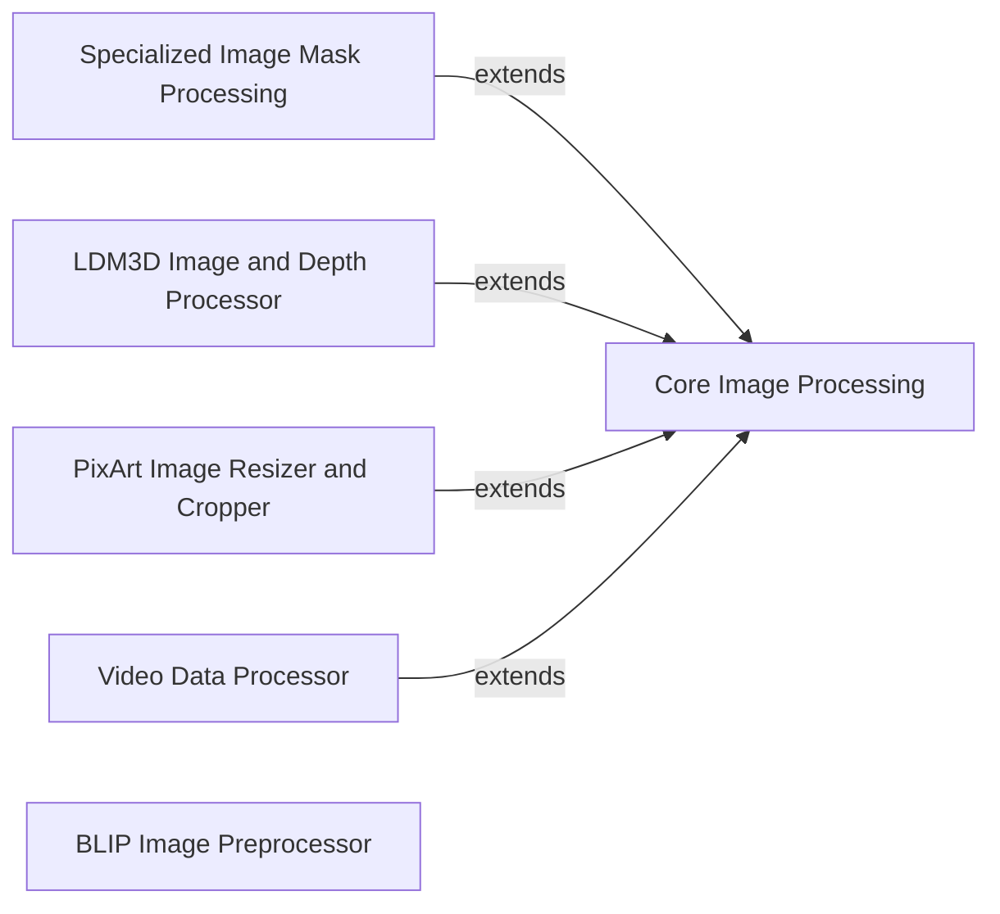

## Component Details

This subsystem, 'Data Processors', is responsible for all image and video related preprocessing and postprocessing tasks within the `diffusers` library. It encompasses a suite of specialized processors that handle various data manipulations, including resizing, cropping, normalization, binarization, color format conversions (e.g., PIL to NumPy to PyTorch tensors and vice-versa), and specific adaptations for different model architectures like LDM3D and PixArt, as well as video data. The core functionality is built upon a base image processor, which is then extended by more specialized processors to meet diverse requirements.

### Core Image Processing
Provides fundamental image preprocessing and postprocessing functionalities, including resizing, normalization, binarization, color format conversion (RGB/grayscale), and conversions between PIL, NumPy, and PyTorch tensor formats. It also includes utilities for image cropping and overlay application.

**Related Classes/Methods**:

- <a href="https://github.com/huggingface/diffusers/blob/master/src/diffusers/image_processor.py#L88-L838" target="_blank" rel="noopener noreferrer">`diffusers.src.diffusers.image_processor.VaeImageProcessor` (88:838)</a>

### Specialized Image Mask Processing
Extends core image processing to handle and downsample image masks, specifically for integration with attention mechanisms like IP-Adapter.

**Related Classes/Methods**:

- <a href="https://github.com/huggingface/diffusers/blob/master/src/diffusers/image_processor.py#L1121-L1222" target="_blank" rel="noopener noreferrer">`diffusers.src.diffusers.image_processor.IPAdapterMaskProcessor` (1121:1222)</a>

### LDM3D Image and Depth Processor
Specializes in processing both RGB and depth images, including specific conversions and handling for 3D model inputs and outputs.

**Related Classes/Methods**:

- <a href="https://github.com/huggingface/diffusers/blob/master/src/diffusers/image_processor.py#L841-L1118" target="_blank" rel="noopener noreferrer">`diffusers.src.diffusers.image_processor.VaeImageProcessorLDM3D` (841:1118)</a>

### PixArt Image Resizer and Cropper
Provides image resizing and cropping functionalities optimized for PixArt models, including aspect ratio classification and tensor-based resizing/cropping.

**Related Classes/Methods**:

- <a href="https://github.com/huggingface/diffusers/blob/master/src/diffusers/image_processor.py#L1225-L1319" target="_blank" rel="noopener noreferrer">`diffusers.src.diffusers.image_processor.PixArtImageProcessor` (1225:1319)</a>

### Video Data Processor
Handles the preprocessing and postprocessing of video data, adapting image processing techniques for sequences of frames.

**Related Classes/Methods**:

- <a href="https://github.com/huggingface/diffusers/blob/master/src/diffusers/video_processor.py#L25-L113" target="_blank" rel="noopener noreferrer">`diffusers.src.diffusers.video_processor.VideoProcessor` (25:113)</a>

### BLIP Image Preprocessor
A dedicated image processor for the BLIP diffusion pipeline, managing resizing, rescaling, normalization, and RGB conversion with specific considerations for BLIP model inputs.

**Related Classes/Methods**:

- <a href="https://github.com/huggingface/diffusers/blob/master/src/diffusers/pipelines/blip_diffusion/blip_image_processing.py#L49-L318" target="_blank" rel="noopener noreferrer">`diffusers.src.diffusers.pipelines.blip_diffusion.blip_image_processing.BlipImageProcessor` (49:318)</a>

### [FAQ](https://github.com/CodeBoarding/GeneratedOnBoardings/tree/main?tab=readme-ov-file#faq)