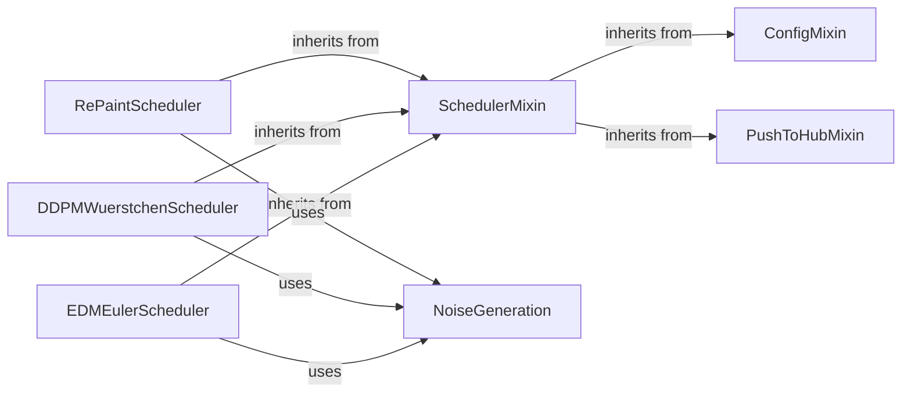

## Component Details

This component overview details the structure and interactions of various diffusion schedulers within the `diffusers` library. The core functionality revolves around the `SchedulerMixin` which provides a common interface for all schedulers, handling configuration and compatibility. Concrete schedulers like `RePaintScheduler`, `DDPMWuerstchenScheduler`, and `EDMEulerScheduler` implement specific noise schedules and sampling processes. The `ConfigMixin` and `PushToHubMixin` provide utility for managing configurations and pushing models to the Hugging Face Hub, respectively. Noise generation is handled by the `NoiseGeneration` utility, which is used by the individual schedulers to introduce randomness into the diffusion process.

### SchedulerMixin
The foundational abstract component for all diffusion schedulers, providing core functionalities like configuration management and compatibility checks. It ensures that all concrete schedulers adhere to a common interface and can be easily integrated into the `diffusers` ecosystem.

**Related Classes/Methods**:

- <a href="https://github.com/huggingface/diffusers/blob/master/src/diffusers/schedulers/scheduling_utils.py#L75-L194" target="_blank" rel="noopener noreferrer">`diffusers.src.diffusers.schedulers.scheduling_utils.SchedulerMixin` (75:194)</a>
- <a href="https://github.com/huggingface/diffusers/blob/master/src/diffusers/schedulers/scheduling_utils.py#L178-L185" target="_blank" rel="noopener noreferrer">`diffusers.src.diffusers.schedulers.scheduling_utils.SchedulerMixin:compatibles` (178:185)</a>
- <a href="https://github.com/huggingface/diffusers/blob/master/src/diffusers/schedulers/scheduling_utils.py#L188-L194" target="_blank" rel="noopener noreferrer">`diffusers.src.diffusers.schedulers.scheduling_utils.SchedulerMixin._get_compatibles` (188:194)</a>

### ConfigMixin
A utility mixin that provides functionalities for loading, saving, and managing configurations for various `diffusers` components, including schedulers. It ensures that component parameters can be easily serialized and deserialized.

**Related Classes/Methods**:

- <a href="https://github.com/huggingface/diffusers/blob/master/src/diffusers/configuration_utils.py#L88-L645" target="_blank" rel="noopener noreferrer">`diffusers.configuration_utils.ConfigMixin` (88:645)</a>

### PushToHubMixin
A utility mixin that provides functionalities for pushing models and schedulers to the Hugging Face Hub. It handles authentication, repository management, and file uploads, enabling seamless sharing and versioning of `diffusers` components.

**Related Classes/Methods**:

- <a href="https://github.com/huggingface/diffusers/blob/master/src/diffusers/utils/hub_utils.py#L458-L557" target="_blank" rel="noopener noreferrer">`diffusers.utils.hub_utils.PushToHubMixin` (458:557)</a>

### RePaintScheduler
A specialized diffusion scheduler designed for inpainting tasks using the DDPM framework. It manages the noise schedule and sampling process, including unique steps for undoing diffusion steps, making it suitable for iterative refinement in inpainting.

**Related Classes/Methods**:

- <a href="https://github.com/huggingface/diffusers/blob/master/src/diffusers/schedulers/scheduling_repaint.py#L91-L365" target="_blank" rel="noopener noreferrer">`diffusers.src.diffusers.schedulers.scheduling_repaint.RePaintScheduler` (91:365)</a>
- <a href="https://github.com/huggingface/diffusers/blob/master/src/diffusers/schedulers/scheduling_repaint.py#L121-L161" target="_blank" rel="noopener noreferrer">`diffusers.src.diffusers.schedulers.scheduling_repaint.RePaintScheduler:__init__` (121:161)</a>
- <a href="https://github.com/huggingface/diffusers/blob/master/src/diffusers/schedulers/scheduling_repaint.py#L246-L337" target="_blank" rel="noopener noreferrer">`diffusers.src.diffusers.schedulers.scheduling_repaint.RePaintScheduler:step` (246:337)</a>
- <a href="https://github.com/huggingface/diffusers/blob/master/src/diffusers/schedulers/scheduling_repaint.py#L339-L354" target="_blank" rel="noopener noreferrer">`diffusers.src.diffusers.schedulers.scheduling_repaint.RePaintScheduler:undo_step` (339:354)</a>
- <a href="https://github.com/huggingface/diffusers/blob/master/src/diffusers/schedulers/scheduling_repaint.py#L227-L244" target="_blank" rel="noopener noreferrer">`diffusers.src.diffusers.schedulers.scheduling_repaint.RePaintScheduler._get_variance` (227:244)</a>
- <a href="https://github.com/huggingface/diffusers/blob/master/src/diffusers/schedulers/scheduling_repaint.py#L47-L88" target="_blank" rel="noopener noreferrer">`diffusers.src.diffusers.schedulers.scheduling_repaint.betas_for_alpha_bar` (47:88)</a>
- <a href="https://github.com/huggingface/diffusers/blob/master/src/diffusers/schedulers/scheduling_repaint.py#L29-L43" target="_blank" rel="noopener noreferrer">`diffusers.src.diffusers.schedulers.scheduling_repaint.RePaintSchedulerOutput` (29:43)</a>

### DDPMWuerstchenScheduler
An implementation of the Denoising Diffusion Probabilistic Models (DDPM) scheduler, specifically optimized for the Wuerstchen model. It manages the core diffusion process, including noise addition and prediction of previous samples, with a focus on efficient alpha cumulative product calculation.

**Related Classes/Methods**:

- <a href="https://github.com/huggingface/diffusers/blob/master/src/diffusers/schedulers/scheduling_ddpm_wuerstchen.py#L88-L230" target="_blank" rel="noopener noreferrer">`diffusers.src.diffusers.schedulers.scheduling_ddpm_wuerstchen.DDPMWuerstchenScheduler` (88:230)</a>
- <a href="https://github.com/huggingface/diffusers/blob/master/src/diffusers/schedulers/scheduling_ddpm_wuerstchen.py#L164-L208" target="_blank" rel="noopener noreferrer">`diffusers.src.diffusers.schedulers.scheduling_ddpm_wuerstchen.DDPMWuerstchenScheduler:step` (164:208)</a>
- <a href="https://github.com/huggingface/diffusers/blob/master/src/diffusers/schedulers/scheduling_ddpm_wuerstchen.py#L210-L222" target="_blank" rel="noopener noreferrer">`diffusers.src.diffusers.schedulers.scheduling_ddpm_wuerstchen.DDPMWuerstchenScheduler:add_noise` (210:222)</a>
- <a href="https://github.com/huggingface/diffusers/blob/master/src/diffusers/schedulers/scheduling_ddpm_wuerstchen.py#L227-L230" target="_blank" rel="noopener noreferrer">`diffusers.src.diffusers.schedulers.scheduling_ddpm_wuerstchen.DDPMWuerstchenScheduler.previous_timestep` (227:230)</a>
- <a href="https://github.com/huggingface/diffusers/blob/master/src/diffusers/schedulers/scheduling_ddpm_wuerstchen.py#L118-L126" target="_blank" rel="noopener noreferrer">`diffusers.src.diffusers.schedulers.scheduling_ddpm_wuerstchen.DDPMWuerstchenScheduler._alpha_cumprod` (118:126)</a>
- <a href="https://github.com/huggingface/diffusers/blob/master/src/diffusers/schedulers/scheduling_ddpm_wuerstchen.py#L44-L85" target="_blank" rel="noopener noreferrer">`diffusers.src.diffusers.schedulers.scheduling_ddpm_wuerstchen.betas_for_alpha_bar` (44:85)</a>
- <a href="https://github.com/huggingface/diffusers/blob/master/src/diffusers/schedulers/scheduling_ddpm_wuerstchen.py#L31-L41" target="_blank" rel="noopener noreferrer">`diffusers.src.diffusers.schedulers.scheduling_ddpm_wuerstchen.DDPMWuerstchenSchedulerOutput` (31:41)</a>

### EDMEulerScheduler
Implements the Euler scheduler based on the EDM (Elucidating the Design Space of Diffusion-Based Generative Models) formulation. It manages sigma schedules (Karras, exponential), preconditions inputs and outputs for the model, and performs the diffusion step, providing a robust and flexible sampling method.

**Related Classes/Methods**:

- <a href="https://github.com/huggingface/diffusers/blob/master/src/diffusers/schedulers/scheduling_edm_euler.py#L49-L448" target="_blank" rel="noopener noreferrer">`diffusers.src.diffusers.schedulers.scheduling_edm_euler.EDMEulerScheduler` (49:448)</a>
- <a href="https://github.com/huggingface/diffusers/blob/master/src/diffusers/schedulers/scheduling_edm_euler.py#L89-L131" target="_blank" rel="noopener noreferrer">`diffusers.src.diffusers.schedulers.scheduling_edm_euler.EDMEulerScheduler:__init__` (89:131)</a>
- <a href="https://github.com/huggingface/diffusers/blob/master/src/diffusers/schedulers/scheduling_edm_euler.py#L163-L166" target="_blank" rel="noopener noreferrer">`diffusers.src.diffusers.schedulers.scheduling_edm_euler.EDMEulerScheduler:precondition_inputs` (163:166)</a>
- <a href="https://github.com/huggingface/diffusers/blob/master/src/diffusers/schedulers/scheduling_edm_euler.py#L191-L213" target="_blank" rel="noopener noreferrer">`diffusers.src.diffusers.schedulers.scheduling_edm_euler.EDMEulerScheduler:scale_model_input` (191:213)</a>
- <a href="https://github.com/huggingface/diffusers/blob/master/src/diffusers/schedulers/scheduling_edm_euler.py#L215-L262" target="_blank" rel="noopener noreferrer">`diffusers.src.diffusers.schedulers.scheduling_edm_euler.EDMEulerScheduler:set_timesteps` (215:262)</a>
- <a href="https://github.com/huggingface/diffusers/blob/master/src/diffusers/schedulers/scheduling_edm_euler.py#L302-L308" target="_blank" rel="noopener noreferrer">`diffusers.src.diffusers.schedulers.scheduling_edm_euler.EDMEulerScheduler._init_step_index` (302:308)</a>
- <a href="https://github.com/huggingface/diffusers/blob/master/src/diffusers/schedulers/scheduling_edm_euler.py#L310-L407" target="_blank" rel="noopener noreferrer">`diffusers.src.diffusers.schedulers.scheduling_edm_euler.EDMEulerScheduler:step` (310:407)</a>
- <a href="https://github.com/huggingface/diffusers/blob/master/src/diffusers/schedulers/scheduling_edm_euler.py#L410-L441" target="_blank" rel="noopener noreferrer">`diffusers.src.diffusers.schedulers.scheduling_edm_euler.EDMEulerScheduler:add_noise` (410:441)</a>
- <a href="https://github.com/huggingface/diffusers/blob/master/src/diffusers/schedulers/scheduling_edm_euler.py#L265-L274" target="_blank" rel="noopener noreferrer">`diffusers.src.diffusers.schedulers.scheduling_edm_euler.EDMEulerScheduler._compute_karras_sigmas` (265:274)</a>
- <a href="https://github.com/huggingface/diffusers/blob/master/src/diffusers/schedulers/scheduling_edm_euler.py#L276-L284" target="_blank" rel="noopener noreferrer">`diffusers.src.diffusers.schedulers.scheduling_edm_euler.EDMEulerScheduler._compute_exponential_sigmas` (276:284)</a>
- <a href="https://github.com/huggingface/diffusers/blob/master/src/diffusers/schedulers/scheduling_edm_euler.py#L168-L174" target="_blank" rel="noopener noreferrer">`diffusers.src.diffusers.schedulers.scheduling_edm_euler.EDMEulerScheduler.precondition_noise` (168:174)</a>
- <a href="https://github.com/huggingface/diffusers/blob/master/src/diffusers/schedulers/scheduling_edm_euler.py#L443-L445" target="_blank" rel="noopener noreferrer">`diffusers.src.diffusers.schedulers.scheduling_edm_euler.EDMEulerScheduler._get_conditioning_c_in` (443:445)</a>
- <a href="https://github.com/huggingface/diffusers/blob/master/src/diffusers/schedulers/scheduling_edm_euler.py#L287-L299" target="_blank" rel="noopener noreferrer">`diffusers.src.diffusers.schedulers.scheduling_edm_euler.EDMEulerScheduler.index_for_timestep` (287:299)</a>
- <a href="https://github.com/huggingface/diffusers/blob/master/src/diffusers/schedulers/scheduling_edm_euler.py#L176-L189" target="_blank" rel="noopener noreferrer">`diffusers.src.diffusers.schedulers.scheduling_edm_euler.EDMEulerScheduler.precondition_outputs` (176:189)</a>
- <a href="https://github.com/huggingface/diffusers/blob/master/src/diffusers/schedulers/scheduling_edm_euler.py#L32-L46" target="_blank" rel="noopener noreferrer">`diffusers.src.diffusers.schedulers.scheduling_edm_euler.EDMEulerSchedulerOutput` (32:46)</a>

### NoiseGeneration
A utility component responsible for generating random tensors, primarily used by various schedulers to introduce noise during the diffusion process. It ensures that noise tensors are created on the correct device and with the specified data type, crucial for consistent noise application.

**Related Classes/Methods**:

- <a href="https://github.com/huggingface/diffusers/blob/master/src/diffusers/utils/torch_utils.py#L38-L85" target="_blank" rel="noopener noreferrer">`diffusers.src.diffusers.utils.torch_utils.randn_tensor` (38:85)</a>

### [FAQ](https://github.com/CodeBoarding/GeneratedOnBoardings/tree/main?tab=readme-ov-file#faq)