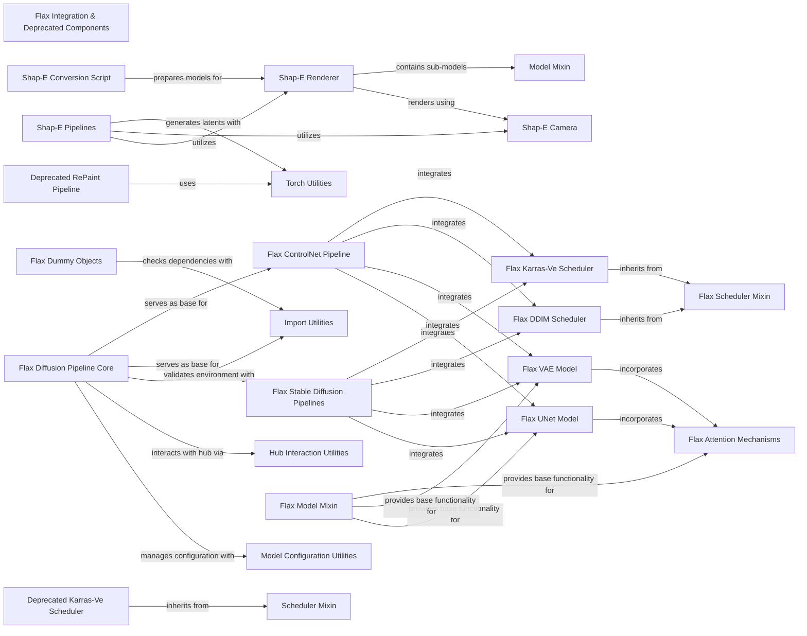

## Component Details

This graph provides an overview of the 'Flax Integration & Deprecated Components' subsystem within the project. It details the structure, flow, and purpose of various Flax-based models, pipelines, and schedulers, highlighting their compatibility with JAX and Flax ecosystems. Additionally, it covers deprecated components maintained for backward compatibility and specialized 3D rendering components related to Shap-E. The core functionality revolves around Flax diffusion pipelines, which integrate various Flax models (UNet, VAE, Attention) and schedulers (DDIM, Karras-Ve). The system also includes distinct pipelines for Stable Diffusion and ControlNet in Flax, alongside the 3D generation capabilities of Shap-E, which comprises its own pipelines, renderer, and camera. Utility components for configuration, hub interaction, and import management support these core functionalities. The presence of deprecated components ensures backward compatibility, while dummy objects facilitate conditional imports and backend management.

### Flax Integration & Deprecated Components
This component includes Flax implementations of various models and components, enabling compatibility with JAX and Flax ecosystems. It also serves as a repository for older or deprecated models, pipelines, and schedulers, maintained for backward compatibility, and includes specialized 3D rendering components.

**Related Classes/Methods**:

- <a href="https://github.com/huggingface/diffusers/blob/master/src/diffusers/models/attention_flax.py#L122-L241" target="_blank" rel="noopener noreferrer">`diffusers.src.diffusers.models.attention_flax.FlaxAttention` (122:241)</a>
- <a href="https://github.com/huggingface/diffusers/blob/master/src/diffusers/pipelines/pipeline_flax_utils.py#L101-L610" target="_blank" rel="noopener noreferrer">`diffusers.src.diffusers.pipelines.pipeline_flax_utils.FlaxDiffusionPipeline` (101:610)</a>
- <a href="https://github.com/huggingface/diffusers/blob/master/src/diffusers/schedulers/scheduling_ddim_flax.py#L66-L314" target="_blank" rel="noopener noreferrer">`diffusers.src.diffusers.schedulers.scheduling_ddim_flax.FlaxDDIMScheduler` (66:314)</a>
- <a href="https://github.com/huggingface/diffusers/blob/master/src/diffusers/pipelines/deprecated/repaint/pipeline_repaint.py#L76-L231" target="_blank" rel="noopener noreferrer">`diffusers.src.diffusers.pipelines.deprecated.repaint.pipeline_repaint.RePaintPipeline` (76:231)</a>
- <a href="https://github.com/huggingface/diffusers/blob/master/src/diffusers/schedulers/deprecated/scheduling_karras_ve.py#L49-L244" target="_blank" rel="noopener noreferrer">`diffusers.src.diffusers.schedulers.deprecated.scheduling_karras_ve.KarrasVeScheduler` (49:244)</a>
- <a href="https://github.com/huggingface/diffusers/blob/master/src/diffusers/pipelines/shap_e/renderer.py#L784-L1050" target="_blank" rel="noopener noreferrer">`diffusers.src.diffusers.pipelines.shap_e.renderer.ShapERenderer` (784:1050)</a>
- <a href="https://github.com/huggingface/diffusers/blob/master/src/diffusers/pipelines/shap_e/camera.py#L23-L119" target="_blank" rel="noopener noreferrer">`diffusers.src.diffusers.pipelines.shap_e.camera.DifferentiableProjectiveCamera` (23:119)</a>

### Flax Diffusion Pipeline Core
This component provides the foundational structure and common functionalities for all Flax-based diffusion pipelines. It handles module registration, saving, and loading of pipeline components (models, schedulers, etc.) from pretrained weights or local directories. It also includes utilities for converting NumPy arrays to PIL images and managing progress bars.

**Related Classes/Methods**:

- <a href="https://github.com/huggingface/diffusers/blob/master/src/diffusers/pipelines/pipeline_flax_utils.py#L101-L610" target="_blank" rel="noopener noreferrer">`diffusers.src.diffusers.pipelines.pipeline_flax_utils.FlaxDiffusionPipeline` (101:610)</a>
- <a href="https://github.com/huggingface/diffusers/blob/master/src/diffusers/pipelines/pipeline_flax_utils.py#L118-L149" target="_blank" rel="noopener noreferrer">`diffusers.src.diffusers.pipelines.pipeline_flax_utils.FlaxDiffusionPipeline:register_modules` (118:149)</a>
- <a href="https://github.com/huggingface/diffusers/blob/master/src/diffusers/pipelines/pipeline_flax_utils.py#L151-L227" target="_blank" rel="noopener noreferrer">`diffusers.src.diffusers.pipelines.pipeline_flax_utils.FlaxDiffusionPipeline:save_pretrained` (151:227)</a>
- <a href="https://github.com/huggingface/diffusers/blob/master/src/diffusers/pipelines/pipeline_flax_utils.py#L231-L534" target="_blank" rel="noopener noreferrer">`diffusers.src.diffusers.pipelines.pipeline_flax_utils.FlaxDiffusionPipeline:from_pretrained` (231:534)</a>
- <a href="https://github.com/huggingface/diffusers/blob/master/src/diffusers/pipelines/pipeline_flax_utils.py#L546-L580" target="_blank" rel="noopener noreferrer">`diffusers.src.diffusers.pipelines.pipeline_flax_utils.FlaxDiffusionPipeline:components` (546:580)</a>
- <a href="https://github.com/huggingface/diffusers/blob/master/src/diffusers/pipelines/pipeline_flax_utils.py#L537-L543" target="_blank" rel="noopener noreferrer">`diffusers.src.diffusers.pipelines.pipeline_flax_utils.FlaxDiffusionPipeline._get_signature_keys` (537:543)</a>
- <a href="https://github.com/huggingface/diffusers/blob/master/src/diffusers/pipelines/pipeline_flax_utils.py#L74-L84" target="_blank" rel="noopener noreferrer">`diffusers.src.diffusers.pipelines.pipeline_flax_utils.import_flax_or_no_model` (74:84)</a>
- <a href="https://github.com/huggingface/diffusers/blob/master/src/diffusers/pipelines/pipeline_flax_utils.py#L88-L98" target="_blank" rel="noopener noreferrer">`diffusers.src.diffusers.pipelines.pipeline_flax_utils.FlaxImagePipelineOutput` (88:98)</a>

### Flax Stable Diffusion Pipelines
This component encompasses various Stable Diffusion pipelines implemented in Flax, including text-to-image, image-to-image, and inpainting. These pipelines leverage the core Flax Diffusion Pipeline functionalities to generate images based on text prompts or input images.

**Related Classes/Methods**:

- <a href="https://github.com/huggingface/diffusers/blob/master/src/diffusers/pipelines/stable_diffusion/pipeline_flax_stable_diffusion.py#L81-L433" target="_blank" rel="noopener noreferrer">`diffusers.src.diffusers.pipelines.stable_diffusion.pipeline_flax_stable_diffusion.FlaxStableDiffusionPipeline` (81:433)</a>
- <a href="https://github.com/huggingface/diffusers/blob/master/src/diffusers/pipelines/stable_diffusion/pipeline_flax_stable_diffusion_img2img.py#L105-L475" target="_blank" rel="noopener noreferrer">`diffusers.src.diffusers.pipelines.stable_diffusion.pipeline_flax_stable_diffusion_img2img.FlaxStableDiffusionImg2ImgPipeline` (105:475)</a>
- <a href="https://github.com/huggingface/diffusers/blob/master/src/diffusers/pipelines/stable_diffusion/pipeline_flax_stable_diffusion_inpaint.py#L102-L526" target="_blank" rel="noopener noreferrer">`diffusers.src.diffusers.pipelines.stable_diffusion.pipeline_flax_stable_diffusion_inpaint.FlaxStableDiffusionInpaintPipeline` (102:526)</a>
- <a href="https://github.com/huggingface/diffusers/blob/master/src/diffusers/pipelines/stable_diffusion_xl/pipeline_flax_stable_diffusion_xl.py#L42-L274" target="_blank" rel="noopener noreferrer">`diffusers.src.diffusers.pipelines.stable_diffusion_xl.pipeline_flax_stable_diffusion_xl.FlaxStableDiffusionXLPipeline` (42:274)</a>
- `diffusers.src.diffusers.pipelines.stable_diffusion.pipeline_output.FlaxStableDiffusionPipelineOutput` (full file reference)
- `diffusers.src.diffusers.pipelines.stable_diffusion_xl.pipeline_output.FlaxStableDiffusionXLPipelineOutput` (full file reference)

### Flax ControlNet Pipeline
This component provides the Flax implementation of the ControlNet pipeline, which allows for fine-grained control over the image generation process using additional input conditions.

**Related Classes/Methods**:

- <a href="https://github.com/huggingface/diffusers/blob/master/src/diffusers/pipelines/controlnet/pipeline_flax_controlnet.py#L114-L481" target="_blank" rel="noopener noreferrer">`diffusers.src.diffusers.pipelines.controlnet.pipeline_flax_controlnet.FlaxStableDiffusionControlNetPipeline` (114:481)</a>

### Shap-E Pipelines
This component includes the Shap-E text-to-image and image-to-image pipelines, designed for generating 3D shapes. They integrate with the Shap-E renderer and camera components to produce 3D outputs.

**Related Classes/Methods**:

- <a href="https://github.com/huggingface/diffusers/blob/master/src/diffusers/pipelines/shap_e/pipeline_shap_e.py#L88-L346" target="_blank" rel="noopener noreferrer">`diffusers.src.diffusers.pipelines.shap_e.pipeline_shap_e.ShapEPipeline` (88:346)</a>
- <a href="https://github.com/huggingface/diffusers/blob/master/src/diffusers/pipelines/shap_e/pipeline_shap_e_img2img.py#L89-L333" target="_blank" rel="noopener noreferrer">`diffusers.src.diffusers.pipelines.shap_e.pipeline_shap_e_img2img.ShapEImg2ImgPipeline` (89:333)</a>
- <a href="https://github.com/huggingface/diffusers/blob/master/src/diffusers/pipelines/shap_e/pipeline_shap_e_img2img.py#L77-L86" target="_blank" rel="noopener noreferrer">`diffusers.src.diffusers.pipelines.shap_e.pipeline_shap_e_img2img.ShapEPipelineOutput` (77:86)</a>
- <a href="https://github.com/huggingface/diffusers/blob/master/src/diffusers/pipelines/shap_e/pipeline_shap_e.py#L76-L85" target="_blank" rel="noopener noreferrer">`diffusers.src.diffusers.pipelines.shap_e.pipeline_shap_e.ShapEPipelineOutput` (76:85)</a>

### Shap-E Renderer
This component is responsible for rendering 3D shapes in the Shap-E pipelines. It includes various sub-models for parameter projection, neural radiance fields (NeRF), bounding box volumes, and mesh decoding.

**Related Classes/Methods**:

- <a href="https://github.com/huggingface/diffusers/blob/master/src/diffusers/pipelines/shap_e/renderer.py#L784-L1050" target="_blank" rel="noopener noreferrer">`diffusers.src.diffusers.pipelines.shap_e.renderer.ShapERenderer` (784:1050)</a>
- <a href="https://github.com/huggingface/diffusers/blob/master/src/diffusers/pipelines/shap_e/renderer.py#L609-L705" target="_blank" rel="noopener noreferrer">`diffusers.src.diffusers.pipelines.shap_e.renderer.MLPNeRSTFModel` (609:705)</a>
- <a href="https://github.com/huggingface/diffusers/blob/master/src/diffusers/pipelines/shap_e/renderer.py#L734-L781" target="_blank" rel="noopener noreferrer">`diffusers.src.diffusers.pipelines.shap_e.renderer.ShapEParamsProjModel` (734:781)</a>
- <a href="https://github.com/huggingface/diffusers/blob/master/src/diffusers/pipelines/shap_e/renderer.py#L214-L233" target="_blank" rel="noopener noreferrer">`diffusers.src.diffusers.pipelines.shap_e.renderer.VoidNeRFModel` (214:233)</a>
- <a href="https://github.com/huggingface/diffusers/blob/master/src/diffusers/pipelines/shap_e/renderer.py#L269-L350" target="_blank" rel="noopener noreferrer">`diffusers.src.diffusers.pipelines.shap_e.renderer.BoundingBoxVolume` (269:350)</a>
- <a href="https://github.com/huggingface/diffusers/blob/master/src/diffusers/pipelines/shap_e/renderer.py#L485-L598" target="_blank" rel="noopener noreferrer">`diffusers.src.diffusers.pipelines.shap_e.renderer.MeshDecoder` (485:598)</a>
- <a href="https://github.com/huggingface/diffusers/blob/master/src/diffusers/pipelines/shap_e/renderer.py#L70-L71" target="_blank" rel="noopener noreferrer">`diffusers.src.diffusers.pipelines.shap_e.renderer.encode_position` (70:71)</a>
- <a href="https://github.com/huggingface/diffusers/blob/master/src/diffusers/pipelines/shap_e/renderer.py#L74-L78" target="_blank" rel="noopener noreferrer">`diffusers.src.diffusers.pipelines.shap_e.renderer.encode_direction` (74:78)</a>
- <a href="https://github.com/huggingface/diffusers/blob/master/src/diffusers/pipelines/shap_e/renderer.py#L53-L67" target="_blank" rel="noopener noreferrer">`diffusers.src.diffusers.pipelines.shap_e.renderer.posenc_nerf` (53:67)</a>
- <a href="https://github.com/huggingface/diffusers/blob/master/src/diffusers/pipelines/shap_e/renderer.py#L85-L116" target="_blank" rel="noopener noreferrer">`diffusers.src.diffusers.pipelines.shap_e.renderer.integrate_samples` (85:116)</a>
- <a href="https://github.com/huggingface/diffusers/blob/master/src/diffusers/pipelines/shap_e/renderer.py#L353-L402" target="_blank" rel="noopener noreferrer">`diffusers.src.diffusers.pipelines.shap_e.renderer.StratifiedRaySampler` (353:402)</a>
- <a href="https://github.com/huggingface/diffusers/blob/master/src/diffusers/pipelines/shap_e/renderer.py#L405-L463" target="_blank" rel="noopener noreferrer">`diffusers.src.diffusers.pipelines.shap_e.renderer.ImportanceRaySampler` (405:463)</a>
- <a href="https://github.com/huggingface/diffusers/blob/master/src/diffusers/pipelines/shap_e/renderer.py#L119-L125" target="_blank" rel="noopener noreferrer">`diffusers.src.diffusers.pipelines.shap_e.renderer.volume_query_points` (119:125)</a>
- <a href="https://github.com/huggingface/diffusers/blob/master/src/diffusers/pipelines/shap_e/renderer.py#L128-L129" target="_blank" rel="noopener noreferrer">`diffusers.src.diffusers.pipelines.shap_e.renderer._convert_srgb_to_linear` (128:129)</a>
- <a href="https://github.com/huggingface/diffusers/blob/master/src/diffusers/pipelines/shap_e/renderer.py#L602-L606" target="_blank" rel="noopener noreferrer">`diffusers.src.diffusers.pipelines.shap_e.renderer.MLPNeRFModelOutput` (602:606)</a>

### Shap-E Camera
This component defines the differentiable camera model used in Shap-E for generating views of 3D objects. It provides functionalities for creating camera rays and handling image resizing.

**Related Classes/Methods**:

- <a href="https://github.com/huggingface/diffusers/blob/master/src/diffusers/pipelines/shap_e/camera.py#L23-L119" target="_blank" rel="noopener noreferrer">`diffusers.src.diffusers.pipelines.shap_e.camera.DifferentiableProjectiveCamera` (23:119)</a>
- <a href="https://github.com/huggingface/diffusers/blob/master/src/diffusers/pipelines/shap_e/camera.py#L122-L147" target="_blank" rel="noopener noreferrer">`diffusers.src.diffusers.pipelines.shap_e.camera.create_pan_cameras` (122:147)</a>

### Flax UNet Model
This component represents the Flax implementation of the U-Net architecture, a common backbone for diffusion models. It includes various blocks for downsampling, upsampling, and cross-attention.

**Related Classes/Methods**:

- <a href="https://github.com/huggingface/diffusers/blob/master/src/diffusers/models/unets/unet_2d_condition_flax.py#L49-L454" target="_blank" rel="noopener noreferrer">`diffusers.src.diffusers.models.unets.unet_2d_condition_flax.FlaxUNet2DConditionModel` (49:454)</a>
- <a href="https://github.com/huggingface/diffusers/blob/master/src/diffusers/models/unets/unet_2d_condition_flax.py#L36-L45" target="_blank" rel="noopener noreferrer">`diffusers.src.diffusers.models.unets.unet_2d_condition_flax.FlaxUNet2DConditionOutput` (36:45)</a>
- <a href="https://github.com/huggingface/diffusers/blob/master/src/diffusers/models/unets/unet_2d_blocks_flax.py#L22-L108" target="_blank" rel="noopener noreferrer">`diffusers.src.diffusers.models.unets.unet_2d_blocks_flax.FlaxCrossAttnDownBlock2D` (22:108)</a>
- <a href="https://github.com/huggingface/diffusers/blob/master/src/diffusers/models/unets/unet_2d_blocks_flax.py#L111-L166" target="_blank" rel="noopener noreferrer">`diffusers.src.diffusers.models.unets.unet_2d_blocks_flax.FlaxDownBlock2D` (111:166)</a>
- <a href="https://github.com/huggingface/diffusers/blob/master/src/diffusers/models/unets/unet_2d_blocks_flax.py#L325-L401" target="_blank" rel="noopener noreferrer">`diffusers.src.diffusers.models.unets.unet_2d_blocks_flax.FlaxUNetMidBlock2DCrossAttn` (325:401)</a>
- <a href="https://github.com/huggingface/diffusers/blob/master/src/diffusers/models/unets/unet_2d_blocks_flax.py#L169-L258" target="_blank" rel="noopener noreferrer">`diffusers.src.diffusers.models.unets.unet_2d_blocks_flax.FlaxCrossAttnUpBlock2D` (169:258)</a>
- <a href="https://github.com/huggingface/diffusers/blob/master/src/diffusers/models/unets/unet_2d_blocks_flax.py#L261-L322" target="_blank" rel="noopener noreferrer">`diffusers.src.diffusers.models.unets.unet_2d_blocks_flax.FlaxUpBlock2D` (261:322)</a>

### Flax VAE Model
This component implements the Variational Autoencoder (VAE) in Flax, used for encoding images into a latent space and decoding latent representations back into images.

**Related Classes/Methods**:

- <a href="https://github.com/huggingface/diffusers/blob/master/src/diffusers/models/vae_flax.py#L727-L876" target="_blank" rel="noopener noreferrer">`diffusers.src.diffusers.models.vae_flax.FlaxAutoencoderKL` (727:876)</a>
- <a href="https://github.com/huggingface/diffusers/blob/master/src/diffusers/models/vae_flax.py#L461-L571" target="_blank" rel="noopener noreferrer">`diffusers.src.diffusers.models.vae_flax.FlaxEncoder` (461:571)</a>
- <a href="https://github.com/huggingface/diffusers/blob/master/src/diffusers/models/vae_flax.py#L574-L686" target="_blank" rel="noopener noreferrer">`diffusers.src.diffusers.models.vae_flax.FlaxDecoder` (574:686)</a>
- <a href="https://github.com/huggingface/diffusers/blob/master/src/diffusers/models/vae_flax.py#L202-L272" target="_blank" rel="noopener noreferrer">`diffusers.src.diffusers.models.vae_flax.FlaxAttentionBlock` (202:272)</a>
- <a href="https://github.com/huggingface/diffusers/blob/master/src/diffusers/models/vae_flax.py#L689-L723" target="_blank" rel="noopener noreferrer">`diffusers.src.diffusers.models.vae_flax.FlaxDiagonalGaussianDistribution` (689:723)</a>
- <a href="https://github.com/huggingface/diffusers/blob/master/src/diffusers/models/vae_flax.py#L48-L58" target="_blank" rel="noopener noreferrer">`diffusers.src.diffusers.models.vae_flax.FlaxAutoencoderKLOutput` (48:58)</a>
- <a href="https://github.com/huggingface/diffusers/blob/master/src/diffusers/models/vae_flax.py#L33-L44" target="_blank" rel="noopener noreferrer">`diffusers.src.diffusers.models.vae_flax.FlaxDecoderOutput` (33:44)</a>

### Flax Attention Mechanisms
This component provides the building blocks for attention mechanisms in Flax models, including multi-head attention and transformer blocks, crucial for processing sequential data in diffusion models.

**Related Classes/Methods**:

- <a href="https://github.com/huggingface/diffusers/blob/master/src/diffusers/models/attention_flax.py#L122-L241" target="_blank" rel="noopener noreferrer">`diffusers.src.diffusers.models.attention_flax.FlaxAttention` (122:241)</a>
- <a href="https://github.com/huggingface/diffusers/blob/master/src/diffusers/models/attention_flax.py#L244-L325" target="_blank" rel="noopener noreferrer">`diffusers.src.diffusers.models.attention_flax.FlaxBasicTransformerBlock` (244:325)</a>
- <a href="https://github.com/huggingface/diffusers/blob/master/src/diffusers/models/attention_flax.py#L328-L431" target="_blank" rel="noopener noreferrer">`diffusers.src.diffusers.models.attention_flax.FlaxTransformer2DModel` (328:431)</a>
- <a href="https://github.com/huggingface/diffusers/blob/master/src/diffusers/models/attention_flax.py#L74-L119" target="_blank" rel="noopener noreferrer">`diffusers.src.diffusers.models.attention_flax.jax_memory_efficient_attention` (74:119)</a>
- <a href="https://github.com/huggingface/diffusers/blob/master/src/diffusers/models/attention_flax.py#L434-L465" target="_blank" rel="noopener noreferrer">`diffusers.src.diffusers.models.attention_flax.FlaxFeedForward` (434:465)</a>

### Flax DDIM Scheduler
This component implements the Denoising Diffusion Implicit Models (DDIM) scheduler in Flax, which defines how noise is added and removed during the diffusion process.

**Related Classes/Methods**:

- <a href="https://github.com/huggingface/diffusers/blob/master/src/diffusers/schedulers/scheduling_ddim_flax.py#L66-L314" target="_blank" rel="noopener noreferrer">`diffusers.src.diffusers.schedulers.scheduling_ddim_flax.FlaxDDIMScheduler` (66:314)</a>
- <a href="https://github.com/huggingface/diffusers/blob/master/src/diffusers/schedulers/scheduling_ddim_flax.py#L36-L58" target="_blank" rel="noopener noreferrer">`diffusers.src.diffusers.schedulers.scheduling_ddim_flax.DDIMSchedulerState` (36:58)</a>
- <a href="https://github.com/huggingface/diffusers/blob/master/src/diffusers/schedulers/scheduling_ddim_flax.py#L62-L63" target="_blank" rel="noopener noreferrer">`diffusers.src.diffusers.schedulers.scheduling_ddim_flax.FlaxDDIMSchedulerOutput` (62:63)</a>

### Flax Karras-Ve Scheduler
This component provides the Flax implementation of the Karras-Ve scheduler, another method for controlling the denoising process in diffusion models.

**Related Classes/Methods**:

- <a href="https://github.com/huggingface/diffusers/blob/master/src/diffusers/schedulers/scheduling_karras_ve_flax.py#L60-L238" target="_blank" rel="noopener noreferrer">`diffusers.src.diffusers.schedulers.scheduling_karras_ve_flax.FlaxKarrasVeScheduler` (60:238)</a>
- <a href="https://github.com/huggingface/diffusers/blob/master/src/diffusers/schedulers/scheduling_karras_ve_flax.py#L30-L38" target="_blank" rel="noopener noreferrer">`diffusers.src.diffusers.schedulers.scheduling_karras_ve_flax.KarrasVeSchedulerState` (30:38)</a>
- <a href="https://github.com/huggingface/diffusers/blob/master/src/diffusers/schedulers/scheduling_karras_ve_flax.py#L42-L57" target="_blank" rel="noopener noreferrer">`diffusers.src.diffusers.schedulers.scheduling_karras_ve_flax.FlaxKarrasVeOutput` (42:57)</a>

### Deprecated RePaint Pipeline
This component represents a deprecated RePaint pipeline, which was used for image inpainting. It's included for historical context or compatibility with older models.

**Related Classes/Methods**:

- <a href="https://github.com/huggingface/diffusers/blob/master/src/diffusers/pipelines/deprecated/repaint/pipeline_repaint.py#L76-L231" target="_blank" rel="noopener noreferrer">`diffusers.src.diffusers.pipelines.deprecated.repaint.pipeline_repaint.RePaintPipeline` (76:231)</a>
- <a href="https://github.com/huggingface/diffusers/blob/master/src/diffusers/pipelines/deprecated/repaint/pipeline_repaint.py#L33-L53" target="_blank" rel="noopener noreferrer">`diffusers.src.diffusers.pipelines.deprecated.repaint.pipeline_repaint._preprocess_image` (33:53)</a>
- <a href="https://github.com/huggingface/diffusers/blob/master/src/diffusers/pipelines/deprecated/repaint/pipeline_repaint.py#L56-L73" target="_blank" rel="noopener noreferrer">`diffusers.src.diffusers.pipelines.deprecated.repaint.pipeline_repaint._preprocess_mask` (56:73)</a>

### Deprecated Karras-Ve Scheduler
This component provides the deprecated Karras-Ve scheduler, maintained for backward compatibility.

**Related Classes/Methods**:

- <a href="https://github.com/huggingface/diffusers/blob/master/src/diffusers/schedulers/deprecated/scheduling_karras_ve.py#L49-L244" target="_blank" rel="noopener noreferrer">`diffusers.src.diffusers.schedulers.deprecated.scheduling_karras_ve.KarrasVeScheduler` (49:244)</a>

### Model Configuration Utilities
This component provides utilities for managing model configurations, including saving and loading configuration files.

**Related Classes/Methods**:

- <a href="https://github.com/huggingface/diffusers/blob/master/src/diffusers/configuration_utils.py#L88-L645" target="_blank" rel="noopener noreferrer">`diffusers.src.diffusers.configuration_utils.ConfigMixin` (88:645)</a>
- <a href="https://github.com/huggingface/diffusers/blob/master/src/diffusers/configuration_utils.py#L111-L126" target="_blank" rel="noopener noreferrer">`diffusers.src.diffusers.configuration_utils.ConfigMixin.register_to_config` (111:126)</a>
- <a href="https://github.com/huggingface/diffusers/blob/master/src/diffusers/configuration_utils.py#L146-L186" target="_blank" rel="noopener noreferrer">`diffusers.src.diffusers.configuration_utils.ConfigMixin.save_config` (146:186)</a>
- <a href="https://github.com/huggingface/diffusers/blob/master/src/diffusers/configuration_utils.py#L291-L458" target="_blank" rel="noopener noreferrer">`diffusers.src.diffusers.configuration_utils.ConfigMixin.load_config` (291:458)</a>
- <a href="https://github.com/huggingface/diffusers/blob/master/src/diffusers/configuration_utils.py#L465-L561" target="_blank" rel="noopener noreferrer">`diffusers.src.diffusers.configuration_utils.ConfigMixin.extract_init_dict` (465:561)</a>

### Hub Interaction Utilities
This component facilitates interaction with the Hugging Face Hub, enabling models and pipelines to be pushed to and downloaded from the hub.

**Related Classes/Methods**:

- <a href="https://github.com/huggingface/diffusers/blob/master/src/diffusers/utils/hub_utils.py#L458-L557" target="_blank" rel="noopener noreferrer">`diffusers.src.diffusers.utils.hub_utils.PushToHubMixin` (458:557)</a>
- `diffusers.src.diffusers.utils.hub_utils._upload_folder` (full file reference)
- <a href="https://github.com/huggingface/diffusers/blob/master/src/diffusers/utils/hub_utils.py#L75-L96" target="_blank" rel="noopener noreferrer">`diffusers.src.diffusers.utils.hub_utils.http_user_agent` (75:96)</a>

### Torch Utilities
This component provides utility functions related to PyTorch, such as generating random tensors.

**Related Classes/Methods**:

- <a href="https://github.com/huggingface/diffusers/blob/master/src/diffusers/utils/torch_utils.py#L38-L85" target="_blank" rel="noopener noreferrer">`diffusers.src.diffusers.utils.torch_utils.randn_tensor` (38:85)</a>

### Import Utilities
This component offers utility functions for handling imports and checking for backend availability, ensuring that necessary libraries are present.

**Related Classes/Methods**:

- <a href="https://github.com/huggingface/diffusers/blob/master/src/diffusers/utils/import_utils.py#L579-L607" target="_blank" rel="noopener noreferrer">`diffusers.src.diffusers.utils.import_utils.requires_backends` (579:607)</a>
- <a href="https://github.com/huggingface/diffusers/blob/master/src/diffusers/utils/import_utils.py#L240-L241" target="_blank" rel="noopener noreferrer">`diffusers.src.diffusers.utils.import_utils.is_transformers_available` (240:241)</a>

### Shap-E Conversion Script
This script is specifically designed to convert Shap-E models from their original configuration to a format compatible with Diffusers.

**Related Classes/Methods**:

- <a href="https://github.com/huggingface/diffusers/blob/master/scripts/convert_shap_e_to_diffusers.py#L860-L863" target="_blank" rel="noopener noreferrer">`diffusers.scripts.convert_shap_e_to_diffusers:renderer_model_from_original_config` (860:863)</a>
- <a href="https://github.com/huggingface/diffusers/blob/master/scripts/convert_shap_e_to_diffusers.py#L967-L984" target="_blank" rel="noopener noreferrer">`diffusers.scripts.convert_shap_e_to_diffusers:renderer` (967:984)</a>
- <a href="https://github.com/huggingface/diffusers/blob/master/scripts/convert_shap_e_to_diffusers.py#L871-L891" target="_blank" rel="noopener noreferrer">`diffusers.scripts.convert_shap_e_to_diffusers.renderer_model_original_checkpoint_to_diffusers_checkpoint` (871:891)</a>
- <a href="https://github.com/huggingface/diffusers/blob/master/scripts/convert_shap_e_to_diffusers.py#L1004-L1011" target="_blank" rel="noopener noreferrer">`diffusers.scripts.convert_shap_e_to_diffusers.load_checkpoint_to_model` (1004:1011)</a>

### Flax Model Mixin
This mixin provides common functionalities for Flax models, particularly for saving and loading pretrained weights.

**Related Classes/Methods**:

- <a href="https://github.com/huggingface/diffusers/blob/master/src/diffusers/models/modeling_flax_utils.py#L50-L561" target="_blank" rel="noopener noreferrer">`diffusers.src.diffusers.models.modeling_flax_utils.FlaxModelMixin` (50:561)</a>
- <a href="https://github.com/huggingface/diffusers/blob/master/src/diffusers/models/modeling_utils.py#L270-L273" target="_blank" rel="noopener noreferrer">`diffusers.src.diffusers.models.modeling_utils.ModelMixin.__init__` (270:273)</a>

### Flax Scheduler Mixin
This mixin provides common functionalities for Flax schedulers, similar to the Flax Model Mixin but for scheduler-specific operations.

**Related Classes/Methods**:

- <a href="https://github.com/huggingface/diffusers/blob/master/src/diffusers/schedulers/scheduling_utils_flax.py#L58-L186" target="_blank" rel="noopener noreferrer">`diffusers.src.diffusers.schedulers.scheduling_utils_flax.FlaxSchedulerMixin` (58:186)</a>
- <a href="https://github.com/huggingface/diffusers/blob/master/src/diffusers/schedulers/scheduling_utils_flax.py#L230-L261" target="_blank" rel="noopener noreferrer">`diffusers.src.diffusers.schedulers.scheduling_utils_flax.CommonSchedulerState.create` (230:261)</a>
- <a href="https://github.com/huggingface/diffusers/blob/master/src/diffusers/schedulers/scheduling_utils_flax.py#L280-L285" target="_blank" rel="noopener noreferrer">`diffusers.src.diffusers.schedulers.scheduling_utils_flax.add_noise_common` (280:285)</a>
- <a href="https://github.com/huggingface/diffusers/blob/master/src/diffusers/schedulers/scheduling_utils_flax.py#L288-L291" target="_blank" rel="noopener noreferrer">`diffusers.src.diffusers.schedulers.scheduling_utils_flax.get_velocity_common` (288:291)</a>

### Flax Dummy Objects
This component contains dummy classes for various Flax models and pipelines. These are likely used for conditional imports or to provide placeholder objects when certain backends are not available, ensuring graceful degradation or specific backend requirements.

**Related Classes/Methods**:

- <a href="https://github.com/huggingface/diffusers/blob/master/src/diffusers/utils/dummy_flax_and_transformers_objects.py#L5-L17" target="_blank" rel="noopener noreferrer">`diffusers.src.diffusers.utils.dummy_flax_and_transformers_objects.FlaxStableDiffusionControlNetPipeline` (5:17)</a>
- <a href="https://github.com/huggingface/diffusers/blob/master/src/diffusers/utils/dummy_flax_and_transformers_objects.py#L20-L32" target="_blank" rel="noopener noreferrer">`diffusers.src.diffusers.utils.dummy_flax_and_transformers_objects.FlaxStableDiffusionImg2ImgPipeline` (20:32)</a>
- <a href="https://github.com/huggingface/diffusers/blob/master/src/diffusers/utils/dummy_flax_and_transformers_objects.py#L35-L47" target="_blank" rel="noopener noreferrer">`diffusers.src.diffusers.utils.dummy_flax_and_transformers_objects.FlaxStableDiffusionInpaintPipeline` (35:47)</a>
- <a href="https://github.com/huggingface/diffusers/blob/master/src/diffusers/utils/dummy_flax_and_transformers_objects.py#L50-L62" target="_blank" rel="noopener noreferrer">`diffusers.src.diffusers.utils.dummy_flax_and_transformers_objects.FlaxStableDiffusionPipeline` (50:62)</a>
- <a href="https://github.com/huggingface/diffusers/blob/master/src/diffusers/utils/dummy_flax_and_transformers_objects.py#L65-L77" target="_blank" rel="noopener noreferrer">`diffusers.src.diffusers.utils.dummy_flax_and_transformers_objects.FlaxStableDiffusionXLPipeline` (65:77)</a>
- <a href="https://github.com/huggingface/diffusers/blob/master/src/diffusers/utils/dummy_flax_objects.py#L5-L17" target="_blank" rel="noopener noreferrer">`diffusers.src.diffusers.utils.dummy_flax_objects.FlaxControlNetModel` (5:17)</a>
- <a href="https://github.com/huggingface/diffusers/blob/master/src/diffusers/utils/dummy_flax_objects.py#L20-L32" target="_blank" rel="noopener noreferrer">`diffusers.src.diffusers.utils.dummy_flax_objects.FlaxModelMixin` (20:32)</a>
- <a href="https://github.com/huggingface/diffusers/blob/master/src/diffusers/utils/dummy_flax_objects.py#L35-L47" target="_blank" rel="noopener noreferrer">`diffusers.src.diffusers.utils.dummy_flax_objects.FlaxUNet2DConditionModel` (35:47)</a>
- <a href="https://github.com/huggingface/diffusers/blob/master/src/diffusers/utils/dummy_flax_objects.py#L50-L62" target="_blank" rel="noopener noreferrer">`diffusers.src.diffusers.utils.dummy_flax_objects.FlaxAutoencoderKL` (50:62)</a>
- <a href="https://github.com/huggingface/diffusers/blob/master/src/diffusers/utils/dummy_flax_objects.py#L65-L77" target="_blank" rel="noopener noreferrer">`diffusers.src.diffusers.utils.dummy_flax_objects.FlaxDiffusionPipeline` (65:77)</a>
- <a href="https://github.com/huggingface/diffusers/blob/master/src/diffusers/utils/dummy_flax_objects.py#L80-L92" target="_blank" rel="noopener noreferrer">`diffusers.src.diffusers.utils.dummy_flax_objects.FlaxDDIMScheduler` (80:92)</a>
- <a href="https://github.com/huggingface/diffusers/blob/master/src/diffusers/utils/dummy_flax_objects.py#L95-L107" target="_blank" rel="noopener noreferrer">`diffusers.src.diffusers.utils.dummy_flax_objects.FlaxDDPMScheduler` (95:107)</a>
- <a href="https://github.com/huggingface/diffusers/blob/master/src/diffusers/utils/dummy_flax_objects.py#L110-L122" target="_blank" rel="noopener noreferrer">`diffusers.src.diffusers.utils.dummy_flax_objects.FlaxDPMSolverMultistepScheduler` (110:122)</a>
- <a href="https://github.com/huggingface/diffusers/blob/master/src/diffusers/utils/dummy_flax_objects.py#L125-L137" target="_blank" rel="noopener noreferrer">`diffusers.src.diffusers.utils.dummy_flax_objects.FlaxEulerDiscreteScheduler` (125:137)</a>
- <a href="https://github.com/huggingface/diffusers/blob/master/src/diffusers/utils/dummy_flax_objects.py#L140-L152" target="_blank" rel="noopener noreferrer">`diffusers.src.diffusers.utils.dummy_flax_objects.FlaxKarrasVeScheduler` (140:152)</a>
- <a href="https://github.com/huggingface/diffusers/blob/master/src/diffusers/utils/dummy_flax_objects.py#L155-L167" target="_blank" rel="noopener noreferrer">`diffusers.src.diffusers.utils.dummy_flax_objects.FlaxLMSDiscreteScheduler` (155:167)</a>
- <a href="https://github.com/huggingface/diffusers/blob/master/src/diffusers/utils/dummy_flax_objects.py#L170-L182" target="_blank" rel="noopener noreferrer">`diffusers.src.diffusers.utils.dummy_flax_objects.FlaxPNDMScheduler` (170:182)</a>
- <a href="https://github.com/huggingface/diffusers/blob/master/src/diffusers/utils/dummy_flax_objects.py#L185-L197" target="_blank" rel="noopener noreferrer">`diffusers.src.diffusers.utils.dummy_flax_objects.FlaxSchedulerMixin` (185:197)</a>
- <a href="https://github.com/huggingface/diffusers/blob/master/src/diffusers/utils/dummy_flax_objects.py#L200-L212" target="_blank" rel="noopener noreferrer">`diffusers.src.diffusers.utils.dummy_flax_objects.FlaxScoreSdeVeScheduler` (200:212)</a>

### Model Mixin
This mixin provides common functionalities for PyTorch-based models, particularly for saving and loading pretrained weights.

**Related Classes/Methods**:

- <a href="https://github.com/huggingface/diffusers/blob/master/src/diffusers/models/modeling_utils.py#L251-L1777" target="_blank" rel="noopener noreferrer">`diffusers.src.diffusers.models.modeling_utils.ModelMixin` (251:1777)</a>

### Scheduler Mixin
This mixin provides common functionalities for PyTorch-based schedulers, including saving and loading.

**Related Classes/Methods**:

- <a href="https://github.com/huggingface/diffusers/blob/master/src/diffusers/schedulers/scheduling_utils.py#L75-L194" target="_blank" rel="noopener noreferrer">`diffusers.src.diffusers.schedulers.scheduling_utils.SchedulerMixin` (75:194)</a>

### [FAQ](https://github.com/CodeBoarding/GeneratedOnBoardings/tree/main?tab=readme-ov-file#faq)