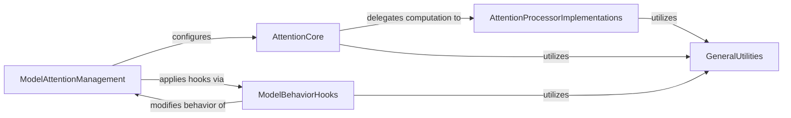

## Component Details

The 'Model Optimization & Hooks' subsystem provides a comprehensive system for enhancing model performance through various optimization techniques and dynamic behavior modification. It encompasses foundational attention mechanisms, a wide array of specialized attention processors tailored for different hardware and architectural needs, and a robust hook system for injecting runtime optimizations like group offloading and pyramid attention broadcast. The subsystem also includes high-level management for configuring attention features within models and general utilities to support these operations. The core flow involves models leveraging the ModelAttentionManagement component to configure their attention layers, which in turn utilize the AttentionCore to delegate computation to specific AttentionProcessorImplementations. ModelBehaviorHooks can be applied to dynamically alter model execution for further optimizations. All these components rely on GeneralUtilities for common functionalities.

### AttentionCore
The foundational component for attention mechanisms, defining the basic structure of attention layers, including linear projections for query, key, and value, and methods for reshaping tensors and computing attention scores. It acts as a container for different Attention Processor implementations.

**Related Classes/Methods**:

- <a href="https://github.com/huggingface/diffusers/blob/master/src/diffusers/models/attention_processor.py#L50-L835" target="_blank" rel="noopener noreferrer">`diffusers.src.diffusers.models.attention_processor.Attention` (50:835)</a>
- <a href="https://github.com/huggingface/diffusers/blob/master/src/diffusers/models/attention_processor.py#L1101-L1170" target="_blank" rel="noopener noreferrer">`diffusers.src.diffusers.models.attention_processor.AttnProcessor` (1101:1170)</a>
- <a href="https://github.com/huggingface/diffusers/blob/master/src/diffusers/models/attention_processor.py#L3242-L3333" target="_blank" rel="noopener noreferrer">`diffusers.src.diffusers.models.attention_processor.AttnProcessor2_0` (3242:3333)</a>
- <a href="https://github.com/huggingface/diffusers/blob/master/src/diffusers/models/attention_processor.py#L4829-L4855" target="_blank" rel="noopener noreferrer">`diffusers.src.diffusers.models.attention_processor.SpatialNorm` (4829:4855)</a>

### AttentionProcessorImplementations
A comprehensive collection of specialized attention processors, each tailored for specific optimizations, hardware, or model architectures. These processors implement various algorithms for attention computation, such as fused projections, memory-efficient attention (xFormers), hardware-specific accelerations (XLA, NPU), and specialized attention for different model architectures or techniques (Custom Diffusion, IP-Adapter, PAG, Sana).

**Related Classes/Methods**:

- <a href="https://github.com/huggingface/diffusers/blob/master/src/diffusers/models/attention_processor.py#L3034-L3125" target="_blank" rel="noopener noreferrer">`diffusers.src.diffusers.models.attention_processor.XFormersAttnProcessor` (3034:3125)</a>
- <a href="https://github.com/huggingface/diffusers/blob/master/src/diffusers/models/attention_processor.py#L4314-L4417" target="_blank" rel="noopener noreferrer">`diffusers.src.diffusers.models.attention_processor.FusedAttnProcessor2_0` (4314:4417)</a>
- <a href="https://github.com/huggingface/diffusers/blob/master/src/diffusers/models/attention_processor.py#L2963-L3031" target="_blank" rel="noopener noreferrer">`diffusers.src.diffusers.models.attention_processor.XFormersAttnAddedKVProcessor` (2963:3031)</a>
- <a href="https://github.com/huggingface/diffusers/blob/master/src/diffusers/models/attention_processor.py#L5290-L5519" target="_blank" rel="noopener noreferrer">`diffusers.src.diffusers.models.attention_processor.IPAdapterXFormersAttnProcessor` (5290:5519)</a>
- <a href="https://github.com/huggingface/diffusers/blob/master/src/diffusers/models/attention_processor.py#L1827-L1903" target="_blank" rel="noopener noreferrer">`diffusers.src.diffusers.models.attention_processor.FusedJointAttnProcessor2_0` (1827:1903)</a>
- <a href="https://github.com/huggingface/diffusers/blob/master/src/diffusers/models/attention_processor.py#L1906-L1988" target="_blank" rel="noopener noreferrer">`diffusers.src.diffusers.models.attention_processor.XFormersJointAttnProcessor` (1906:1988)</a>
- <a href="https://github.com/huggingface/diffusers/blob/master/src/diffusers/models/attention_processor.py#L4420-L4533" target="_blank" rel="noopener noreferrer">`diffusers.src.diffusers.models.attention_processor.CustomDiffusionXFormersAttnProcessor` (4420:4533)</a>
- <a href="https://github.com/huggingface/diffusers/blob/master/src/diffusers/models/attention_processor.py#L4536-L4647" target="_blank" rel="noopener noreferrer">`diffusers.src.diffusers.models.attention_processor.CustomDiffusionAttnProcessor2_0` (4536:4647)</a>
- <a href="https://github.com/huggingface/diffusers/blob/master/src/diffusers/models/attention_processor.py#L4858-L5055" target="_blank" rel="noopener noreferrer">`diffusers.src.diffusers.models.attention_processor.IPAdapterAttnProcessor` (4858:5055)</a>
- <a href="https://github.com/huggingface/diffusers/blob/master/src/diffusers/models/attention_processor.py#L5058-L5287" target="_blank" rel="noopener noreferrer">`diffusers.src.diffusers.models.attention_processor.IPAdapterAttnProcessor2_0` (5058:5287)</a>
- <a href="https://github.com/huggingface/diffusers/blob/master/src/diffusers/models/attention_processor.py#L1277-L1341" target="_blank" rel="noopener noreferrer">`diffusers.src.diffusers.models.attention_processor.AttnAddedKVProcessor` (1277:1341)</a>
- <a href="https://github.com/huggingface/diffusers/blob/master/src/diffusers/models/attention_processor.py#L1344-L1417" target="_blank" rel="noopener noreferrer">`diffusers.src.diffusers.models.attention_processor.AttnAddedKVProcessor2_0` (1344:1417)</a>
- <a href="https://github.com/huggingface/diffusers/blob/master/src/diffusers/models/attention_processor.py#L1420-L1503" target="_blank" rel="noopener noreferrer">`diffusers.src.diffusers.models.attention_processor.JointAttnProcessor2_0` (1420:1503)</a>
- <a href="https://github.com/huggingface/diffusers/blob/master/src/diffusers/models/attention_processor.py#L1506-L1659" target="_blank" rel="noopener noreferrer">`diffusers.src.diffusers.models.attention_processor.PAGJointAttnProcessor2_0` (1506:1659)</a>
- <a href="https://github.com/huggingface/diffusers/blob/master/src/diffusers/models/attention_processor.py#L1662-L1824" target="_blank" rel="noopener noreferrer">`diffusers.src.diffusers.models.attention_processor.PAGCFGJointAttnProcessor2_0` (1662:1824)</a>
- <a href="https://github.com/huggingface/diffusers/blob/master/src/diffusers/models/attention_processor.py#L1991-L2082" target="_blank" rel="noopener noreferrer">`diffusers.src.diffusers.models.attention_processor.AllegroAttnProcessor2_0` (1991:2082)</a>
- <a href="https://github.com/huggingface/diffusers/blob/master/src/diffusers/models/attention_processor.py#L2085-L2175" target="_blank" rel="noopener noreferrer">`diffusers.src.diffusers.models.attention_processor.AuraFlowAttnProcessor2_0` (2085:2175)</a>
- <a href="https://github.com/huggingface/diffusers/blob/master/src/diffusers/models/attention_processor.py#L2178-L2272" target="_blank" rel="noopener noreferrer">`diffusers.src.diffusers.models.attention_processor.FusedAuraFlowAttnProcessor2_0` (2178:2272)</a>
- <a href="https://github.com/huggingface/diffusers/blob/master/src/diffusers/models/attention_processor.py#L2275-L2364" target="_blank" rel="noopener noreferrer">`diffusers.src.diffusers.models.attention_processor.FluxAttnProcessor2_0` (2275:2364)</a>
- <a href="https://github.com/huggingface/diffusers/blob/master/src/diffusers/models/attention_processor.py#L2367-L2470" target="_blank" rel="noopener noreferrer">`diffusers.src.diffusers.models.attention_processor.FluxAttnProcessor2_0_NPU` (2367:2470)</a>
- <a href="https://github.com/huggingface/diffusers/blob/master/src/diffusers/models/attention_processor.py#L2473-L2565" target="_blank" rel="noopener noreferrer">`diffusers.src.diffusers.models.attention_processor.FusedFluxAttnProcessor2_0` (2473:2565)</a>
- <a href="https://github.com/huggingface/diffusers/blob/master/src/diffusers/models/attention_processor.py#L2568-L2676" target="_blank" rel="noopener noreferrer">`diffusers.src.diffusers.models.attention_processor.FusedFluxAttnProcessor2_0_NPU` (2568:2676)</a>
- <a href="https://github.com/huggingface/diffusers/blob/master/src/diffusers/models/attention_processor.py#L2823-L2889" target="_blank" rel="noopener noreferrer">`diffusers.src.diffusers.models.attention_processor.CogVideoXAttnProcessor2_0` (2823:2889)</a>
- <a href="https://github.com/huggingface/diffusers/blob/master/src/diffusers/models/attention_processor.py#L2892-L2960" target="_blank" rel="noopener noreferrer">`diffusers.src.diffusers.models.attention_processor.FusedCogVideoXAttnProcessor2_0` (2892:2960)</a>
- <a href="https://github.com/huggingface/diffusers/blob/master/src/diffusers/models/attention_processor.py#L3336-L3449" target="_blank" rel="noopener noreferrer">`diffusers.src.diffusers.models.attention_processor.XLAFlashAttnProcessor2_0` (3336:3449)</a>
- <a href="https://github.com/huggingface/diffusers/blob/master/src/diffusers/models/attention_processor.py#L3128-L3239" target="_blank" rel="noopener noreferrer">`diffusers.src.diffusers.models.attention_processor.AttnProcessorNPU` (3128:3239)</a>
- <a href="https://github.com/huggingface/diffusers/blob/master/src/diffusers/models/attention_processor.py#L3552-L3634" target="_blank" rel="noopener noreferrer">`diffusers.src.diffusers.models.attention_processor.MochiVaeAttnProcessor2_0` (3552:3634)</a>
- <a href="https://github.com/huggingface/diffusers/blob/master/src/diffusers/models/attention_processor.py#L996-L1098" target="_blank" rel="noopener noreferrer">`diffusers.src.diffusers.models.attention_processor.MochiAttnProcessor2_0` (996:1098)</a>
- <a href="https://github.com/huggingface/diffusers/blob/master/src/diffusers/models/attention_processor.py#L3637-L3767" target="_blank" rel="noopener noreferrer">`diffusers.src.diffusers.models.attention_processor.StableAudioAttnProcessor2_0` (3637:3767)</a>
- <a href="https://github.com/huggingface/diffusers/blob/master/src/diffusers/models/attention_processor.py#L3770-L3865" target="_blank" rel="noopener noreferrer">`diffusers.src.diffusers.models.attention_processor.HunyuanAttnProcessor2_0` (3770:3865)</a>
- <a href="https://github.com/huggingface/diffusers/blob/master/src/diffusers/models/attention_processor.py#L3868-L3968" target="_blank" rel="noopener noreferrer">`diffusers.src.diffusers.models.attention_processor.FusedHunyuanAttnProcessor2_0` (3868:3968)</a>
- <a href="https://github.com/huggingface/diffusers/blob/master/src/diffusers/models/attention_processor.py#L3971-L4091" target="_blank" rel="noopener noreferrer">`diffusers.src.diffusers.models.attention_processor.PAGHunyuanAttnProcessor2_0` (3971:4091)</a>
- <a href="https://github.com/huggingface/diffusers/blob/master/src/diffusers/models/attention_processor.py#L4094-L4215" target="_blank" rel="noopener noreferrer">`diffusers.src.diffusers.models.attention_processor.PAGCFGHunyuanAttnProcessor2_0` (4094:4215)</a>
- <a href="https://github.com/huggingface/diffusers/blob/master/src/diffusers/models/attention_processor.py#L4218-L4311" target="_blank" rel="noopener noreferrer">`diffusers.src.diffusers.models.attention_processor.LuminaAttnProcessor2_0` (4218:4311)</a>
- <a href="https://github.com/huggingface/diffusers/blob/master/src/diffusers/models/attention_processor.py#L4650-L4734" target="_blank" rel="noopener noreferrer">`diffusers.src.diffusers.models.attention_processor.SlicedAttnProcessor` (4650:4734)</a>
- <a href="https://github.com/huggingface/diffusers/blob/master/src/diffusers/models/attention_processor.py#L4737-L4826" target="_blank" rel="noopener noreferrer">`diffusers.src.diffusers.models.attention_processor.SlicedAttnAddedKVProcessor` (4737:4826)</a>
- <a href="https://github.com/huggingface/diffusers/blob/master/src/diffusers/models/attention_processor.py#L6002-L6051" target="_blank" rel="noopener noreferrer">`diffusers.src.diffusers.models.attention_processor.SanaLinearAttnProcessor2_0` (6002:6051)</a>
- <a href="https://github.com/huggingface/diffusers/blob/master/src/diffusers/models/attention_processor.py#L6054-L6106" target="_blank" rel="noopener noreferrer">`diffusers.src.diffusers.models.attention_processor.PAGCFGSanaLinearAttnProcessor2_0` (6054:6106)</a>
- <a href="https://github.com/huggingface/diffusers/blob/master/src/diffusers/models/attention_processor.py#L6109-L6163" target="_blank" rel="noopener noreferrer">`diffusers.src.diffusers.models.attention_processor.PAGIdentitySanaLinearAttnProcessor2_0` (6109:6163)</a>
- <a href="https://github.com/huggingface/diffusers/blob/master/src/diffusers/models/attention_processor.py#L864-L927" target="_blank" rel="noopener noreferrer">`diffusers.src.diffusers.models.attention_processor.SanaMultiscaleLinearAttention` (864:927)</a>
- <a href="https://github.com/huggingface/diffusers/blob/master/src/diffusers/models/attention_processor.py#L5895-L5952" target="_blank" rel="noopener noreferrer">`diffusers.src.diffusers.models.attention_processor.SanaMultiscaleAttnProcessor2_0` (5895:5952)</a>
- <a href="https://github.com/huggingface/diffusers/blob/master/src/diffusers/models/attention_processor.py#L838-L861" target="_blank" rel="noopener noreferrer">`diffusers.src.diffusers.models.attention_processor.SanaMultiscaleAttentionProjection` (838:861)</a>
- <a href="https://github.com/huggingface/diffusers/blob/master/src/diffusers/models/attention_processor.py#L5522-L5690" target="_blank" rel="noopener noreferrer">`diffusers.src.diffusers.models.attention_processor.SD3IPAdapterJointAttnProcessor2_0` (5522:5690)</a>
- <a href="https://github.com/huggingface/diffusers/blob/master/src/diffusers/models/attention_processor.py#L5693-L5789" target="_blank" rel="noopener noreferrer">`diffusers.src.diffusers.models.attention_processor.PAGIdentitySelfAttnProcessor2_0` (5693:5789)</a>
- <a href="https://github.com/huggingface/diffusers/blob/master/src/diffusers/models/attention_processor.py#L5792-L5892" target="_blank" rel="noopener noreferrer">`diffusers.src.diffusers.models.attention_processor.PAGCFGIdentitySelfAttnProcessor2_0` (5792:5892)</a>
- <a href="https://github.com/huggingface/diffusers/blob/master/src/diffusers/models/attention_processor.py#L5955-L5961" target="_blank" rel="noopener noreferrer">`diffusers.src.diffusers.models.attention_processor.LoRAAttnProcessor` (5955:5961)</a>
- <a href="https://github.com/huggingface/diffusers/blob/master/src/diffusers/models/attention_processor.py#L5964-L5970" target="_blank" rel="noopener noreferrer">`diffusers.src.diffusers.models.attention_processor.LoRAAttnProcessor2_0` (5964:5970)</a>
- <a href="https://github.com/huggingface/diffusers/blob/master/src/diffusers/models/attention_processor.py#L5973-L5979" target="_blank" rel="noopener noreferrer">`diffusers.src.diffusers.models.attention_processor.LoRAXFormersAttnProcessor` (5973:5979)</a>
- <a href="https://github.com/huggingface/diffusers/blob/master/src/diffusers/models/attention_processor.py#L5982-L5988" target="_blank" rel="noopener noreferrer">`diffusers.src.diffusers.models.attention_processor.LoRAAttnAddedKVProcessor` (5982:5988)</a>

### ModelAttentionManagement
This component handles the integration and high-level configuration of attention mechanisms within various diffusion models and pipelines. It provides methods to enable or disable specific attention features, such as fused QKV projections or memory-efficient attention, by interacting with the underlying AttentionCore.

**Related Classes/Methods**:

- `diffusers.src.diffusers.pipelines.pipeline_utils.DiffusionPipeline:fuse_qkv_projections` (full file reference)
- <a href="https://github.com/huggingface/diffusers/blob/master/src/diffusers/models/modeling_utils.py#L541-L600" target="_blank" rel="noopener noreferrer">`diffusers.src.diffusers.models.modeling_utils.ModelMixin:enable_group_offload` (541:600)</a>
- <a href="https://github.com/huggingface/diffusers/blob/master/src/diffusers/models/modeling_utils.py#L414-L448" target="_blank" rel="noopener noreferrer">`diffusers.src.diffusers.models.modeling_utils.ModelMixin:enable_xformers_memory_efficient_attention` (414:448)</a>
- <a href="https://github.com/huggingface/diffusers/blob/master/src/diffusers/models/modeling_utils.py#L450-L454" target="_blank" rel="noopener noreferrer">`diffusers.src.diffusers.models.modeling_utils.ModelMixin:disable_xformers_memory_efficient_attention` (450:454)</a>
- <a href="https://github.com/huggingface/diffusers/blob/master/src/diffusers/models/modeling_utils.py#L397-L412" target="_blank" rel="noopener noreferrer">`diffusers.src.diffusers.models.modeling_utils.ModelMixin:set_use_memory_efficient_attention_xformers` (397:412)</a>
- <a href="https://github.com/huggingface/diffusers/blob/master/src/diffusers/models/attention_processor.py#L359-L503" target="_blank" rel="noopener noreferrer">`diffusers.src.diffusers.models.attention_processor.Attention:set_use_memory_efficient_attention_xformers` (359:503)</a>
- <a href="https://github.com/huggingface/diffusers/blob/master/src/diffusers/models/attention_processor.py#L533-L551" target="_blank" rel="noopener noreferrer">`diffusers.src.diffusers.models.attention_processor.Attention:set_processor` (533:551)</a>
- <a href="https://github.com/huggingface/diffusers/blob/master/src/diffusers/models/attention_processor.py#L309-L340" target="_blank" rel="noopener noreferrer">`diffusers.src.diffusers.models.attention_processor.Attention:set_use_xla_flash_attention` (309:340)</a>
- <a href="https://github.com/huggingface/diffusers/blob/master/src/diffusers/models/attention_processor.py#L342-L357" target="_blank" rel="noopener noreferrer">`diffusers.src.diffusers.models.attention_processor.Attention:set_use_npu_flash_attention` (342:357)</a>
- <a href="https://github.com/huggingface/diffusers/blob/master/src/diffusers/models/attention_processor.py#L505-L531" target="_blank" rel="noopener noreferrer">`diffusers.src.diffusers.models.attention_processor.Attention:set_attention_slice` (505:531)</a>
- <a href="https://github.com/huggingface/diffusers/blob/master/src/diffusers/models/attention_processor.py#L785-L835" target="_blank" rel="noopener noreferrer">`diffusers.src.diffusers.models.attention_processor.Attention:fuse_projections` (785:835)</a>
- <a href="https://github.com/huggingface/diffusers/blob/master/src/diffusers/models/unets/unet_motion_model.py#L1909-L1932" target="_blank" rel="noopener noreferrer">`diffusers.src.diffusers.models.unets.unet_motion_model.UNetMotionModel:fuse_qkv_projections` (1909:1932)</a>
- <a href="https://github.com/huggingface/diffusers/blob/master/src/diffusers/models/unets/unet_motion_model.py#L1784-L1816" target="_blank" rel="noopener noreferrer">`diffusers.src.diffusers.models.unets.unet_motion_model.UNetMotionModel.set_attn_processor` (1784:1816)</a>
- <a href="https://github.com/huggingface/diffusers/blob/master/src/diffusers/models/unets/unet_2d_condition.py#L869-L892" target="_blank" rel="noopener noreferrer">`diffusers.src.diffusers.models.unets.unet_2d_condition.UNet2DConditionModel:fuse_qkv_projections` (869:892)</a>
- <a href="https://github.com/huggingface/diffusers/blob/master/src/diffusers/models/unets/unet_2d_condition.py#L723-L755" target="_blank" rel="noopener noreferrer">`diffusers.src.diffusers.models.unets.unet_2d_condition.UNet2DConditionModel.set_attn_processor` (723:755)</a>
- <a href="https://github.com/huggingface/diffusers/blob/master/src/diffusers/models/unets/unet_i2vgen_xl.py#L470-L493" target="_blank" rel="noopener noreferrer">`diffusers.src.diffusers.models.unets.unet_i2vgen_xl.I2VGenXLUNet:fuse_qkv_projections` (470:493)</a>
- <a href="https://github.com/huggingface/diffusers/blob/master/src/diffusers/models/unets/unet_i2vgen_xl.py#L343-L375" target="_blank" rel="noopener noreferrer">`diffusers.src.diffusers.models.unets.unet_i2vgen_xl.I2VGenXLUNet.set_attn_processor` (343:375)</a>
- <a href="https://github.com/huggingface/diffusers/blob/master/src/diffusers/models/unets/unet_3d_condition.py#L506-L529" target="_blank" rel="noopener noreferrer">`diffusers.src.diffusers.models.unets.unet_3d_condition.UNet3DConditionModel:fuse_qkv_projections` (506:529)</a>
- <a href="https://github.com/huggingface/diffusers/blob/master/src/diffusers/models/unets/unet_3d_condition.py#L381-L413" target="_blank" rel="noopener noreferrer">`diffusers.src.diffusers.models.unets.unet_3d_condition.UNet3DConditionModel.set_attn_processor` (381:413)</a>
- <a href="https://github.com/huggingface/diffusers/blob/master/src/diffusers/models/transformers/hunyuan_transformer_2d.py#L322-L345" target="_blank" rel="noopener noreferrer">`diffusers.src.diffusers.models.transformers.hunyuan_transformer_2d.HunyuanDiT2DModel:fuse_qkv_projections` (322:345)</a>
- <a href="https://github.com/huggingface/diffusers/blob/master/src/diffusers/models/transformers/hunyuan_transformer_2d.py#L387-L419" target="_blank" rel="noopener noreferrer">`diffusers.src.diffusers.models.transformers.hunyuan_transformer_2d.HunyuanDiT2DModel.set_attn_processor` (387:419)</a>
- <a href="https://github.com/huggingface/diffusers/blob/master/src/diffusers/models/transformers/transformer_sd3.py#L278-L301" target="_blank" rel="noopener noreferrer">`diffusers.src.diffusers.models.transformers.transformer_sd3.SD3Transformer2DModel:fuse_qkv_projections` (278:301)</a>
- <a href="https://github.com/huggingface/diffusers/blob/master/src/diffusers/models/transformers/transformer_sd3.py#L243-L275" target="_blank" rel="noopener noreferrer">`diffusers.src.diffusers.models.transformers.transformer_sd3.SD3Transformer2DModel.set_attn_processor` (243:275)</a>
- <a href="https://github.com/huggingface/diffusers/blob/master/src/diffusers/models/transformers/transformer_flux.py#L350-L373" target="_blank" rel="noopener noreferrer">`diffusers.src.diffusers.models.transformers.transformer_flux.FluxTransformer2DModel:fuse_qkv_projections` (350:373)</a>
- <a href="https://github.com/huggingface/diffusers/blob/master/src/diffusers/models/transformers/transformer_flux.py#L315-L347" target="_blank" rel="noopener noreferrer">`diffusers.src.diffusers.models.transformers.transformer_flux.FluxTransformer2DModel.set_attn_processor` (315:347)</a>
- <a href="https://github.com/huggingface/diffusers/blob/master/src/diffusers/models/transformers/cogvideox_transformer_3d.py#L395-L418" target="_blank" rel="noopener noreferrer">`diffusers.src.diffusers.models.transformers.cogvideox_transformer_3d.CogVideoXTransformer3DModel:fuse_qkv_projections` (395:418)</a>
- <a href="https://github.com/huggingface/diffusers/blob/master/src/diffusers/models/transformers/cogvideox_transformer_3d.py#L360-L392" target="_blank" rel="noopener noreferrer">`diffusers.src.diffusers.models.transformers.cogvideox_transformer_3d.CogVideoXTransformer3DModel.set_attn_processor` (360:392)</a>
- <a href="https://github.com/huggingface/diffusers/blob/master/src/diffusers/models/transformers/auraflow_transformer_2d.py#L429-L452" target="_blank" rel="noopener noreferrer">`diffusers.src.diffusers.models.transformers.auraflow_transformer_2d.AuraFlowTransformer2DModel:fuse_qkv_projections` (429:452)</a>
- <a href="https://github.com/huggingface/diffusers/blob/master/src/diffusers/models/transformers/auraflow_transformer_2d.py#L394-L426" target="_blank" rel="noopener noreferrer">`diffusers.src.diffusers.models.transformers.auraflow_transformer_2d.AuraFlowTransformer2DModel.set_attn_processor` (394:426)</a>
- <a href="https://github.com/huggingface/diffusers/blob/master/src/diffusers/models/transformers/pixart_transformer_2d.py#L256-L279" target="_blank" rel="noopener noreferrer">`diffusers.src.diffusers.models.transformers.pixart_transformer_2d.PixArtTransformer2DModel:fuse_qkv_projections` (256:279)</a>
- <a href="https://github.com/huggingface/diffusers/blob/master/src/diffusers/models/transformers/pixart_transformer_2d.py#L213-L245" target="_blank" rel="noopener noreferrer">`diffusers.src.diffusers.models.transformers.pixart_transformer_2d.PixArtTransformer2DModel.set_attn_processor` (213:245)</a>
- <a href="https://github.com/huggingface/diffusers/blob/master/src/diffusers/models/autoencoders/autoencoder_kl.py#L530-L553" target="_blank" rel="noopener noreferrer">`diffusers.src.diffusers.models.autoencoders.autoencoder_kl.AutoencoderKL:fuse_qkv_projections` (530:553)</a>
- <a href="https://github.com/huggingface/diffusers/blob/master/src/diffusers/models/autoencoders/autoencoder_kl.py#L196-L228" target="_blank" rel="noopener noreferrer">`diffusers.src.diffusers.models.autoencoders.autoencoder_kl.AutoencoderKL.set_attn_processor` (196:228)</a>

### ModelBehaviorHooks
This component provides a system for injecting and managing hooks that modify the runtime behavior of models, including attention-related optimizations like group offloading and pyramid attention broadcast. It allows for dynamic alteration of model execution flow.

**Related Classes/Methods**:

- <a href="https://github.com/huggingface/diffusers/blob/master/src/diffusers/hooks/group_offloading.py#L246-L337" target="_blank" rel="noopener noreferrer">`diffusers.src.diffusers.hooks.group_offloading.LazyPrefetchGroupOffloadingHook` (246:337)</a>
- <a href="https://github.com/huggingface/diffusers/blob/master/src/diffusers/hooks/pyramid_attention_broadcast.py#L135-L175" target="_blank" rel="noopener noreferrer">`diffusers.src.diffusers.hooks.pyramid_attention_broadcast.PyramidAttentionBroadcastHook` (135:175)</a>
- <a href="https://github.com/huggingface/diffusers/blob/master/src/diffusers/hooks/hooks.py#L221-L224" target="_blank" rel="noopener noreferrer">`diffusers.src.diffusers.hooks.hooks.HookRegistry.check_if_exists_or_initialize` (221:224)</a>
- <a href="https://github.com/huggingface/diffusers/blob/master/src/diffusers/hooks/group_offloading.py#L340-L353" target="_blank" rel="noopener noreferrer">`diffusers.src.diffusers.hooks.group_offloading.LayerExecutionTrackerHook` (340:353)</a>
- `diffusers.src.diffusers.hooks.group_offloading.LazyPrefetchGroupOffloadingHook.initialize_hook.make_execution_order_update_callback` (full file reference)
- <a href="https://github.com/huggingface/diffusers/blob/master/src/diffusers/hooks/group_offloading.py#L723-L737" target="_blank" rel="noopener noreferrer">`diffusers.src.diffusers.hooks.group_offloading._apply_lazy_group_offloading_hook` (723:737)</a>
- <a href="https://github.com/huggingface/diffusers/blob/master/src/diffusers/hooks/group_offloading.py#L198-L243" target="_blank" rel="noopener noreferrer">`diffusers.src.diffusers.hooks.group_offloading.GroupOffloadingHook` (198:243)</a>
- <a href="https://github.com/huggingface/diffusers/blob/master/src/diffusers/hooks/pyramid_attention_broadcast.py#L140-L147" target="_blank" rel="noopener noreferrer">`diffusers.src.diffusers.hooks.pyramid_attention_broadcast.PyramidAttentionBroadcastHook:__init__` (140:147)</a>
- <a href="https://github.com/huggingface/diffusers/blob/master/src/diffusers/hooks/pyramid_attention_broadcast.py#L149-L151" target="_blank" rel="noopener noreferrer">`diffusers.src.diffusers.hooks.pyramid_attention_broadcast.PyramidAttentionBroadcastHook:initialize_hook` (149:151)</a>
- <a href="https://github.com/huggingface/diffusers/blob/master/src/diffusers/hooks/pyramid_attention_broadcast.py#L105-L132" target="_blank" rel="noopener noreferrer">`diffusers.src.diffusers.hooks.pyramid_attention_broadcast.PyramidAttentionBroadcastState` (105:132)</a>
- <a href="https://github.com/huggingface/diffusers/blob/master/src/diffusers/hooks/pyramid_attention_broadcast.py#L178-L235" target="_blank" rel="noopener noreferrer">`diffusers.src.diffusers.hooks.pyramid_attention_broadcast:apply_pyramid_attention_broadcast` (178:235)</a>
- <a href="https://github.com/huggingface/diffusers/blob/master/src/diffusers/hooks/pyramid_attention_broadcast.py#L238-L284" target="_blank" rel="noopener noreferrer">`diffusers.src.diffusers.hooks.pyramid_attention_broadcast._apply_pyramid_attention_broadcast_on_attention_class` (238:284)</a>
- <a href="https://github.com/huggingface/diffusers/blob/master/src/diffusers/hooks/pyramid_attention_broadcast.py#L287-L311" target="_blank" rel="noopener noreferrer">`diffusers.src.diffusers.hooks.pyramid_attention_broadcast._apply_pyramid_attention_broadcast_hook` (287:311)</a>
- <a href="https://github.com/huggingface/diffusers/blob/master/src/diffusers/utils/dummy_pt_objects.py#L54-L55" target="_blank" rel="noopener noreferrer">`diffusers.src.diffusers.utils.dummy_pt_objects:apply_pyramid_attention_broadcast` (54:55)</a>
- <a href="https://github.com/huggingface/diffusers/blob/master/src/diffusers/hooks/group_offloading.py#L356-L477" target="_blank" rel="noopener noreferrer">`diffusers.src.diffusers.hooks.group_offloading.apply_group_offloading` (356:477)</a>

### GeneralUtilities
This component provides common utility functions that are used across the subsystem for various purposes, such as handling deprecation warnings and checking the availability of external libraries like xFormers.

**Related Classes/Methods**:

- <a href="https://github.com/huggingface/diffusers/blob/master/src/diffusers/utils/deprecation_utils.py#L8-L49" target="_blank" rel="noopener noreferrer">`diffusers.src.diffusers.utils.deprecation_utils.deprecate` (8:49)</a>
- <a href="https://github.com/huggingface/diffusers/blob/master/src/diffusers/utils/import_utils.py#L268-L269" target="_blank" rel="noopener noreferrer">`diffusers.src.diffusers.utils.import_utils.is_xformers_available` (268:269)</a>

### [FAQ](https://github.com/CodeBoarding/GeneratedOnBoardings/tree/main?tab=readme-ov-file#faq)