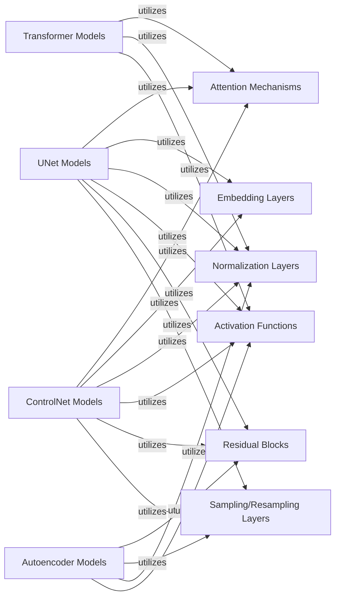

## Component Details

This graph illustrates the structure and interdependencies of the Neural Network Modules within the Diffusers library. It details the primary model architectures such as UNets, Transformers, Autoencoders, and ControlNets, along with their foundational building blocks like attention mechanisms, embeddings, and various neural network layers. The purpose is to provide a clear overview of how these core components are organized and interact to form the backbone of diffusion models.

### UNet Models
Implementations of U-shaped neural networks, crucial for iterative denoising in diffusion models, often incorporating conditioning mechanisms.

**Related Classes/Methods**:

- <a href="https://github.com/huggingface/diffusers/blob/master/src/diffusers/models/unets/unet_2d_condition.py#L71-L1310" target="_blank" rel="noopener noreferrer">`diffusers.src.diffusers.models.unets.unet_2d_condition.UNet2DConditionModel` (71:1310)</a>

### Transformer Models
Neural network models and fundamental blocks based on the Transformer architecture, used for processing and transforming latent representations, especially for attention mechanisms.

**Related Classes/Methods**:

- <a href="https://github.com/huggingface/diffusers/blob/master/src/diffusers/models/transformers/transformer_2d.py#L39-L551" target="_blank" rel="noopener noreferrer">`diffusers.src.diffusers.models.transformers.transformer_2d.Transformer2DModel` (39:551)</a>
- <a href="https://github.com/huggingface/diffusers/blob/master/src/diffusers/models/attention.py#L261-L589" target="_blank" rel="noopener noreferrer">`diffusers.src.diffusers.models.attention.BasicTransformerBlock` (261:589)</a>

### Autoencoder Models
Variational Autoencoders (VAEs) responsible for compressing high-dimensional data (e.g., images) into a lower-dimensional latent space and reconstructing them.

**Related Classes/Methods**:

- <a href="https://github.com/huggingface/diffusers/blob/master/src/diffusers/models/autoencoders/autoencoder_kl.py#L38-L567" target="_blank" rel="noopener noreferrer">`diffusers.src.diffusers.models.autoencoders.autoencoder_kl.AutoencoderKL` (38:567)</a>
- <a href="https://github.com/huggingface/diffusers/blob/master/src/diffusers/models/autoencoders/vae.py#L60-L178" target="_blank" rel="noopener noreferrer">`diffusers.src.diffusers.models.autoencoders.vae.Encoder` (60:178)</a>

### ControlNet Models
Specialized neural networks designed to provide additional conditional control over the diffusion generation process, allowing for more precise output manipulation.

**Related Classes/Methods**:

- <a href="https://github.com/huggingface/diffusers/blob/master/src/diffusers/models/controlnets/controlnet.py#L109-L861" target="_blank" rel="noopener noreferrer">`diffusers.src.diffusers.models.controlnets.controlnet.ControlNetModel` (109:861)</a>

### Attention Mechanisms
Modules implementing various forms of attention, crucial for capturing long-range dependencies and contextual information within the model.

**Related Classes/Methods**:

- <a href="https://github.com/huggingface/diffusers/blob/master/src/diffusers/models/attention_processor.py#L50-L835" target="_blank" rel="noopener noreferrer">`diffusers.src.diffusers.models.attention_processor.Attention` (50:835)</a>

### Embedding Layers
Layers responsible for transforming input features (e.g., timesteps, text embeddings) into a dense vector representation suitable for neural network processing.

**Related Classes/Methods**:

- <a href="https://github.com/huggingface/diffusers/blob/master/src/diffusers/models/embeddings.py#L1274-L1319" target="_blank" rel="noopener noreferrer">`diffusers.src.diffusers.models.embeddings.TimestepEmbedding` (1274:1319)</a>

### Normalization Layers
Modules that normalize activations within the network, improving training stability and performance.

**Related Classes/Methods**:

- <a href="https://github.com/huggingface/diffusers/blob/master/src/diffusers/models/normalization.py#L131-L171" target="_blank" rel="noopener noreferrer">`diffusers.src.diffusers.models.normalization.AdaLayerNormZero` (131:171)</a>

### Activation Functions
Non-linear functions applied to the output of neurons, introducing non-linearity into the model, enabling it to learn complex patterns.

**Related Classes/Methods**:

- <a href="https://github.com/huggingface/diffusers/blob/master/src/diffusers/models/activations.py#L65-L90" target="_blank" rel="noopener noreferrer">`diffusers.src.diffusers.models.activations.GELU` (65:90)</a>

### Residual Blocks
Building blocks that incorporate skip connections, allowing gradients to flow more easily through deep networks and mitigating the vanishing gradient problem.

**Related Classes/Methods**:

- <a href="https://github.com/huggingface/diffusers/blob/master/src/diffusers/models/resnet.py#L189-L373" target="_blank" rel="noopener noreferrer">`diffusers.src.diffusers.models.resnet.ResnetBlock2D` (189:373)</a>

### Sampling/Resampling Layers
Layers responsible for upsampling or downsampling feature maps, crucial for changing spatial dimensions within the network, particularly in U-Net architectures.

**Related Classes/Methods**:

- <a href="https://github.com/huggingface/diffusers/blob/master/src/diffusers/models/upsampling.py#L76-L192" target="_blank" rel="noopener noreferrer">`diffusers.src.diffusers.models.upsampling.Upsample2D` (76:192)</a>

### [FAQ](https://github.com/CodeBoarding/GeneratedOnBoardings/tree/main?tab=readme-ov-file#faq)