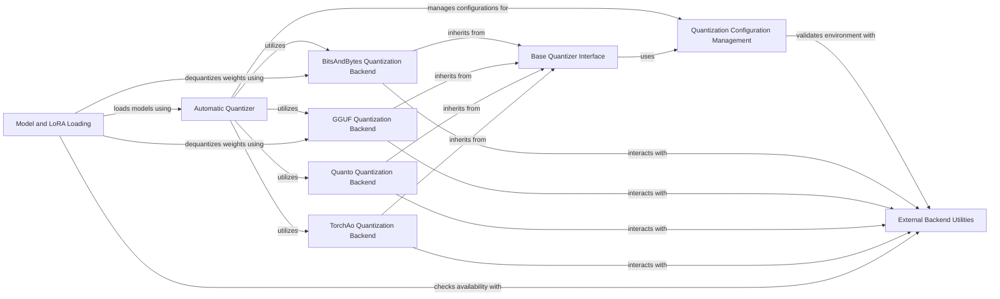

## Component Details

The Quantization subsystem in Diffusers provides comprehensive functionalities for model quantization, aiming to reduce memory footprint and improve inference speed. It supports various quantization configurations and backends, including BitsAndBytes, TorchAo, Quanto, and GGUF. The system is designed with a modular approach, featuring a base quantizer interface, automatic quantization capabilities, and dedicated components for managing configurations and interacting with external backend utilities. It also integrates with model and LoRA loading processes to handle dequantization when necessary.

### Quantization Configuration Management
Handles the creation, serialization, and validation of various quantization configurations for different backends.

**Related Classes/Methods**:

- <a href="https://github.com/huggingface/diffusers/blob/master/src/diffusers/quantizers/quantization_config.py#L62-L173" target="_blank" rel="noopener noreferrer">`diffusers.src.diffusers.quantizers.quantization_config.QuantizationConfigMixin` (62:173)</a>
- <a href="https://github.com/huggingface/diffusers/blob/master/src/diffusers/quantizers/quantization_config.py#L177-L406" target="_blank" rel="noopener noreferrer">`diffusers.src.diffusers.quantizers.quantization_config.BitsAndBytesConfig` (177:406)</a>
- <a href="https://github.com/huggingface/diffusers/blob/master/src/diffusers/quantizers/quantization_config.py#L433-L689" target="_blank" rel="noopener noreferrer">`diffusers.src.diffusers.quantizers.quantization_config.TorchAoConfig` (433:689)</a>
- <a href="https://github.com/huggingface/diffusers/blob/master/src/diffusers/quantizers/quantization_config.py#L693-L724" target="_blank" rel="noopener noreferrer">`diffusers.src.diffusers.quantizers.quantization_config.QuantoConfig` (693:724)</a>
- <a href="https://github.com/huggingface/diffusers/blob/master/src/diffusers/quantizers/quantization_config.py#L410-L429" target="_blank" rel="noopener noreferrer">`diffusers.src.diffusers.quantizers.quantization_config.GGUFQuantizationConfig` (410:429)</a>
- `diffusers.src.diffusers.quantizers.PipelineQuantizationConfig` (full file reference)

### Base Quantizer Interface
Defines the common interface and fundamental operations for all specific quantization implementations, such as preprocessing, postprocessing, and dequantization.

**Related Classes/Methods**:

- <a href="https://github.com/huggingface/diffusers/blob/master/src/diffusers/quantizers/base.py#L34-L229" target="_blank" rel="noopener noreferrer">`diffusers.src.diffusers.quantizers.base.DiffusersQuantizer` (34:229)</a>

### Automatic Quantizer
Provides an automatic mechanism to load and merge quantization configurations, simplifying the application of quantization.

**Related Classes/Methods**:

- <a href="https://github.com/huggingface/diffusers/blob/master/src/diffusers/quantizers/auto.py#L53-L143" target="_blank" rel="noopener noreferrer">`diffusers.src.diffusers.quantizers.auto.DiffusersAutoQuantizer` (53:143)</a>

### BitsAndBytes Quantization Backend
Implements model quantization and dequantization specifically using the BitsAndBytes library, including 4-bit and 8-bit quantization.

**Related Classes/Methods**:

- <a href="https://github.com/huggingface/diffusers/blob/master/src/diffusers/quantizers/bitsandbytes/bnb_quantizer.py#L44-L329" target="_blank" rel="noopener noreferrer">`diffusers.src.diffusers.quantizers.bitsandbytes.bnb_quantizer.BnB4BitDiffusersQuantizer` (44:329)</a>
- <a href="https://github.com/huggingface/diffusers/blob/master/src/diffusers/quantizers/bitsandbytes/bnb_quantizer.py#L332-L573" target="_blank" rel="noopener noreferrer">`diffusers.src.diffusers.quantizers.bitsandbytes.bnb_quantizer.BnB8BitDiffusersQuantizer` (332:573)</a>
- <a href="https://github.com/huggingface/diffusers/blob/master/src/diffusers/quantizers/bitsandbytes/utils.py#L308-L319" target="_blank" rel="noopener noreferrer">`diffusers.src.diffusers.quantizers.bitsandbytes.utils._check_bnb_status` (308:319)</a>
- <a href="https://github.com/huggingface/diffusers/blob/master/src/diffusers/quantizers/bitsandbytes/utils.py#L117-L156" target="_blank" rel="noopener noreferrer">`diffusers.src.diffusers.quantizers.bitsandbytes.utils.replace_with_bnb_linear` (117:156)</a>
- <a href="https://github.com/huggingface/diffusers/blob/master/src/diffusers/quantizers/bitsandbytes/utils.py#L286-L305" target="_blank" rel="noopener noreferrer">`diffusers.src.diffusers.quantizers.bitsandbytes.utils.dequantize_and_replace` (286:305)</a>
- <a href="https://github.com/huggingface/diffusers/blob/master/src/diffusers/quantizers/bitsandbytes/utils.py#L42-L114" target="_blank" rel="noopener noreferrer">`diffusers.src.diffusers.quantizers.bitsandbytes.utils._replace_with_bnb_linear` (42:114)</a>
- <a href="https://github.com/huggingface/diffusers/blob/master/src/diffusers/quantizers/bitsandbytes/utils.py#L214-L283" target="_blank" rel="noopener noreferrer">`diffusers.src.diffusers.quantizers.bitsandbytes.utils._dequantize_and_replace` (214:283)</a>
- <a href="https://github.com/huggingface/diffusers/blob/master/src/diffusers/quantizers/bitsandbytes/utils.py#L160-L194" target="_blank" rel="noopener noreferrer">`diffusers.src.diffusers.quantizers.bitsandbytes.utils.dequantize_bnb_weight` (160:194)</a>
- <a href="https://github.com/huggingface/diffusers/blob/master/src/diffusers/quantizers/bitsandbytes/utils.py#L197-L211" target="_blank" rel="noopener noreferrer">`diffusers.src.diffusers.quantizers.bitsandbytes.utils._create_accelerate_new_hook` (197:211)</a>

### GGUF Quantization Backend
Provides functionalities for quantizing and dequantizing models using the GGUF format, including specific GGUF tensor operations.

**Related Classes/Methods**:

- <a href="https://github.com/huggingface/diffusers/blob/master/src/diffusers/quantizers/gguf/gguf_quantizer.py#L36-L165" target="_blank" rel="noopener noreferrer">`diffusers.src.diffusers.quantizers.gguf.gguf_quantizer.GGUFQuantizer` (36:165)</a>
- <a href="https://github.com/huggingface/diffusers/blob/master/src/diffusers/quantizers/gguf/utils.py#L373-L374" target="_blank" rel="noopener noreferrer">`diffusers.src.diffusers.quantizers.gguf.utils._quant_shape_from_byte_shape` (373:374)</a>
- <a href="https://github.com/huggingface/diffusers/blob/master/src/diffusers/quantizers/gguf/utils.py#L50-L80" target="_blank" rel="noopener noreferrer">`diffusers.src.diffusers.quantizers.gguf.utils._replace_with_gguf_linear` (50:80)</a>
- <a href="https://github.com/huggingface/diffusers/blob/master/src/diffusers/quantizers/gguf/utils.py#L83-L116" target="_blank" rel="noopener noreferrer">`diffusers.src.diffusers.quantizers.gguf.utils._dequantize_gguf_and_restore_linear` (83:116)</a>
- <a href="https://github.com/huggingface/diffusers/blob/master/src/diffusers/quantizers/gguf/utils.py#L152-L156" target="_blank" rel="noopener noreferrer">`diffusers.src.diffusers.quantizers.gguf.utils.dequantize_blocks_Q8_0` (152:156)</a>
- <a href="https://github.com/huggingface/diffusers/blob/master/src/diffusers/quantizers/gguf/utils.py#L133-L136" target="_blank" rel="noopener noreferrer">`diffusers.src.diffusers.quantizers.gguf.utils.split_block_dims` (133:136)</a>
- <a href="https://github.com/huggingface/diffusers/blob/master/src/diffusers/quantizers/gguf/utils.py#L159-L175" target="_blank" rel="noopener noreferrer">`diffusers.src.diffusers.quantizers.gguf.utils.dequantize_blocks_Q5_1` (159:175)</a>
- <a href="https://github.com/huggingface/diffusers/blob/master/src/diffusers/quantizers/gguf/utils.py#L128-L130" target="_blank" rel="noopener noreferrer">`diffusers.src.diffusers.quantizers.gguf.utils.to_uint32` (128:130)</a>
- <a href="https://github.com/huggingface/diffusers/blob/master/src/diffusers/quantizers/gguf/utils.py#L178-L194" target="_blank" rel="noopener noreferrer">`diffusers.src.diffusers.quantizers.gguf.utils.dequantize_blocks_Q5_0` (178:194)</a>
- <a href="https://github.com/huggingface/diffusers/blob/master/src/diffusers/quantizers/gguf/utils.py#L197-L209" target="_blank" rel="noopener noreferrer">`diffusers.src.diffusers.quantizers.gguf.utils.dequantize_blocks_Q4_1` (197:209)</a>
- <a href="https://github.com/huggingface/diffusers/blob/master/src/diffusers/quantizers/gguf/utils.py#L212-L222" target="_blank" rel="noopener noreferrer">`diffusers.src.diffusers.quantizers.gguf.utils.dequantize_blocks_Q4_0` (212:222)</a>
- <a href="https://github.com/huggingface/diffusers/blob/master/src/diffusers/quantizers/gguf/utils.py#L225-L250" target="_blank" rel="noopener noreferrer">`diffusers.src.diffusers.quantizers.gguf.utils.dequantize_blocks_Q6_K` (225:250)</a>
- <a href="https://github.com/huggingface/diffusers/blob/master/src/diffusers/quantizers/gguf/utils.py#L253-L276" target="_blank" rel="noopener noreferrer">`diffusers.src.diffusers.quantizers.gguf.utils.dequantize_blocks_Q5_K` (253:276)</a>
- <a href="https://github.com/huggingface/diffusers/blob/master/src/diffusers/quantizers/gguf/utils.py#L139-L149" target="_blank" rel="noopener noreferrer">`diffusers.src.diffusers.quantizers.gguf.utils.get_scale_min` (139:149)</a>
- <a href="https://github.com/huggingface/diffusers/blob/master/src/diffusers/quantizers/gguf/utils.py#L279-L296" target="_blank" rel="noopener noreferrer">`diffusers.src.diffusers.quantizers.gguf.utils.dequantize_blocks_Q4_K` (279:296)</a>
- <a href="https://github.com/huggingface/diffusers/blob/master/src/diffusers/quantizers/gguf/utils.py#L299-L329" target="_blank" rel="noopener noreferrer">`diffusers.src.diffusers.quantizers.gguf.utils.dequantize_blocks_Q3_K` (299:329)</a>
- <a href="https://github.com/huggingface/diffusers/blob/master/src/diffusers/quantizers/gguf/utils.py#L332-L349" target="_blank" rel="noopener noreferrer">`diffusers.src.diffusers.quantizers.gguf.utils.dequantize_blocks_Q2_K` (332:349)</a>
- <a href="https://github.com/huggingface/diffusers/blob/master/src/diffusers/quantizers/gguf/utils.py#L377-L395" target="_blank" rel="noopener noreferrer">`diffusers.src.diffusers.quantizers.gguf.utils.dequantize_gguf_tensor` (377:395)</a>
- <a href="https://github.com/huggingface/diffusers/blob/master/src/diffusers/quantizers/gguf/utils.py#L398-L440" target="_blank" rel="noopener noreferrer">`diffusers.src.diffusers.quantizers.gguf.utils.GGUFParameter` (398:440)</a>
- <a href="https://github.com/huggingface/diffusers/blob/master/src/diffusers/quantizers/gguf/utils.py#L443-L461" target="_blank" rel="noopener noreferrer">`diffusers.src.diffusers.quantizers.gguf.utils.GGUFLinear` (443:461)</a>

### Quanto Quantization Backend
Handles model quantization and dequantization using the Quanto library.

**Related Classes/Methods**:

- <a href="https://github.com/huggingface/diffusers/blob/master/src/diffusers/quantizers/quanto/quanto_quantizer.py#L32-L177" target="_blank" rel="noopener noreferrer">`diffusers.src.diffusers.quantizers.quanto.quanto_quantizer.QuantoQuantizer` (32:177)</a>
- <a href="https://github.com/huggingface/diffusers/blob/master/src/diffusers/quantizers/quanto/utils.py#L12-L60" target="_blank" rel="noopener noreferrer">`diffusers.src.diffusers.quantizers.quanto.utils._replace_with_quanto_layers` (12:60)</a>
- `diffusers.src.diffusers.quantizers.quanto.utils._get_weight_type` (full file reference)

### TorchAo Quantization Backend
Manages model quantization and dequantization through the TorchAo library.

**Related Classes/Methods**:

- <a href="https://github.com/huggingface/diffusers/blob/master/src/diffusers/quantizers/torchao/torchao_quantizer.py#L131-L337" target="_blank" rel="noopener noreferrer">`diffusers.src.diffusers.quantizers.torchao.torchao_quantizer.TorchAoHfQuantizer` (131:337)</a>
- <a href="https://github.com/huggingface/diffusers/blob/master/src/diffusers/quantizers/torchao/torchao_quantizer.py#L112-L120" target="_blank" rel="noopener noreferrer">`diffusers.src.diffusers.quantizers.torchao.torchao_quantizer:_quantization_type` (112:120)</a>
- <a href="https://github.com/huggingface/diffusers/blob/master/src/diffusers/quantizers/torchao/torchao_quantizer.py#L123-L128" target="_blank" rel="noopener noreferrer">`diffusers.src.diffusers.quantizers.torchao.torchao_quantizer:_linear_extra_repr` (123:128)</a>

### Model and LoRA Loading
Responsible for loading models, including handling single-file models and integrating LoRA weights, with considerations for dequantization during LoRA expansion.

**Related Classes/Methods**:

- <a href="https://github.com/huggingface/diffusers/blob/master/src/diffusers/loaders/single_file_model.py#L166-L444" target="_blank" rel="noopener noreferrer">`diffusers.src.diffusers.loaders.single_file_model.FromOriginalModelMixin` (166:444)</a>
- <a href="https://github.com/huggingface/diffusers/blob/master/src/diffusers/loaders/lora_pipeline.py#L76-L117" target="_blank" rel="noopener noreferrer">`diffusers.src.diffusers.loaders.lora_pipeline._maybe_dequantize_weight_for_expanded_lora` (76:117)</a>
- <a href="https://github.com/huggingface/diffusers/blob/master/src/diffusers/loaders/lora_pipeline.py#L2409-L2530" target="_blank" rel="noopener noreferrer">`diffusers.src.diffusers.loaders.lora_pipeline.FluxLoraLoaderMixin:_maybe_expand_transformer_param_shape_or_error_` (2409:2530)</a>
- <a href="https://github.com/huggingface/diffusers/blob/master/src/diffusers/models/model_loading_utils.py#L154-L209" target="_blank" rel="noopener noreferrer">`diffusers.src.diffusers.models.model_loading_utils.load_state_dict` (154:209)</a>
- <a href="https://github.com/huggingface/diffusers/blob/master/src/diffusers/models/model_loading_utils.py#L474-L522" target="_blank" rel="noopener noreferrer">`diffusers.src.diffusers.models.model_loading_utils.load_gguf_checkpoint` (474:522)</a>
- <a href="https://github.com/huggingface/diffusers/blob/master/src/diffusers/models/modeling_utils.py#L251-L1777" target="_blank" rel="noopener noreferrer">`diffusers.src.diffusers.models.modeling_utils.ModelMixin` (251:1777)</a>

### External Backend Utilities
Provides utility functions for checking the availability and version compatibility of external quantization libraries and includes dummy objects for backend-specific configurations.

**Related Classes/Methods**:

- <a href="https://github.com/huggingface/diffusers/blob/master/src/diffusers/utils/import_utils.py#L240-L241" target="_blank" rel="noopener noreferrer">`diffusers.src.diffusers.utils.import_utils.is_transformers_available` (240:241)</a>
- <a href="https://github.com/huggingface/diffusers/blob/master/src/diffusers/utils/import_utils.py#L352-L353" target="_blank" rel="noopener noreferrer">`diffusers.src.diffusers.utils.import_utils.is_optimum_quanto_available` (352:353)</a>
- <a href="https://github.com/huggingface/diffusers/blob/master/src/diffusers/utils/import_utils.py#L791-L803" target="_blank" rel="noopener noreferrer">`diffusers.src.diffusers.utils.import_utils.is_optimum_quanto_version` (791:803)</a>
- <a href="https://github.com/huggingface/diffusers/blob/master/src/diffusers/utils/import_utils.py#L272-L273" target="_blank" rel="noopener noreferrer">`diffusers.src.diffusers.utils.import_utils.is_accelerate_available` (272:273)</a>
- <a href="https://github.com/huggingface/diffusers/blob/master/src/diffusers/utils/import_utils.py#L702-L714" target="_blank" rel="noopener noreferrer">`diffusers.src.diffusers.utils.import_utils.is_accelerate_version` (702:714)</a>
- <a href="https://github.com/huggingface/diffusers/blob/master/src/diffusers/utils/import_utils.py#L348-L349" target="_blank" rel="noopener noreferrer">`diffusers.src.diffusers.utils.import_utils.is_torchao_available` (348:349)</a>
- <a href="https://github.com/huggingface/diffusers/blob/master/src/diffusers/utils/import_utils.py#L328-L329" target="_blank" rel="noopener noreferrer">`diffusers.src.diffusers.utils.import_utils.is_bitsandbytes_available` (328:329)</a>
- <a href="https://github.com/huggingface/diffusers/blob/master/src/diffusers/utils/import_utils.py#L732-L743" target="_blank" rel="noopener noreferrer">`diffusers.src.diffusers.utils.import_utils.is_bitsandbytes_version` (732:743)</a>
- <a href="https://github.com/huggingface/diffusers/blob/master/src/diffusers/utils/import_utils.py#L344-L345" target="_blank" rel="noopener noreferrer">`diffusers.src.diffusers.utils.import_utils.is_gguf_available` (344:345)</a>
- <a href="https://github.com/huggingface/diffusers/blob/master/src/diffusers/utils/import_utils.py#L746-L758" target="_blank" rel="noopener noreferrer">`diffusers.src.diffusers.utils.import_utils.is_gguf_version` (746:758)</a>
- <a href="https://github.com/huggingface/diffusers/blob/master/src/diffusers/utils/import_utils.py#L224-L225" target="_blank" rel="noopener noreferrer">`diffusers.src.diffusers.utils.import_utils.is_torch_available` (224:225)</a>
- <a href="https://github.com/huggingface/diffusers/blob/master/src/diffusers/utils/import_utils.py#L623-L640" target="_blank" rel="noopener noreferrer">`diffusers.src.diffusers.utils.import_utils.compare_versions` (623:640)</a>
- <a href="https://github.com/huggingface/diffusers/blob/master/src/diffusers/utils/import_utils.py#L579-L607" target="_blank" rel="noopener noreferrer">`diffusers.src.diffusers.utils.import_utils.requires_backends` (579:607)</a>
- <a href="https://github.com/huggingface/diffusers/blob/master/src/diffusers/utils/testing_utils.py#L483-L487" target="_blank" rel="noopener noreferrer">`diffusers.src.diffusers.utils.testing_utils.require_bitsandbytes` (483:487)</a>
- <a href="https://github.com/huggingface/diffusers/blob/master/src/diffusers/utils/testing_utils.py#L490-L494" target="_blank" rel="noopener noreferrer">`diffusers.src.diffusers.utils.testing_utils.require_quanto` (490:494)</a>
- <a href="https://github.com/huggingface/diffusers/blob/master/src/diffusers/utils/testing_utils.py#L551-L560" target="_blank" rel="noopener noreferrer">`diffusers.src.diffusers.utils.testing_utils.require_bitsandbytes_version_greater` (551:560)</a>
- <a href="https://github.com/huggingface/diffusers/blob/master/src/diffusers/utils/testing_utils.py#L575-L584" target="_blank" rel="noopener noreferrer">`diffusers.src.diffusers.utils.testing_utils.require_gguf_version_greater_or_equal` (575:584)</a>
- <a href="https://github.com/huggingface/diffusers/blob/master/src/diffusers/utils/testing_utils.py#L587-L596" target="_blank" rel="noopener noreferrer">`diffusers.src.diffusers.utils.testing_utils.require_torchao_version_greater_or_equal` (587:596)</a>
- <a href="https://github.com/huggingface/diffusers/blob/master/src/diffusers/utils/dummy_gguf_objects.py#L5-L17" target="_blank" rel="noopener noreferrer">`diffusers.src.diffusers.utils.dummy_gguf_objects.GGUFQuantizationConfig` (5:17)</a>
- <a href="https://github.com/huggingface/diffusers/blob/master/src/diffusers/utils/dummy_torchao_objects.py#L5-L17" target="_blank" rel="noopener noreferrer">`diffusers.src.diffusers.utils.dummy_torchao_objects.TorchAoConfig` (5:17)</a>
- <a href="https://github.com/huggingface/diffusers/blob/master/src/diffusers/utils/dummy_optimum_quanto_objects.py#L5-L17" target="_blank" rel="noopener noreferrer">`diffusers.src.diffusers.utils.dummy_optimum_quanto_objects.QuantoConfig` (5:17)</a>
- <a href="https://github.com/huggingface/diffusers/blob/master/src/diffusers/utils/dummy_bitsandbytes_objects.py#L5-L17" target="_blank" rel="noopener noreferrer">`diffusers.src.diffusers.utils.dummy_bitsandbytes_objects.BitsAndBytesConfig` (5:17)</a>
- <a href="https://github.com/huggingface/diffusers/blob/master/src/diffusers/utils/dummy_pt_objects.py#L1496-L1508" target="_blank" rel="noopener noreferrer">`diffusers.src.diffusers.utils.dummy_pt_objects.DiffusersQuantizer` (1496:1508)</a>
- <a href="https://github.com/huggingface/diffusers/blob/master/src/diffusers/utils/loading_utils.py#L142-L151" target="_blank" rel="noopener noreferrer">`diffusers.src.diffusers.utils.loading_utils.get_module_from_name` (142:151)</a>

### [FAQ](https://github.com/CodeBoarding/GeneratedOnBoardings/tree/main?tab=readme-ov-file#faq)