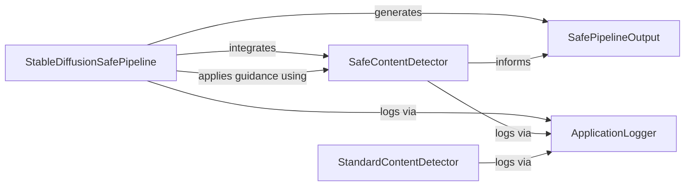

## Component Details

The Safety & Monitoring subsystem in `diffusers` is responsible for ensuring the safety of generated content and providing general logging capabilities. It primarily focuses on detecting and mitigating potentially harmful or inappropriate images generated by stable diffusion pipelines. The core flow involves the `StableDiffusionSafePipeline` orchestrating the image generation, which then invokes a `SafeContentDetector` to analyze the output for NSFW content. The `SafeContentDetector`, along with the `StandardContentDetector`, utilizes cosine distance for its safety checks. All components within this subsystem leverage the `ApplicationLogger` for reporting events and warnings. The final output of the safe pipeline is structured by `SafePipelineOutput`, which includes flags and details about the safety checks performed.

### StableDiffusionSafePipeline
Orchestrates the text-to-image generation process, integrating safety checks and applying safety guidance to mitigate harmful content.

**Related Classes/Methods**:

- <a href="https://github.com/huggingface/diffusers/blob/master/src/diffusers/pipelines/stable_diffusion_safe/pipeline_stable_diffusion_safe.py#L32-L783" target="_blank" rel="noopener noreferrer">`diffusers.src.diffusers.pipelines.stable_diffusion_safe.pipeline_stable_diffusion_safe.StableDiffusionPipelineSafe` (32:783)</a>
- <a href="https://github.com/huggingface/diffusers/blob/master/src/diffusers/pipelines/stable_diffusion_safe/pipeline_stable_diffusion_safe.py#L65-L164" target="_blank" rel="noopener noreferrer">`diffusers.src.diffusers.pipelines.stable_diffusion_safe.pipeline_stable_diffusion_safe.StableDiffusionPipelineSafe:__init__` (65:164)</a>
- <a href="https://github.com/huggingface/diffusers/blob/master/src/diffusers/pipelines/stable_diffusion_safe/pipeline_stable_diffusion_safe.py#L322-L343" target="_blank" rel="noopener noreferrer">`diffusers.src.diffusers.pipelines.stable_diffusion_safe.pipeline_stable_diffusion_safe.StableDiffusionPipelineSafe:run_safety_checker` (322:343)</a>
- <a href="https://github.com/huggingface/diffusers/blob/master/src/diffusers/pipelines/stable_diffusion_safe/pipeline_stable_diffusion_safe.py#L451-L491" target="_blank" rel="noopener noreferrer">`diffusers.src.diffusers.pipelines.stable_diffusion_safe.pipeline_stable_diffusion_safe.StableDiffusionPipelineSafe:perform_safety_guidance` (451:491)</a>
- <a href="https://github.com/huggingface/diffusers/blob/master/src/diffusers/pipelines/stable_diffusion_safe/pipeline_stable_diffusion_safe.py#L519-L783" target="_blank" rel="noopener noreferrer">`diffusers.src.diffusers.pipelines.stable_diffusion_safe.pipeline_stable_diffusion_safe.StableDiffusionPipelineSafe:__call__` (519:783)</a>
- <a href="https://github.com/huggingface/diffusers/blob/master/src/diffusers/pipelines/stable_diffusion_safe/pipeline_stable_diffusion_safe.py#L187-L320" target="_blank" rel="noopener noreferrer">`diffusers.src.diffusers.pipelines.stable_diffusion_safe.pipeline_stable_diffusion_safe.StableDiffusionPipelineSafe:_encode_prompt` (187:320)</a>

### SafeContentDetector
A specialized safety checker that analyzes generated images for "not-safe-for-work" (NSFW) content, specifically designed for the safe stable diffusion pipeline.

**Related Classes/Methods**:

- <a href="https://github.com/huggingface/diffusers/blob/master/src/diffusers/pipelines/stable_diffusion_safe/safety_checker.py#L31-L109" target="_blank" rel="noopener noreferrer">`diffusers.src.diffusers.pipelines.stable_diffusion_safe.safety_checker.SafeStableDiffusionSafetyChecker` (31:109)</a>
- <a href="https://github.com/huggingface/diffusers/blob/master/src/diffusers/pipelines/stable_diffusion_safe/safety_checker.py#L49-L85" target="_blank" rel="noopener noreferrer">`diffusers.src.diffusers.pipelines.stable_diffusion_safe.safety_checker.SafeStableDiffusionSafetyChecker:forward` (49:85)</a>
- <a href="https://github.com/huggingface/diffusers/blob/master/src/diffusers/pipelines/stable_diffusion_safe/safety_checker.py#L25-L28" target="_blank" rel="noopener noreferrer">`diffusers.src.diffusers.pipelines.stable_diffusion_safe.safety_checker.cosine_distance` (25:28)</a>

### StandardContentDetector
A general-purpose safety checker for stable diffusion models, responsible for identifying and flagging potentially unsafe image content.

**Related Classes/Methods**:

- <a href="https://github.com/huggingface/diffusers/blob/master/src/diffusers/pipelines/stable_diffusion/safety_checker.py#L32-L126" target="_blank" rel="noopener noreferrer">`diffusers.src.diffusers.pipelines.stable_diffusion.safety_checker.StableDiffusionSafetyChecker` (32:126)</a>
- <a href="https://github.com/huggingface/diffusers/blob/master/src/diffusers/pipelines/stable_diffusion/safety_checker.py#L51-L100" target="_blank" rel="noopener noreferrer">`diffusers.src.diffusers.pipelines.stable_diffusion.safety_checker.StableDiffusionSafetyChecker:forward` (51:100)</a>
- <a href="https://github.com/huggingface/diffusers/blob/master/src/diffusers/pipelines/stable_diffusion/safety_checker.py#L26-L29" target="_blank" rel="noopener noreferrer">`diffusers.src.diffusers.pipelines.stable_diffusion.safety_checker.cosine_distance` (26:29)</a>

### ApplicationLogger
Manages the logging infrastructure across the `diffusers` library, providing functionalities for configuring log levels and handling messages.

**Related Classes/Methods**:

- <a href="https://github.com/huggingface/diffusers/blob/master/src/diffusers/utils/logging.py#L1-L100" target="_blank" rel="noopener noreferrer">`diffusers.src.diffusers.utils.logging` (1:100)</a>
- <a href="https://github.com/huggingface/diffusers/blob/master/src/diffusers/utils/logging.py#L112-L123" target="_blank" rel="noopener noreferrer">`diffusers.src.diffusers.utils.logging:get_logger` (112:123)</a>
- <a href="https://github.com/huggingface/diffusers/blob/master/src/diffusers/utils/logging.py#L146-L162" target="_blank" rel="noopener noreferrer">`diffusers.src.diffusers.utils.logging:set_verbosity` (146:162)</a>

### SafePipelineOutput
A data structure that encapsulates the output of the safe stable diffusion pipeline, including generated images, NSFW detection flags, and details about applied safety concepts.

**Related Classes/Methods**:

- <a href="https://github.com/huggingface/diffusers/blob/master/src/diffusers/pipelines/stable_diffusion_safe/pipeline_output.py#L13-L34" target="_blank" rel="noopener noreferrer">`diffusers.src.diffusers.pipelines.stable_diffusion_safe.pipeline_output.StableDiffusionSafePipelineOutput` (13:34)</a>

### [FAQ](https://github.com/CodeBoarding/GeneratedOnBoardings/tree/main?tab=readme-ov-file#faq)