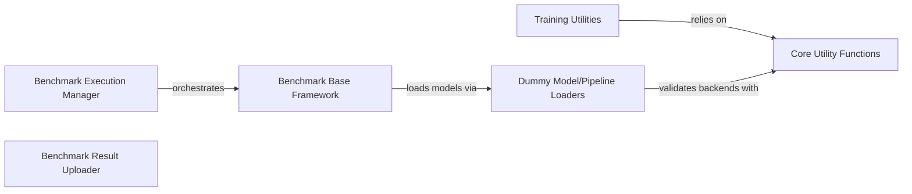

## Component Details

This subsystem provides comprehensive utilities for training and benchmarking diffusion models. It includes tools for managing training-specific aspects like random seeds and Exponential Moving Average (EMA) models, as well as a robust framework for executing and managing performance benchmarks across various diffusion model types. The system also handles the uploading of benchmark results and provides core utility functions for backend validation and state dictionary conversions, alongside dummy loaders for simulating model interactions during benchmarking.

### Benchmark Execution Manager
Orchestrates the execution of various diffusion model benchmarks, running them with different configurations and handling subprocess calls.

**Related Classes/Methods**:

- <a href="https://github.com/huggingface/diffusers/blob/master/benchmarks/run_all.py#L36-L97" target="_blank" rel="noopener noreferrer">`diffusers.benchmarks.run_all:main` (36:97)</a>
- <a href="https://github.com/huggingface/diffusers/blob/master/benchmarks/run_all.py#L19-L33" target="_blank" rel="noopener noreferrer">`diffusers.benchmarks.run_all:run_command` (19:33)</a>
- <a href="https://github.com/huggingface/diffusers/blob/master/benchmarks/run_all.py#L14-L15" target="_blank" rel="noopener noreferrer">`diffusers.benchmarks.run_all.SubprocessCallException` (14:15)</a>

### Benchmark Base Framework
Provides abstract base classes for different types of diffusion model benchmarks (e.g., text-to-image, image-to-image, inpainting, ControlNet, T2IAdapter). These classes define the common structure and methods for benchmarking.

**Related Classes/Methods**:

- <a href="https://github.com/huggingface/diffusers/blob/master/benchmarks/base_classes.py#L76-L95" target="_blank" rel="noopener noreferrer">`diffusers.benchmarks.base_classes.TextToImageBenchmark:__init__` (76:95)</a>
- <a href="https://github.com/huggingface/diffusers/blob/master/benchmarks/base_classes.py#L104-L121" target="_blank" rel="noopener noreferrer">`diffusers.benchmarks.base_classes.TextToImageBenchmark:benchmark` (104:121)</a>
- <a href="https://github.com/huggingface/diffusers/blob/master/benchmarks/base_classes.py#L125-L126" target="_blank" rel="noopener noreferrer">`diffusers.benchmarks.base_classes.TurboTextToImageBenchmark:__init__` (125:126)</a>
- <a href="https://github.com/huggingface/diffusers/blob/master/benchmarks/base_classes.py#L140-L145" target="_blank" rel="noopener noreferrer">`diffusers.benchmarks.base_classes.LCMLoRATextToImageBenchmark:__init__` (140:145)</a>
- <a href="https://github.com/huggingface/diffusers/blob/master/benchmarks/base_classes.py#L166-L183" target="_blank" rel="noopener noreferrer">`diffusers.benchmarks.base_classes.LCMLoRATextToImageBenchmark:benchmark` (166:183)</a>
- <a href="https://github.com/huggingface/diffusers/blob/master/benchmarks/base_classes.py#L191-L193" target="_blank" rel="noopener noreferrer">`diffusers.benchmarks.base_classes.ImageToImageBenchmark:__init__` (191:193)</a>
- <a href="https://github.com/huggingface/diffusers/blob/master/benchmarks/base_classes.py#L205-L206" target="_blank" rel="noopener noreferrer">`diffusers.benchmarks.base_classes.TurboImageToImageBenchmark:__init__` (205:206)</a>
- <a href="https://github.com/huggingface/diffusers/blob/master/benchmarks/base_classes.py#L224-L227" target="_blank" rel="noopener noreferrer">`diffusers.benchmarks.base_classes.InpaintingBenchmark:__init__` (224:227)</a>
- <a href="https://github.com/huggingface/diffusers/blob/master/benchmarks/base_classes.py#L243-L257" target="_blank" rel="noopener noreferrer">`diffusers.benchmarks.base_classes.IPAdapterTextToImageBenchmark:__init__` (243:257)</a>
- <a href="https://github.com/huggingface/diffusers/blob/master/benchmarks/base_classes.py#L276-L292" target="_blank" rel="noopener noreferrer">`diffusers.benchmarks.base_classes.ControlNetBenchmark:__init__` (276:292)</a>
- <a href="https://github.com/huggingface/diffusers/blob/master/benchmarks/base_classes.py#L307-L308" target="_blank" rel="noopener noreferrer">`diffusers.benchmarks.base_classes.ControlNetSDXLBenchmark:__init__` (307:308)</a>
- <a href="https://github.com/huggingface/diffusers/blob/master/benchmarks/base_classes.py#L319-L335" target="_blank" rel="noopener noreferrer">`diffusers.benchmarks.base_classes.T2IAdapterBenchmark:__init__` (319:335)</a>
- <a href="https://github.com/huggingface/diffusers/blob/master/benchmarks/base_classes.py#L345-L346" target="_blank" rel="noopener noreferrer">`diffusers.benchmarks.base_classes.T2IAdapterSDXLBenchmark:__init__` (345:346)</a>
- <a href="https://github.com/huggingface/diffusers/blob/master/benchmarks/base_classes.py#L61-L70" target="_blank" rel="noopener noreferrer">`diffusers.benchmarks.base_classes.BaseBenchmak.get_result_filepath` (61:70)</a>

### Benchmark Result Uploader
Manages the process of pushing benchmark results to a Hugging Face dataset, including checking for previous benchmarks and filtering data.

**Related Classes/Methods**:

- <a href="https://github.com/huggingface/diffusers/blob/master/benchmarks/push_results.py#L28-L68" target="_blank" rel="noopener noreferrer">`diffusers.benchmarks.push_results:push_to_hf_dataset` (28:68)</a>
- <a href="https://github.com/huggingface/diffusers/blob/master/benchmarks/push_results.py#L13-L19" target="_blank" rel="noopener noreferrer">`diffusers.benchmarks.push_results.has_previous_benchmark` (13:19)</a>
- <a href="https://github.com/huggingface/diffusers/blob/master/benchmarks/push_results.py#L22-L25" target="_blank" rel="noopener noreferrer">`diffusers.benchmarks.push_results.filter_float` (22:25)</a>

### Training Utilities
Provides a collection of utility functions and the Exponential Moving Average (EMA) model implementation, primarily used during the training of diffusion models, such as setting seeds, resolving interpolation modes, and handling state dict conversions.

**Related Classes/Methods**:

- <a href="https://github.com/huggingface/diffusers/blob/master/src/diffusers/training_utils.py#L40-L56" target="_blank" rel="noopener noreferrer">`diffusers.src.diffusers.training_utils:set_seed` (40:56)</a>
- <a href="https://github.com/huggingface/diffusers/blob/master/src/diffusers/training_utils.py#L97-L138" target="_blank" rel="noopener noreferrer">`diffusers.src.diffusers.training_utils:resolve_interpolation_mode` (97:138)</a>
- <a href="https://github.com/huggingface/diffusers/blob/master/src/diffusers/training_utils.py#L231-L247" target="_blank" rel="noopener noreferrer">`diffusers.src.diffusers.training_utils:_set_state_dict_into_text_encoder` (231:247)</a>
- <a href="https://github.com/huggingface/diffusers/blob/master/src/diffusers/training_utils.py#L295-L308" target="_blank" rel="noopener noreferrer">`diffusers.src.diffusers.training_utils:free_memory` (295:308)</a>
- <a href="https://github.com/huggingface/diffusers/blob/master/src/diffusers/training_utils.py#L312-L644" target="_blank" rel="noopener noreferrer">`diffusers.src.diffusers.training_utils.EMAModel` (312:644)</a>
- <a href="https://github.com/huggingface/diffusers/blob/master/src/diffusers/training_utils.py#L317-L399" target="_blank" rel="noopener noreferrer">`diffusers.src.diffusers.training_utils.EMAModel:__init__` (317:399)</a>
- <a href="https://github.com/huggingface/diffusers/blob/master/src/diffusers/training_utils.py#L402-L409" target="_blank" rel="noopener noreferrer">`diffusers.src.diffusers.training_utils.EMAModel:from_pretrained` (402:409)</a>
- <a href="https://github.com/huggingface/diffusers/blob/master/src/diffusers/training_utils.py#L411-L424" target="_blank" rel="noopener noreferrer">`diffusers.src.diffusers.training_utils.EMAModel:save_pretrained` (411:424)</a>
- <a href="https://github.com/huggingface/diffusers/blob/master/src/diffusers/training_utils.py#L446-L501" target="_blank" rel="noopener noreferrer">`diffusers.src.diffusers.training_utils.EMAModel:step` (446:501)</a>
- <a href="https://github.com/huggingface/diffusers/blob/master/src/diffusers/training_utils.py#L530-L543" target="_blank" rel="noopener noreferrer">`diffusers.src.diffusers.training_utils.EMAModel.to` (530:543)</a>
- <a href="https://github.com/huggingface/diffusers/blob/master/src/diffusers/training_utils.py#L598-L644" target="_blank" rel="noopener noreferrer">`diffusers.src.diffusers.training_utils.EMAModel.load_state_dict` (598:644)</a>
- <a href="https://github.com/huggingface/diffusers/blob/master/src/diffusers/training_utils.py#L545-L562" target="_blank" rel="noopener noreferrer">`diffusers.src.diffusers.training_utils.EMAModel.state_dict` (545:562)</a>
- <a href="https://github.com/huggingface/diffusers/blob/master/src/diffusers/training_utils.py#L503-L520" target="_blank" rel="noopener noreferrer">`diffusers.src.diffusers.training_utils.EMAModel.copy_to` (503:520)</a>
- <a href="https://github.com/huggingface/diffusers/blob/master/src/diffusers/training_utils.py#L426-L443" target="_blank" rel="noopener noreferrer">`diffusers.src.diffusers.training_utils.EMAModel.get_decay` (426:443)</a>

### Core Utility Functions
A set of fundamental utility functions that provide common functionalities like checking backend availability, handling deprecations, and converting state dictionaries, used across various parts of the `diffusers` library.

**Related Classes/Methods**:

- <a href="https://github.com/huggingface/diffusers/blob/master/src/diffusers/utils/import_utils.py#L232-L233" target="_blank" rel="noopener noreferrer">`diffusers.src.diffusers.utils.import_utils.is_torch_npu_available` (232:233)</a>
- <a href="https://github.com/huggingface/diffusers/blob/master/src/diffusers/utils/import_utils.py#L316-L317" target="_blank" rel="noopener noreferrer">`diffusers.src.diffusers.utils.import_utils.is_torchvision_available` (316:317)</a>
- <a href="https://github.com/huggingface/diffusers/blob/master/src/diffusers/utils/import_utils.py#L240-L241" target="_blank" rel="noopener noreferrer">`diffusers.src.diffusers.utils.import_utils.is_transformers_available` (240:241)</a>
- <a href="https://github.com/huggingface/diffusers/blob/master/src/diffusers/utils/import_utils.py#L579-L607" target="_blank" rel="noopener noreferrer">`diffusers.src.diffusers.utils.import_utils.requires_backends` (579:607)</a>
- <a href="https://github.com/huggingface/diffusers/blob/master/src/diffusers/utils/deprecation_utils.py#L8-L49" target="_blank" rel="noopener noreferrer">`diffusers.src.diffusers.utils.deprecation_utils.deprecate` (8:49)</a>
- <a href="https://github.com/huggingface/diffusers/blob/master/src/diffusers/utils/state_dict_utils.py#L179-L203" target="_blank" rel="noopener noreferrer">`diffusers.src.diffusers.utils.state_dict_utils.convert_state_dict_to_peft` (179:203)</a>
- <a href="https://github.com/huggingface/diffusers/blob/master/src/diffusers/utils/state_dict_utils.py#L206-L250" target="_blank" rel="noopener noreferrer">`diffusers.src.diffusers.utils.state_dict_utils.convert_state_dict_to_diffusers` (206:250)</a>

### Dummy Model/Pipeline Loaders
Provides dummy or placeholder objects and methods for loading various diffusion pipelines, models, and schedulers. These are primarily used within the benchmarking framework to simulate model loading without requiring full dependencies, and also include a dummy EMA model.

**Related Classes/Methods**:

- <a href="https://github.com/huggingface/diffusers/blob/master/src/diffusers/utils/dummy_pt_objects.py#L1237-L1238" target="_blank" rel="noopener noreferrer">`diffusers.utils.dummy_pt_objects.AutoPipelineForText2Image.from_pretrained` (1237:1238)</a>
- <a href="https://github.com/huggingface/diffusers/blob/master/src/diffusers/utils/dummy_pt_objects.py#L1908-L1909" target="_blank" rel="noopener noreferrer">`diffusers.utils.dummy_pt_objects.LCMScheduler.from_config` (1908:1909)</a>
- <a href="https://github.com/huggingface/diffusers/blob/master/src/diffusers/utils/dummy_pt_objects.py#L414-L415" target="_blank" rel="noopener noreferrer">`diffusers.utils.dummy_pt_objects.ControlNetModel.from_pretrained` (414:415)</a>
- <a href="https://github.com/huggingface/diffusers/blob/master/src/diffusers/utils/dummy_pt_objects.py#L954-L955" target="_blank" rel="noopener noreferrer">`diffusers.utils.dummy_pt_objects.T2IAdapter.from_pretrained` (954:955)</a>
- <a href="https://github.com/huggingface/diffusers/blob/master/src/diffusers/utils/dummy_torch_and_transformers_objects.py#L1981-L1982" target="_blank" rel="noopener noreferrer">`diffusers.utils.dummy_torch_and_transformers_objects.StableDiffusionControlNetPipeline.from_pretrained` (1981:1982)</a>
- <a href="https://github.com/huggingface/diffusers/blob/master/src/diffusers/utils/dummy_torch_and_transformers_objects.py#L1891-L1892" target="_blank" rel="noopener noreferrer">`diffusers.utils.dummy_torch_and_transformers_objects.StableDiffusionAdapterPipeline.from_pretrained` (1891:1892)</a>
- <a href="https://github.com/huggingface/diffusers/blob/master/src/diffusers/utils/dummy_pt_objects.py#L2069-L2070" target="_blank" rel="noopener noreferrer">`diffusers.src.diffusers.utils.dummy_pt_objects.EMAModel:__init__` (2069:2070)</a>
- <a href="https://github.com/huggingface/diffusers/blob/master/src/diffusers/utils/dummy_pt_objects.py#L2073-L2074" target="_blank" rel="noopener noreferrer">`diffusers.src.diffusers.utils.dummy_pt_objects.EMAModel:from_config` (2073:2074)</a>
- <a href="https://github.com/huggingface/diffusers/blob/master/src/diffusers/utils/dummy_pt_objects.py#L2077-L2078" target="_blank" rel="noopener noreferrer">`diffusers.src.diffusers.utils.dummy_pt_objects.EMAModel:from_pretrained` (2077:2078)</a>

### [FAQ](https://github.com/CodeBoarding/GeneratedOnBoardings/tree/main?tab=readme-ov-file#faq)