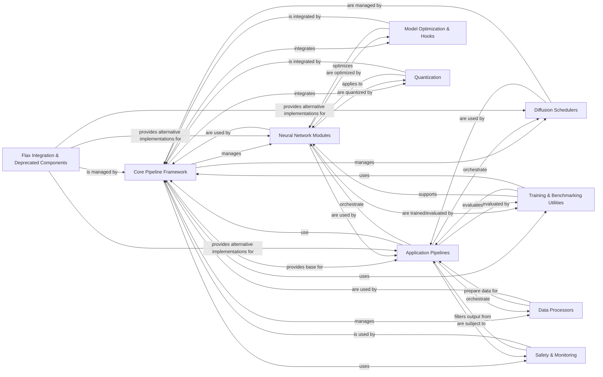

## Component Details

The `diffusers` library provides a comprehensive framework for state-of-the-art diffusion models, enabling various generative tasks such as text-to-image, image-to-image, video, and audio generation. Its core functionality revolves around a flexible pipeline architecture that integrates neural network modules (UNets, Transformers, VAEs, ControlNets), diffusion schedulers, and data processing utilities. The library supports model loading, saving, and optimization, including quantization and performance-enhancing hooks. It also offers tools for benchmarking and ensuring content safety, with a strong emphasis on extensibility and compatibility with the Hugging Face Hub.

### Core Pipeline Framework
The central component responsible for managing the overall diffusion process. It provides the base class for all pipelines, handles model loading and saving, device placement, configuration management, and general utility functions for common operations like memory management and attention mechanisms. It also facilitates interaction with the Hugging Face Hub.

**Related Classes/Methods**:

- <a href="https://github.com/huggingface/diffusers/blob/master/src/diffusers/pipelines/pipeline_utils.py#L142-L1994" target="_blank" rel="noopener noreferrer">`diffusers.src.diffusers.pipelines.pipeline_utils.DiffusionPipeline` (142:1994)</a>
- <a href="https://github.com/huggingface/diffusers/blob/master/src/diffusers/pipelines/pipeline_flax_utils.py#L101-L610" target="_blank" rel="noopener noreferrer">`diffusers.src.diffusers.pipelines.pipeline_flax_utils.FlaxDiffusionPipeline` (101:610)</a>
- <a href="https://github.com/huggingface/diffusers/blob/master/src/diffusers/pipelines/auto_pipeline.py#L267-L558" target="_blank" rel="noopener noreferrer">`diffusers.src.diffusers.pipelines.auto_pipeline.AutoPipelineForText2Image` (267:558)</a>
- <a href="https://github.com/huggingface/diffusers/blob/master/src/diffusers/configuration_utils.py#L88-L645" target="_blank" rel="noopener noreferrer">`diffusers.src.diffusers.configuration_utils.ConfigMixin` (88:645)</a>
- <a href="https://github.com/huggingface/diffusers/blob/master/src/diffusers/configuration_utils.py#L746-L760" target="_blank" rel="noopener noreferrer">`diffusers.src.diffusers.configuration_utils.LegacyConfigMixin` (746:760)</a>
- <a href="https://github.com/huggingface/diffusers/blob/master/src/diffusers/utils/hub_utils.py#L458-L557" target="_blank" rel="noopener noreferrer">`diffusers.src.diffusers.utils.hub_utils.PushToHubMixin` (458:557)</a>
- <a href="https://github.com/huggingface/diffusers/blob/master/src/diffusers/utils/loading_utils.py#L1-L109" target="_blank" rel="noopener noreferrer">`diffusers.src.diffusers.utils.loading_utils` (1:109)</a>
- <a href="https://github.com/huggingface/diffusers/blob/master/src/diffusers/utils/state_dict_utils.py#L1-L204" target="_blank" rel="noopener noreferrer">`diffusers.src.diffusers.utils.state_dict_utils` (1:204)</a>

### Neural Network Modules
This component encompasses the core model architectures and fundamental building blocks used in Diffusers. It includes various UNet implementations, Transformers, Autoencoders (VAEs), ControlNets, and their constituent layers such as attention blocks, ResNet blocks, embeddings, normalization layers, and activation functions.

**Related Classes/Methods**:

- <a href="https://github.com/huggingface/diffusers/blob/master/src/diffusers/models/unets/unet_2d_condition.py#L71-L1310" target="_blank" rel="noopener noreferrer">`diffusers.src.diffusers.models.unets.unet_2d_condition.UNet2DConditionModel` (71:1310)</a>
- <a href="https://github.com/huggingface/diffusers/blob/master/src/diffusers/models/transformers/transformer_2d.py#L39-L551" target="_blank" rel="noopener noreferrer">`diffusers.src.diffusers.models.transformers.transformer_2d.Transformer2DModel` (39:551)</a>
- <a href="https://github.com/huggingface/diffusers/blob/master/src/diffusers/models/autoencoders/autoencoder_kl.py#L38-L567" target="_blank" rel="noopener noreferrer">`diffusers.src.diffusers.models.autoencoders.autoencoder_kl.AutoencoderKL` (38:567)</a>
- <a href="https://github.com/huggingface/diffusers/blob/master/src/diffusers/models/controlnets/controlnet.py#L109-L861" target="_blank" rel="noopener noreferrer">`diffusers.src.diffusers.models.controlnets.controlnet.ControlNetModel` (109:861)</a>
- <a href="https://github.com/huggingface/diffusers/blob/master/src/diffusers/models/attention_processor.py#L50-L835" target="_blank" rel="noopener noreferrer">`diffusers.src.diffusers.models.attention_processor.Attention` (50:835)</a>
- <a href="https://github.com/huggingface/diffusers/blob/master/src/diffusers/models/embeddings.py#L1274-L1319" target="_blank" rel="noopener noreferrer">`diffusers.src.diffusers.models.embeddings.TimestepEmbedding` (1274:1319)</a>
- <a href="https://github.com/huggingface/diffusers/blob/master/src/diffusers/models/normalization.py#L131-L171" target="_blank" rel="noopener noreferrer">`diffusers.src.diffusers.models.normalization.AdaLayerNormZero` (131:171)</a>
- <a href="https://github.com/huggingface/diffusers/blob/master/src/diffusers/models/activations.py#L65-L90" target="_blank" rel="noopener noreferrer">`diffusers.src.diffusers.models.activations.GELU` (65:90)</a>
- <a href="https://github.com/huggingface/diffusers/blob/master/src/diffusers/models/resnet.py#L189-L373" target="_blank" rel="noopener noreferrer">`diffusers.src.diffusers.models.resnet.ResnetBlock2D` (189:373)</a>
- <a href="https://github.com/huggingface/diffusers/blob/master/src/diffusers/models/attention.py#L261-L589" target="_blank" rel="noopener noreferrer">`diffusers.src.diffusers.models.attention.BasicTransformerBlock` (261:589)</a>
- <a href="https://github.com/huggingface/diffusers/blob/master/src/diffusers/models/upsampling.py#L76-L192" target="_blank" rel="noopener noreferrer">`diffusers.src.diffusers.models.upsampling.Upsample2D` (76:192)</a>
- <a href="https://github.com/huggingface/diffusers/blob/master/src/diffusers/models/autoencoders/vae.py#L60-L178" target="_blank" rel="noopener noreferrer">`diffusers.src.diffusers.models.autoencoders.vae.Encoder` (60:178)</a>
- <a href="https://github.com/huggingface/diffusers/blob/master/src/diffusers/pipelines/kolors/text_encoder.py#L746-L862" target="_blank" rel="noopener noreferrer">`diffusers.src.diffusers.pipelines.kolors.text_encoder.ChatGLMModel` (746:862)</a>

### Diffusion Schedulers
Implements various diffusion schedulers that control the noise schedule and sampling process during inference. These schedulers define how noise is added and removed at each step of the diffusion process.

**Related Classes/Methods**:

- <a href="https://github.com/huggingface/diffusers/blob/master/src/diffusers/schedulers/scheduling_repaint.py#L91-L365" target="_blank" rel="noopener noreferrer">`diffusers.src.diffusers.schedulers.scheduling_repaint.RePaintScheduler` (91:365)</a>
- <a href="https://github.com/huggingface/diffusers/blob/master/src/diffusers/schedulers/scheduling_ddpm_wuerstchen.py#L88-L230" target="_blank" rel="noopener noreferrer">`diffusers.src.diffusers.schedulers.scheduling_ddpm_wuerstchen.DDPMWuerstchenScheduler` (88:230)</a>
- <a href="https://github.com/huggingface/diffusers/blob/master/src/diffusers/schedulers/scheduling_edm_euler.py#L49-L448" target="_blank" rel="noopener noreferrer">`diffusers.src.diffusers.schedulers.scheduling_edm_euler.EDMEulerScheduler` (49:448)</a>
- <a href="https://github.com/huggingface/diffusers/blob/master/src/diffusers/schedulers/scheduling_utils.py#L75-L194" target="_blank" rel="noopener noreferrer">`diffusers.src.diffusers.schedulers.scheduling_utils.SchedulerMixin` (75:194)</a>

### Data Processors
Handles all image and video related preprocessing and postprocessing tasks, including resizing, cropping, normalization, and conversion between different data formats (PIL, NumPy, PyTorch tensors).

**Related Classes/Methods**:

- <a href="https://github.com/huggingface/diffusers/blob/master/src/diffusers/image_processor.py#L88-L838" target="_blank" rel="noopener noreferrer">`diffusers.src.diffusers.image_processor.VaeImageProcessor` (88:838)</a>
- <a href="https://github.com/huggingface/diffusers/blob/master/src/diffusers/image_processor.py#L1121-L1222" target="_blank" rel="noopener noreferrer">`diffusers.src.diffusers.image_processor.IPAdapterMaskProcessor` (1121:1222)</a>
- <a href="https://github.com/huggingface/diffusers/blob/master/src/diffusers/video_processor.py#L25-L113" target="_blank" rel="noopener noreferrer">`diffusers.src.diffusers.video_processor.VideoProcessor` (25:113)</a>

### Application Pipelines
High-level interfaces for various diffusion models, encapsulating the entire generation process from input to output. These pipelines combine Neural Network Modules, Diffusion Schedulers, and Data Processors to perform specific tasks like text-to-image, image-to-image, video, and audio generation.

**Related Classes/Methods**:

- <a href="https://github.com/huggingface/diffusers/blob/master/src/diffusers/pipelines/stable_diffusion/pipeline_stable_diffusion.py#L154-L1103" target="_blank" rel="noopener noreferrer">`diffusers.src.diffusers.pipelines.stable_diffusion.pipeline_stable_diffusion.StableDiffusionPipeline` (154:1103)</a>
- <a href="https://github.com/huggingface/diffusers/blob/master/src/diffusers/pipelines/stable_video_diffusion/pipeline_stable_video_diffusion.py#L147-L628" target="_blank" rel="noopener noreferrer">`diffusers.src.diffusers.pipelines.stable_video_diffusion.pipeline_stable_video_diffusion.StableVideoDiffusionPipeline` (147:628)</a>
- <a href="https://github.com/huggingface/diffusers/blob/master/src/diffusers/pipelines/audioldm/pipeline_audioldm.py#L60-L557" target="_blank" rel="noopener noreferrer">`diffusers.src.diffusers.pipelines.audioldm.pipeline_audioldm.AudioLDMPipeline` (60:557)</a>
- <a href="https://github.com/huggingface/diffusers/blob/master/src/diffusers/pipelines/shap_e/pipeline_shap_e.py#L88-L346" target="_blank" rel="noopener noreferrer">`diffusers.src.diffusers.pipelines.shap_e.pipeline_shap_e.ShapEPipeline` (88:346)</a>
- <a href="https://github.com/huggingface/diffusers/blob/master/src/diffusers/pipelines/t2i_adapter/pipeline_stable_diffusion_xl_adapter.py#L216-L1311" target="_blank" rel="noopener noreferrer">`diffusers.src.diffusers.pipelines.t2i_adapter.pipeline_stable_diffusion_xl_adapter.StableDiffusionXLAdapterPipeline` (216:1311)</a>

### Model Optimization & Hooks
Provides a system for applying hooks to models for various optimizations like group offloading, pyramid attention broadcast, faster caching, and layer-wise casting, as well as specialized attention processors for improved performance.

**Related Classes/Methods**:

- <a href="https://github.com/huggingface/diffusers/blob/master/src/diffusers/models/attention_processor.py#L3034-L3125" target="_blank" rel="noopener noreferrer">`diffusers.src.diffusers.models.attention_processor.XFormersAttnProcessor` (3034:3125)</a>
- <a href="https://github.com/huggingface/diffusers/blob/master/src/diffusers/models/attention_processor.py#L4314-L4417" target="_blank" rel="noopener noreferrer">`diffusers.src.diffusers.models.attention_processor.FusedAttnProcessor2_0` (4314:4417)</a>
- <a href="https://github.com/huggingface/diffusers/blob/master/src/diffusers/hooks/group_offloading.py#L246-L337" target="_blank" rel="noopener noreferrer">`diffusers.src.diffusers.hooks.group_offloading.LazyPrefetchGroupOffloadingHook` (246:337)</a>
- <a href="https://github.com/huggingface/diffusers/blob/master/src/diffusers/hooks/pyramid_attention_broadcast.py#L135-L175" target="_blank" rel="noopener noreferrer">`diffusers.src.diffusers.hooks.pyramid_attention_broadcast.PyramidAttentionBroadcastHook` (135:175)</a>

### Quantization
Provides functionalities for model quantization, including different quantization configurations (BitsAndBytes, TorchAo, Quanto, GGUF) and methods for applying and de-quantizing model parameters to reduce memory footprint and improve inference speed.

**Related Classes/Methods**:

- <a href="https://github.com/huggingface/diffusers/blob/master/src/diffusers/quantizers/auto.py#L53-L143" target="_blank" rel="noopener noreferrer">`diffusers.src.diffusers.quantizers.auto.DiffusersAutoQuantizer` (53:143)</a>
- <a href="https://github.com/huggingface/diffusers/blob/master/src/diffusers/quantizers/base.py#L34-L229" target="_blank" rel="noopener noreferrer">`diffusers.src.diffusers.quantizers.base.DiffusersQuantizer` (34:229)</a>
- <a href="https://github.com/huggingface/diffusers/blob/master/src/diffusers/quantizers/bitsandbytes/bnb_quantizer.py#L44-L329" target="_blank" rel="noopener noreferrer">`diffusers.src.diffusers.quantizers.bitsandbytes.bnb_quantizer.BnB4BitDiffusersQuantizer` (44:329)</a>
- <a href="https://github.com/huggingface/diffusers/blob/master/src/diffusers/quantizers/quantization_config.py#L62-L173" target="_blank" rel="noopener noreferrer">`diffusers.src.diffusers.quantizers.quantization_config.QuantizationConfigMixin` (62:173)</a>

### Training & Benchmarking Utilities
Contains utilities specifically designed for training diffusion models, such as setting random seeds and managing Exponential Moving Average (EMA) models. It also provides tools and base classes for benchmarking the performance of different diffusion models and pipelines.

**Related Classes/Methods**:

- <a href="https://github.com/huggingface/diffusers/blob/master/src/diffusers/training_utils.py#L312-L644" target="_blank" rel="noopener noreferrer">`diffusers.src.diffusers.training_utils.EMAModel` (312:644)</a>
- <a href="https://github.com/huggingface/diffusers/blob/master/benchmarks/run_all.py#L19-L33" target="_blank" rel="noopener noreferrer">`diffusers.benchmarks.run_all.run_command` (19:33)</a>
- <a href="https://github.com/huggingface/diffusers/blob/master/benchmarks/push_results.py#L28-L68" target="_blank" rel="noopener noreferrer">`diffusers.benchmarks.push_results.push_to_hf_dataset` (28:68)</a>
- <a href="https://github.com/huggingface/diffusers/blob/master/benchmarks/base_classes.py#L73-L121" target="_blank" rel="noopener noreferrer">`diffusers.benchmarks.base_classes.TextToImageBenchmark` (73:121)</a>

### Safety & Monitoring
Components responsible for ensuring the safety of generated content by detecting and filtering out potentially harmful or inappropriate images. It also includes general logging functionalities.

**Related Classes/Methods**:

- <a href="https://github.com/huggingface/diffusers/blob/master/src/diffusers/pipelines/stable_diffusion_safe/safety_checker.py#L31-L109" target="_blank" rel="noopener noreferrer">`diffusers.src.diffusers.pipelines.stable_diffusion_safe.safety_checker.SafeStableDiffusionSafetyChecker` (31:109)</a>
- <a href="https://github.com/huggingface/diffusers/blob/master/src/diffusers/pipelines/stable_diffusion/safety_checker.py#L32-L126" target="_blank" rel="noopener noreferrer">`diffusers.src.diffusers.pipelines.stable_diffusion.safety_checker.StableDiffusionSafetyChecker` (32:126)</a>
- <a href="https://github.com/huggingface/diffusers/blob/master/src/diffusers/utils/logging.py#L1-L100" target="_blank" rel="noopener noreferrer">`diffusers.src.diffusers.utils.logging` (1:100)</a>

### Flax Integration & Deprecated Components
This component includes Flax implementations of various models and components, enabling compatibility with JAX and Flax ecosystems. It also serves as a repository for older or deprecated models, pipelines, and schedulers, maintained for backward compatibility, and includes specialized 3D rendering components.

**Related Classes/Methods**:

- <a href="https://github.com/huggingface/diffusers/blob/master/src/diffusers/models/attention_flax.py#L122-L241" target="_blank" rel="noopener noreferrer">`diffusers.src.diffusers.models.attention_flax.FlaxAttention` (122:241)</a>
- <a href="https://github.com/huggingface/diffusers/blob/master/src/diffusers/pipelines/pipeline_flax_utils.py#L101-L610" target="_blank" rel="noopener noreferrer">`diffusers.src.diffusers.pipelines.pipeline_flax_utils.FlaxDiffusionPipeline` (101:610)</a>
- <a href="https://github.com/huggingface/diffusers/blob/master/src/diffusers/schedulers/scheduling_ddim_flax.py#L66-L314" target="_blank" rel="noopener noreferrer">`diffusers.src.diffusers.schedulers.scheduling_ddim_flax.FlaxDDIMScheduler` (66:314)</a>
- <a href="https://github.com/huggingface/diffusers/blob/master/src/diffusers/pipelines/deprecated/repaint/pipeline_repaint.py#L76-L231" target="_blank" rel="noopener noreferrer">`diffusers.src.diffusers.pipelines.deprecated.repaint.pipeline_repaint.RePaintPipeline` (76:231)</a>
- <a href="https://github.com/huggingface/diffusers/blob/master/src/diffusers/schedulers/deprecated/scheduling_karras_ve.py#L49-L244" target="_blank" rel="noopener noreferrer">`diffusers.src.diffusers.schedulers.deprecated.scheduling_karras_ve.KarrasVeScheduler` (49:244)</a>
- <a href="https://github.com/huggingface/diffusers/blob/master/src/diffusers/pipelines/shap_e/renderer.py#L784-L1050" target="_blank" rel="noopener noreferrer">`diffusers.src.diffusers.pipelines.shap_e.renderer.ShapERenderer` (784:1050)</a>
- <a href="https://github.com/huggingface/diffusers/blob/master/src/diffusers/pipelines/shap_e/camera.py#L23-L119" target="_blank" rel="noopener noreferrer">`diffusers.src.diffusers.pipelines.shap_e.camera.DifferentiableProjectiveCamera` (23:119)</a>

### [FAQ](https://github.com/CodeBoarding/GeneratedOnBoardings/tree/main?tab=readme-ov-file#faq)