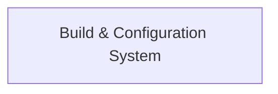

## Details

One paragraph explaining the functionality which is represented by this graph. What the main flow is and what is its purpose.

### Build & Configuration System [[Expand]](./Build_Configuration_System.md)
This component is responsible for orchestrating the entire build process of the polyglot library. It manages the compilation, linking, and installation of all project components, including the C++ core, Python bindings (Pybind11), and Rust bindings (Rust FFI). Utilizing Meson as its primary tool, it ensures cross-platform compatibility and enforces the overall project structure, integrating various language-specific build steps into a unified system.

**Related Classes/Methods**:

- `meson.build` (1:1)

### [FAQ](https://github.com/CodeBoarding/GeneratedOnBoardings/tree/main?tab=readme-ov-file#faq)