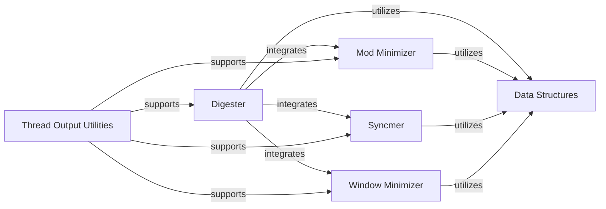

## Details

One paragraph explaining the functionality which is represented by this graph. What the main flow is and what is its purpose.

### Digester
Implements the core ntHash algorithm, responsible for generating hash values from biological sequences. It acts as the primary interface for sequence digestion.

**Related Classes/Methods**:

- `data_structure.hpp` (1:100)
- `mod_minimizer.hpp` (1:100)
- `syncmer.hpp` (1:100)
- `window_minimizer.hpp` (1:100)

### Data Structures
Defines the fundamental data structures used throughout the C++ library, such as representations for biological sequences, k-mers, hash values, and other intermediate computational results. Ensures efficient memory management and data access.

**Related Classes/Methods**: _None_

### Mod Minimizer
Implements the modulo minimizer technique, a specific algorithm for selecting representative k-mers from a sequence based on a modulo operation on their hash values.

**Related Classes/Methods**:

- `data_structure.hpp` (1:100)

### Syncmer
Implements syncmer-based algorithms, another method for selecting representative k-mers that ensures consistent k-mer selection across different sequence contexts.

**Related Classes/Methods**:

- `data_structure.hpp` (1:100)

### Window Minimizer
Implements window-based minimizer techniques, which involve finding the minimum hash value within a sliding window over a sequence to select representative k-mers.

**Related Classes/Methods**:

- `data_structure.hpp` (1:100)

### Thread Output Utilities
Provides utilities for managing output and potentially coordinating threads within a multi-threaded execution environment, crucial for high-performance parallel computations.

**Related Classes/Methods**: _None_

### [FAQ](https://github.com/CodeBoarding/GeneratedOnBoardings/tree/main?tab=readme-ov-file#faq)