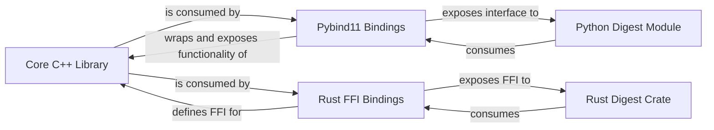

## Details

One paragraph explaining the functionality which is represented by this graph. What the main flow is and what is its purpose.

### Core C++ Library [[Expand]](./Core_C_Library.md)
Implements the fundamental, performance-critical bioinformatics/genomics algorithms and data structures in C++. It serves as the authoritative source of functionality that the polyglot bindings expose.

**Related Classes/Methods**:

- `digester` (1:1)

### Pybind11 Bindings
Responsible for creating the Python interface to the Core C++ Library using Pybind11. This involves managing data type conversions between C++ and Python, handling object lifetimes, and exposing C++ functions and classes as callable Python entities.

**Related Classes/Methods**:

- `bindings` (1:1)

### Rust FFI Bindings
Provides the Foreign Function Interface (FFI) layer that allows Rust code to safely and efficiently interact with the Core C++ Library. This includes defining external C functions in Rust and ensuring correct data marshalling across the C++/Rust boundary.

**Related Classes/Methods**:

- `lib` (1:1)
- `bindings` (1:1)

### Python Digest Module
The high-level Python module that presents a user-friendly and idiomatic Python interface to the digest functionality provided by the Core C++ Library, built directly upon the Pybind11 Bindings.

**Related Classes/Methods**:

- `bindings` (1:1)

### Rust Digest Crate
The high-level Rust crate that offers an idiomatic Rust interface to the digest functionality from the Core C++ Library, leveraging the Rust FFI Bindings for interoperability.

**Related Classes/Methods**:

- `lib` (1:1)

### [FAQ](https://github.com/CodeBoarding/GeneratedOnBoardings/tree/main?tab=readme-ov-file#faq)